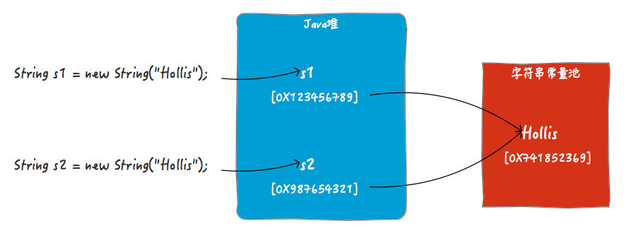
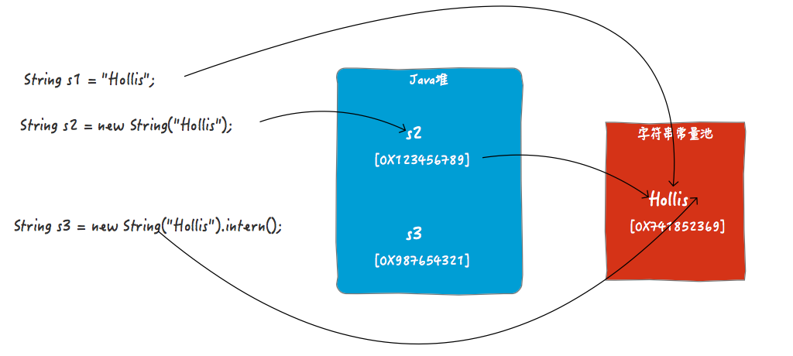

String，是Java中除了基本数据类型以外，最为重要的一个类型了。很多人会认为他比较简单。
但是和String有关的面试题有很多，下面我随便找两道面试题，看看你能不能都答对：

Q1：`String s = new String("hollis");`定义了几个对象。

Q2：如何理解String的intern方法？

上面这两个是面试题和String相关的比较常考的，很多人一般都知道答案。

A1：若常量池中已经存在”hollis”，则直接引用，也就是此时只会创建一个对象，如果常量池中不存在”hollis”，则先创建后引用，也就是有两个。

A2：当一个String实例str调用intern()方法时，Java查找常量池中是否有相同Unicode的字符串常量，如果有，则返回其的引用，如果没有，则在常量池中增加一个Unicode等于str的字符串并返回它的引用；

两个答案看上去没有任何问题，但是，仔细想想好像哪里不对呀。按照上面的两个面试题的回答，就是说new String也会检查常量池，如果有的话就直接引用，如果不存在就要在常量池创建一个，那么还要intern干啥？难道以下代码是没有意义的吗？

```
String s = new String("Hollis").intern();
```
如果，每当我们使用new创建字符串的时候，都会到字符串池检查，然后返回。那么以下代码也应该输出结果都是true?
```
String s1 = "Hollis";
String s2 = new String("Hollis");
String s3 = new String("Hollis").intern();

System.out.println(s1 == s2);
System.out.println(s1 == s3);
```
但是，以上代码输出结果为（base jdk1.8.0_73）：

```
false
true
```
不知道，聪明的读者看完这段代码之后，是不是有点被搞蒙了，到底是怎么回事儿？

别急，且听我慢慢道来。

### 字面量和运行时常量池

JVM为了提高性能和减少内存开销，在实例化字符串常量的时候进行了一些优化。为了减少在JVM中创建的字符串的数量，字符串类维护了一个字符串常量池。

在JVM运行时区域的方法区中，有一块区域是运行时常量池，主要用来存储编译期生成的各种字面量和符号引用。

了解Class文件结构或者做过Java代码的反编译的朋友可能都知道，在java代码被javac编译之后，文件结构中是包含一部分Constant pool的。比如以下代码：

```
public static void main(String[] args) {
    String s = "Hollis";
}
```
经过编译后，常量池内容如下：

```
Constant pool:
   #1 = Methodref          #4.#20         // java/lang/Object."<init>":()V
   #2 = String             #21            // Hollis
   #3 = Class              #22            // StringDemo
   #4 = Class              #23            // java/lang/Object
   ...
   #16 = Utf8               s
   ..
   #21 = Utf8               Hollis
   #22 = Utf8               StringDemo
   #23 = Utf8               java/lang/Object
```

上面的Class文件中的常量池中，比较重要的几个内容：

```
#16 = Utf8               s
#21 = Utf8               Hollis
#22 = Utf8               StringDemo
```

上面几个常量中，s就是前面提到的符号引用，而Hollis就是前面提到的字面量。而Class文件中的常量池部分的内容，会在运行期被运行时常量池加载进去。
关于字面量，详情参考[Java SE Specifications](https://docs.oracle.com/javase/specs/jls/se8/html/jls-3.html#jls-3.10.5)

###new String创建了几个对象
下面，我们可以来分析下String s = new String("Hollis");创建对象情况了。

这段代码中，我们可以知道的是，在编译期，符号引用s和字面量Hollis会被加入到Class文件的常量池中，然后在类加载阶段（具体时间段参考Java 中[new String(“字面量”) 中 “字面量” 是何时进入字符串常量池的?](https://www.zhihu.com/question/55994121)），这两个常量会进入常量池。

但是，这个“进入”阶段，并不会直接把所有类中定义的常量全部都加载进来，而是会做个比较，如果需要加到字符串常量池中的字符串已经存在，那么就不需要再把字符串字面量加载进来了。

所以，当我们说<若常量池中已经存在”hollis”，则直接引用，也就是此时只会创建一个对象>说的就是这个字符串字面量在字符串池中被创建的过程。

说完了编译期的事儿了，该到运行期了，在运行期，`new String("Hollis");`执行到的时候，是要在Java堆中创建一个字符串对象的，而这个对象所对应的字符串字面量是保存在字符串常量池中的。但是，`String s = new String("Hollis");`，对象的符号引用s是保存在Java虚拟机栈上的，他保存的是堆中刚刚创建出来的的字符串对象的引用。

所以，你也就知道以下代码输出结果为false的原因了。

```
String s1 = new String("Hollis");
String s2 = new String("Hollis");
System.out.println(s1 == s2);
```

因为，==比较的是s1和s2在堆中创建的对象的地址，当然不同了。但是如果使用equals，那么比较的就是字面量的内容了，那就会得到true。



>在不同版本的JDK中，Java堆和字符串常量池之间的关系也是不同的，这里为了方便表述，就画成两个独立的物理区域了。具体情况请参考Java虚拟机规范。

所以，`String s = new String("Hollis");`创建几个对象的答案你也就清楚了。

常量池中的“对象”是在编译期就确定好了的，在类被加载的时候创建的，如果类加载时，该字符串常量在常量池中已经有了，那这一步就省略了。堆中的对象是在运行期才确定的，在代码执行到new的时候创建的。

运行时常量池的动态扩展
编译期生成的各种字面量和符号引用是运行时常量池中比较重要的一部分来源，但是并不是全部。那么还有一种情况，可以在运行期像运行时常量池中增加常量。那就是String的intern方法。

当一个String实例调用intern()方法时，Java查找常量池中是否有相同Unicode的字符串常量，如果有，则返回其的引用，如果没有，则在常量池中增加一个Unicode等于str的字符串并返回它的引用；

intern()有两个作用，第一个是将字符串字面量放入常量池（如果池没有的话），第二个是返回这个常量的引用。

我们再来看下开头的那个让人产生疑惑的例子：

```
String s1 = "Hollis";
String s2 = new String("Hollis");
String s3 = new String("Hollis").intern();

System.out.println(s1 == s2);
System.out.println(s1 == s3);
```

你可以简单的理解为`String s1 = "Hollis";`和`String s3 = new String("Hollis").intern();`做的事情是一样的（但实际有些区别，这里暂不展开）。都是定义一个字符串对象，然后将其字符串字面量保存在常量池中，并把这个字面量的引用返回给定义好的对象引用。



对于`String s3 = new String("Hollis").intern();`，在不调用intern情况，s3指向的是JVM在堆中创建的那个对象的引用的（如图中的s2）。但是当执行了intern方法时，s3将指向字符串常量池中的那个字符串常量。

由于s1和s3都是字符串常量池中的字面量的引用，所以s1==s3。但是，s2的引用是堆中的对象，所以s2!=s1。

### intern的正确用法
不知道，你有没有发现，在`String s3 = new String("Hollis").intern();`中，其实intern是多余的？

因为就算不用intern，Hollis作为一个字面量也会被加载到Class文件的常量池，进而加入到运行时常量池中，为啥还要多此一举呢？到底什么场景下才需要使用intern呢？

在解释这个之前，我们先来看下以下代码：

```
String s1 = "Hollis";
String s2 = "Chuang";
String s3 = s1 + s2;
String s4 = "Hollis" + "Chuang";
```

在经过反编译后，得到代码如下：
```
String s1 = "Hollis";
String s2 = "Chuang";
String s3 = (new StringBuilder()).append(s1).append(s2).toString();
String s4 = "HollisChuang";
```

可以发现，同样是字符串拼接，s3和s4在经过编译器编译后的实现方式并不一样。s3被转化成StringBuilder及append，而s4被直接拼接成新的字符串。

如果你感兴趣，你还能发现，`String s3 = s1 + s2;` 经过编译之后，常量池中是有两个字符串常量的分别是 Hollis、Chuang（其实Hollis和Chuang是`String s1 = "Hollis";`和`String s2 = "Chuang";`定义出来的），拼接结果HollisChuang并不在常量池中。

如果代码只有`String s4 = "Hollis" + "Chuang";`，那么常量池中将只有HollisChuang而没有”Hollis” 和 “Chuang”。

究其原因，是因为常量池要保存的是已确定的字面量值。也就是说，对于字符串的拼接，纯字面量和字面量的拼接，会把拼接结果作为常量保存到字符串池。

如果在字符串拼接中，有一个参数是非字面量，而是一个变量的话，整个拼接操作会被编译成StringBuilder.append，这种情况编译器是无法知道其确定值的。只有在运行期才能确定。

那么，有了这个特性了，intern就有用武之地了。那就是很多时候，我们在程序中得到的字符串是只有在运行期才能确定的，在编译期是无法确定的，那么也就没办法在编译期被加入到常量池中。

这时候，对于那种可能经常使用的字符串，使用intern进行定义，每次JVM运行到这段代码的时候，就会直接把常量池中该字面值的引用返回，这样就可以减少大量字符串对象的创建了。

如一[深入解析String#intern](https://tech.meituan.com/in_depth_understanding_string_intern.html)文中举的一个例子：

```
static final int MAX = 1000 * 10000;
static final String[] arr = new String[MAX];

public static void main(String[] args) throws Exception {
    Integer[] DB_DATA = new Integer[10];
    Random random = new Random(10 * 10000);
    for (int i = 0; i < DB_DATA.length; i++) {
        DB_DATA[i] = random.nextInt();
    }
    long t = System.currentTimeMillis();
    for (int i = 0; i < MAX; i++) {
         arr[i] = new String(String.valueOf(DB_DATA[i % DB_DATA.length])).intern();
    }

    System.out.println((System.currentTimeMillis() - t) + "ms");
    System.gc();
}
```

在以上代码中，我们明确的知道，会有很多重复的相同的字符串产生，但是这些字符串的值都是只有在运行期才能确定的。所以，只能我们通过intern显示的将其加入常量池，这样可以减少很多字符串的重复创建。

### 总结
我们再回到文章开头那个疑惑：按照上面的两个面试题的回答，就是说new String也会检查常量池，如果有的话就直接引用，如果不存在就要在常量池创建一个，那么还要intern干啥？难道以下代码是没有意义的吗？

```
String s = new String("Hollis").intern();
```

而intern中说的“如果有的话就直接返回其引用”，指的是会把字面量对象的引用直接返回给定义的对象。这个过程是不会在Java堆中再创建一个String对象的。

的确，以上代码的写法其实是使用intern是没什么意义的。因为字面量Hollis会作为编译期常量被加载到运行时常量池。

之所以能有以上的疑惑，其实是对字符串常量池、字面量等概念没有真正理解导致的。有些问题其实就是这样，单个问题，自己都知道答案，但是多个问题综合到一起就蒙了。归根结底是知识的理解还停留在点上，没有串成面。