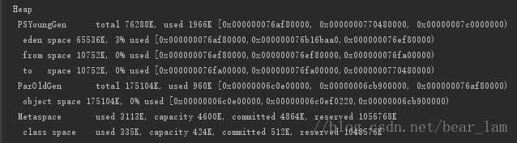

### id1.对指定运行程序输出GC日志:


### 点击edit configurations...


在vm options处加入-XX:+PrintGCDetails

测试:代码调用system.gc后输出以下内容:



```
-verbose:gc ： 开启gc日志
-XX:+PrintGCDetails ： 打印gc详情
-XX:+PrintGCDateStamps ： 打印gc时间戳
-Xloggc:gcc.log ： 将日志输出到文件xx(默认位置为桌面)
```

### 还可以根据自己电脑的配置修改jvm堆,栈的大小,默认值如下
```
-Xms128m
-Xmx750m
-XX:ReservedCodeCacheSize=240m
```

### 我是16G内存,直接改为:
```
-Xms512m
-Xmx2018m
-XX:ReservedCodeCacheSize=720m
```