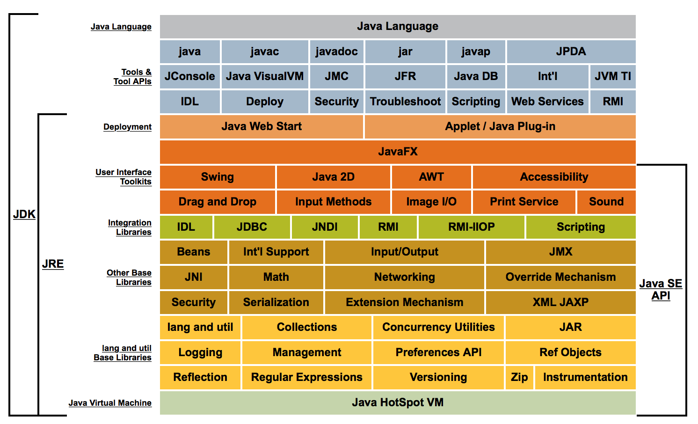
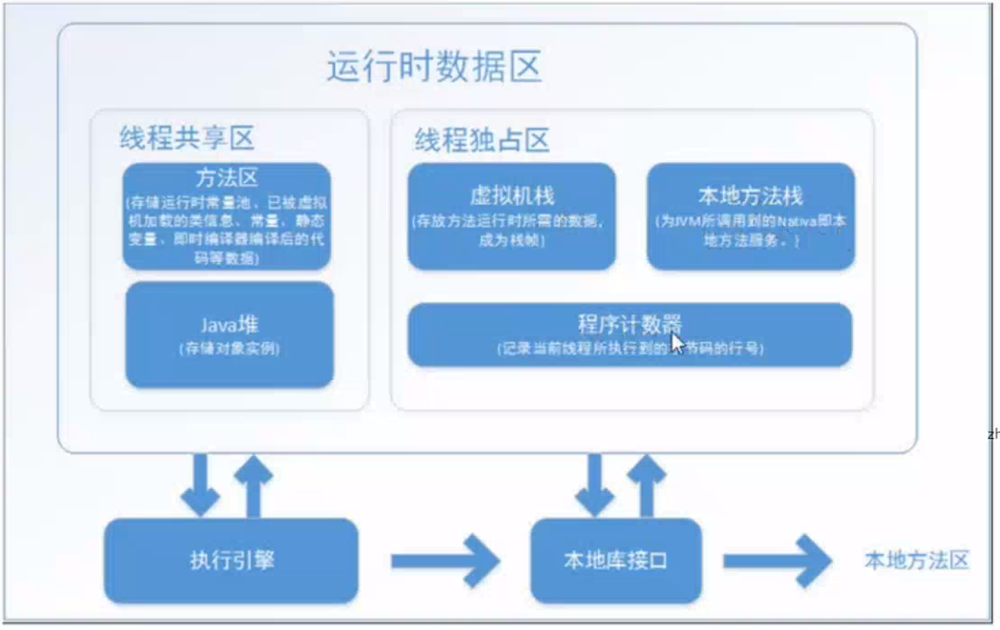
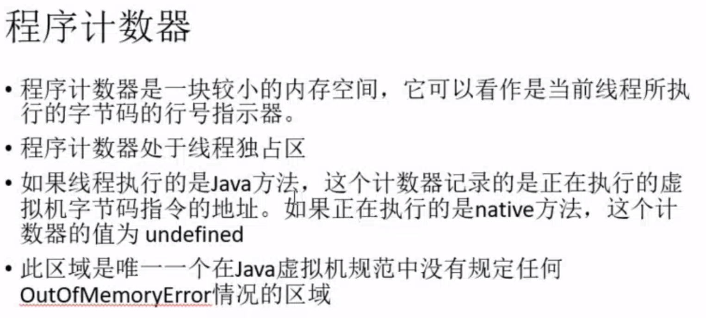

1.Jvm可视化监控工具（jconsole 实际是tool.jar 文件的包装）






# 垃圾回收

### 1.如何判断对象为垃圾对象
- 引用计数法
- 可达性分析法

```
-verbose:gc ： 开启gc日志
-XX:+PrintGCDetails ： 打印gc详情
-XX:+PrintGCDateStamps ： 打印gc时间戳
-Xloggc:gcc.log ： 将日志输出到文件xx(默认位置为桌面)
```
### 2.如何回收

##### 1.回收策略
- 标记清除算法
- 复制算法
- 标记整理算法
- 分代算法

##### 2.垃圾回收器
- Serial
- Parnew
- GC

