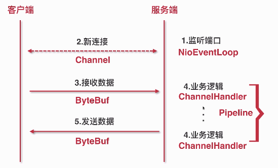
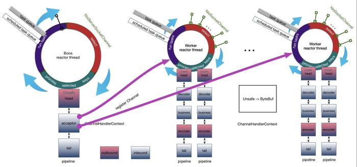

# 第2章 Netty基本组件

 ### 服务端启动器:
1. 服务端监听端口;
2. 客户端连接服务端;
3. 客户端给服务端发送数据

### 服务端与客户端通信过程:
 1. 监听端口[服务端监听端口]->NioEventLoop[NIO事件循环:新连接的接入、连接当前存在的连接，连接上数据流读写]:
 - (1)Server在端口上监听Client新用户连接,
 - (2)新用户链接建立完成后在对应端口上监听新连接的数据;

 2. 新连接[通过while(true)循环不断accept()方法连接,客户端创建新连接,服务端获取客户端连接，处理器处理客户端连接]->Channel;
 3. 接收数据[客户端写数据到服务端,服务端接收数据]->ByteBuf[服务端接收客户端数据流载体];
 4. 业务逻辑[服务端接收到客户端数据做业务逻辑处理]->Pipeline:一系列ChannelHandler[二进制协议数据包拆分,数据包Java对象转换,真正业务逻辑处理,封数据库包];
 5. 发送数据[服务端发送数据到客户端]->ByteBuf[服务端发送客户端数据流载体]

### Netty基本组件:

1. NioEventLoop->Thread:accept/getOutputStream->select,ClientHandler.start->processSelectedKey
2. Channel->Socket/ServerSocketChannel->ServerSocket:NioByteUnsafe[客户端Channel数据流读写],NioMessageUnsafe[客户端新连接接入,处理新连接使用NioServerSocketChannel,javaChannel()获取Nio的ServerSocketChannel]
3. ByteBuf->IO Bytes:read/write->输入/输出流
4. Pipeline->Logic Chain:AbstractChannel的构造器使用newChannelPipeline()创建Pipeline,每个Channel都有Pipeline,将Login Chain逻辑链路加到Channel,Channel数据流读写都经过Pipeline
5. ChannelHandler->Logic:DefaultChannelPipeline的add/remove方法动态增加/删除Logic,数据流读写都经过ChannelHandler

```
public class ServerBoot {
    private static final int PORT = 8000;

    public static void main(String[] args) {
        Server server = new Server(PORT);
        server.start();
    }
}
```
### 服务器
```
/**
 * 服务器
 */
public class Server {
    private ServerSocket serverSocket;

    public Server(int port) {
        try {
            //创建服务端ServerSocket绑定port
            this.serverSocket = new ServerSocket(port);
            System.out.println("服务端启动成功,端口:" + port);
        } catch (IOException e) {
            e.printStackTrace();
            System.out.println("服务端启动失败");
        }
    }

    public void start() {
        //创建端口监听线程避免阻塞ServerBoot线程
        new Thread(new Runnable() {
            @Override
            public void run() {
                doStart();
            }
        }).start();
    }

    /**
     * 接收客户端连接
     */
    private void doStart() {
        //NioEventLoop的run()方法while(true)
        while (true) {
            try {
                //NioEventLoop的select操作
                Socket client = serverSocket.accept();
                //NioEventLoop的processSelectedKeys操作
                new ClientHandler(client).start();
            } catch (IOException e) {
                e.printStackTrace();
                System.out.println("服务端异常");
            }
        }
    }
}
```

### 客户端处理器
```
/**
 * 客户端处理器
 */
public class ClientHandler {

    public static final int MAX_DATA_LEN = 1024;
    private Socket socket;

    public ClientHandler(Socket socket) {
        this.socket = socket;
    }

    public void start() {
        System.out.println("新客户端接入");
        //创建客户端读写线程避免阻塞接收客户端连接
        new Thread(new Runnable() {
            @Override
            public void run() {
                doStart();
            }
        }).start();
    }

    private void doStart() {
        InputStream inputStream = null;
        try {
            inputStream = socket.getInputStream();
            while (true) {
                byte[] data = new byte[MAX_DATA_LEN];
                int len;
                while ((len = inputStream.read(data)) != -1) {
                    String message = new String(data, 0, len);
                    System.out.println("客户端传来消息: " + message);
                    socket.getOutputStream().write(data);
                }
            }
        } catch (IOException e) {
            e.printStackTrace();
        }
    }
}
```

### 客户端
```
/**
 * 客户端
 */
public class Client {
    private static final String HOST = "127.0.0.1";
    private static final int PORT = 8000;
    private static final int SLEEP_TIME = 5000;

    public static void main(String[] args) throws IOException {
        //创建客户端Socket绑定host和port
        Socket socket = new Socket(HOST, PORT);

        new Thread(new Runnable() {
            @Override
            public void run() {
                System.out.println("客户端启动成功");
                //NioEventLoop的run()方法while(true)
                while (true) {
                    try {
                        String message = "hello world";
                        System.out.println("客户端发送数据: " + message);
                        //NioEventLoop的select操作
                        socket.getOutputStream().write(message.getBytes());
                    } catch (IOException e) {
                        e.printStackTrace();
                        System.out.println("写数据出错!");
                    }
                    sleep();
                }
            }
        }).start();
    }

    private static void sleep() {
        try {
            Thread.sleep(SLEEP_TIME);
        } catch (InterruptedException e) {
            e.printStackTrace();
        }
    }
}
```

# 第3章 Netty服务端启动

### Netty服务端启动:
##### 1. 创建服务端Channel:创建底层JDK Channel,封装JDK Channel,创建基本组件绑定Channel;
- (1)bind(port)[用户代码入口]:serverBootstrap.bind(port)
- (2)initAndRegister()[初始化并注册]
- (3)newChannel()[创建服务端Channel]:
 通过serverBootstrap.channel()方法传入NioServerSocketChannel类构造ReflectiveChannelFactory实例将NioServerSocketChannel类设置为反射类;
 channelFactory.newChannel()通过clazz.newInstance()调用反射类构造方法反射创建服务端Channel

 ##### 反射创建服务端Channel(查看NioServerSocketChannel构造方法):
- (1)newSocket()[通过JDK来创建底层JDK Channel]:provider.openServerSocketChannel()
- (2)AbstractNioChannel()
 * [1]AbstractChannel()[创建id,unsafe,pipeline]
 * [2]configureBlocking(false)[阻塞模式]:设置非阻塞模式
 * (3)NioServerSocketChannelConfig()[TCP参数配置类]:设置底层JDK Channel TCP参数配置例如backlog、receivebuf、sendbuf
 * <p>
 * 2.初始化服务端Channel:设置Channel基本属性,添加逻辑处理器;
 * <p>
 * (1)init()[初始化服务端channel,初始化入口]
 * (2)set ChannelOptions,ChannelAttrs
 * (3)set ChildOptions,ChildAttrs:提供给通过服务端Channel创建的新连接Channel创建的,每次accept新连接都配置用户自定义的两个属性配置
 * (4)config handler[配置服务端Pipeline]
 * (5)add ServerBootstrapAcceptor[添加连接器]:提供给accept接入的新连接分配NIO线程
 * 保存用户自定义基本属性,通过配置属性创建连接接入器,连接接入器每次accept新连接使用自定义属性配置新连接
 * <p>
 * 3.注册Selector:将底层JDK Channel注册到事件轮询器Selector上面,并把服务端Channel作为Attachment绑定在对应底层JDK Channel;
 * <p>
 * (1)AbstractChannel.register(channel)[注册Selector入口]
 * (2)this.eventLoop=eventLoop[绑定线程]
 * (3)register0()[实际注册]
 * [1]doRegister()[调用JDK底层注册]:JDK Channel注册Selector调用javaChannel().register(eventLoop().selector, 0, this),将服务端Channel通过Attachment绑定到Selector
 * [2]invokeHandlerAddedIfNeeded():事件回调,触发Handler
 * [3]fireChannelRegistered()[传播事件]
 * <p>
 * 4.端口绑定:实现本地端口监听
 * <p>
 * (1)AbstractUnsafe.bind()[端口绑定]
 * (2)doBind():javaChannel().bind()[JDK动态绑定]
 * (3)pipeline.fireChannelActive()[传播事件]:HeadContext.readIfIsAutoRead()将注册Selector的事件重新绑定为OP_ACCEPT事件,有新连接接入Selector轮询到OP_ACCEPT事件最终将连接交给Netty处理
 * 绑定OP_ACCEPT事件:当端口完成绑定触发active事件,active事件最终调用channel的read事件,read对于服务器来说可以读新连接
 * <p>
 * 服务端Socket在哪里初始化?反射创建服务端Channel:NioServerSocketChannel默认构造方法调用newSocket()使用provider.openServerSocketChannel()创建服务端Socket
 * 在哪里accept连接?端口绑定:Pipeline调用fireChannelActive()传播active事件,HeadContext使用readIfIsAutoRead()重新绑定OP_ACCEPT事件,新连接接入Selector轮询到OP_ACCEPT事件处理
 * <p>
 * 服务端启动核心路径总结:
 * 首先调用newChannel()创建服务端Channel,调用JDK底层API创建JDK Channel,Netty包装JDK底层Channel,创建基本组件绑定Channel例如Pipeline;
 * 然后调用init()方法初始化服务端Channel,为服务端Channel添加连接处理器;
 * 随后调用register()方法注册Selector,将JDK Channel注册到事件轮询器Selector上面,并将服务端Channel作为Attachment绑定到对应JDK底层Channel;
 * 最后调用doBind()方法实现对本地端口监听,绑定成功重新向Selector注册OP_ACCEPT事件接收新连接

 ```
 public class Server {

    public static void main(String[] args) throws InterruptedException {
        EventLoopGroup bossGroup = new NioEventLoopGroup(1);
        EventLoopGroup workerGroup = new NioEventLoopGroup();

        try {
            ServerBootstrap serverBootstrap = new ServerBootstrap();
            serverBootstrap.group(bossGroup, workerGroup)
                    .channel(NioServerSocketChannel.class)
                    .childOption(ChannelOption.TCP_NODELAY, true)
                    .childAttr(AttributeKey.newInstance("childAttr"), "childAttrValue")
                    .handler(new ServerHandler())
                    .childHandler(new ChannelInitializer<SocketChannel>() {

                        @Override
                        protected void initChannel(SocketChannel ch) throws Exception {
                            ch.pipeline().addLast(new AuthHandler());
                            //..
                        }
                    });

            ChannelFuture channelFuture = serverBootstrap.bind(8888).sync();
            channelFuture.channel().closeFuture().sync();
        } finally {
            bossGroup.shutdownGracefully();
            workerGroup.shutdownGracefully();
        }
    }
}
 ```

 ```
 public class ServerHandler extends ChannelInboundHandlerAdapter {
    @Override
    public void channelActive(ChannelHandlerContext ctx) throws Exception {
        System.out.println("channelActive");
    }

    @Override
    public void channelRegistered(ChannelHandlerContext ctx) throws Exception {
        System.out.println("channelRegistered");
    }

    @Override
    public void handlerAdded(ChannelHandlerContext ctx) throws Exception {
        System.out.println("handlerAdded");
    }
}
 ```

 # 第4章 NioEventLoop

 * NioEventLoop:
 * 1.NioEventLoop创建
 * (1)new NioEventLoopGroup()[线程组,默认2*cpu即Runtime.getRuntime().availableProcessors()*2]
 * [1]new ThreadPerTaskExecutor()[线程创建器]:创建线程执行器,线程执行器的作用是负责创建NioEventLoopGroup对应底层线程
 * ThreadPerTaskExecutor:通过构造ThreadFactory,每次执行任务创建线程然后运行线程
 * 每次执行任务都会创建一个线程实体FastThreadLocalThread;
 * NioEventLoop线程命名规则nioEventLoop-1[线程池,第几个NioEventLoopGroup即poolId.incrementAndGet()]-xx[NioEventLoopGroup第几个NioEventLoop即nextId.incrementAndGet()]
 * [2]for(){newChild()}[构造NioEventLoop]:创建NioEventLoop对象数组,for循环创建每个NioEventLoop,调用newChild()配置NioEventLoop核心参数
 * newChild():创建NioEventLoop线程
 * 保持线程执行器ThreadPerTaskExecutor;
 * 创建一个MpscQueue:taskQueue用于外部线程执行Netty任务的时候,如果判断不是在NioEventLoop对应线程里面执行,而直接塞到任务队列里面,由NioEventLoop对应线程执行,PlatformDependent.newMpscQueue(maxPendingTasks)创建MpscQueue保存异步任务队列;
 * 创建一个selector:provider.openSelector()创建selector轮询初始化连接
 * [3]chooserFactory.newChooser()[线程选择器]:创建线程选择器,给每个新连接分配NioEventLoop线程
 * isPowerOfTwo()[判断是否是2的幂,如2,4,8,16]:判断当前创建的NioEventLoopGroup数组个数是否是2的幂
 * PowerOfTowEventExecutorChooser[优化]:NioEventLoop索引下标=index++&(length-1)即idx.getAndIncrement() & executors.length - 1
 * idx                               111010
 * &
 * executors.length - 1                1111
 * result                              1010
 * GenericEventExecutorChooser[普通]:NioEventLoop索引下标=abs(index++%length)即Math.abs(idx.getAndIncrement() % executors.length)
 * 调用chooser.next()方法给新连接绑定对应的NioEventLoop
 * <p>
 * 2.NioEventLoop启动
 * NioEventLoop启动触发器:
 * (1)服务端启动绑定端口
 * (2)新连接接入通过chooser绑定一个NioEventLoop
 * NioEventLoop启动流程:
 * (1)bind->execute(task)[入口]:调用bind()方法把具体绑定端口操作封装成Task,通过eventLoop()方法获取channelRegistered()注册绑定NioEventLoop执行NioEventLoop的execute()方法
 * (2)startThread()->doStartThread()[创建线程]:调用inEventLoop()方法判断当前调用execute()方法线程是否为NioEventLoop线程,通过startThread()方法创建启动线程
 * (3)ThreadPerTaskExecutor.execute():通过线程执行器ThreadPerTaskExecutor执行任务创建并启动FastThreadLocalThread线程
 * (4)thread = Thread.currentThread():NioEventLoop保存当前创建FastThreadLocalThread线程,保存的目的是为了判断后续对NioEventLoop相关执行的线程是否为本身,如果不是则封装成Task扔到TaskQueue串行执行实现线程安全
 * (5)NioEventLoop.run()[启动]
 * <p>
 * 3.NioEventLoop执行逻辑
 * NioEventLoop.run()->SingleThreadEventExecutor.this.run():
 * (1)run()->for(;;)
 * [1]select()[检查是否有io事件]:轮询注册到selector上面的io事件
 * <1>deadline以及任务穿插逻辑处理:计算本次执行select截止时间(根据NioEventLoop当时是否有定时任务处理)以及判断在select的时候是否有任务要处理
 * wakeUp标识当前select操作是否为唤醒状态,每次select操作把wakeUp设置为false标识此次需要进行select操作并且是未唤醒状态;
 * 获取当前时间,当前时间+定时任务队列第一个任务截止时间获取当前执行select操作不能超过的截止时间;
 * 计算当前是否超时,如果超时并且一次都未select则进行非阻塞select方法;
 * 如果未到截止时间继续判断异步任务队列是否有任务并且通过CAS操作将wakeUp设置为true调用非阻塞select方法
 * <2>阻塞式select:未到截止时间或者任务队列为空进行一次阻塞式select操作,默认时间为1s
 * 截止时间未到并且当前任务队列为空进行阻塞式select操作;
 * 每次select操作之后selectCnt++表示当前已经执行selectCnt次;
 * 如果已经轮询到事件或者当前select操作是否需要唤醒或者执行select操作已经被外部线程唤醒或者异步队列有任务或者当前定时任务队列有任务,满足一个条件则本次select操作终止
 * <3>避免JDK空轮询的Bug
 * 判断这次select操作是否阻塞timeoutMillis时间,未阻塞timeoutMillis时间表示可能触发JDK空轮询;
 * 判断触发JDK空轮询的次数是否超过阈值(默认512),达到阈值调用rebuildSelector()方法替换原来的selector操作方式避免下次JDK空轮询继续发生;
 * rebuildSelector()主要逻辑是把老的selector上面的所有selector key注册到新的selector上面,新的selector上面的select操作可能不会发生空轮询的Bug;
 * 通过openSelector()重新创建selector,获取旧的selector所有key和attachment,获取key的注册事件,将key的注册事件取消,注册到重新创建新的selector上面并且注册对应事件以及Netty封装的channel,如果attachment经Netty封装的NioChannel,将NioChannel的selectionKey赋值为新的selectionKey
 * 重新进行非阻塞式select
 * <p>
 * [2]processSelectedKeys()[处理io事件]
 * <1>selected keySet优化:select操作每次把已就绪状态的io事件添加到底层HashSet(时间复杂度为O(n))数据结构,通过反射方式将HashSet替换成数组的实现,任何情况下select操作时间复杂度为O(1)优于HashSet
 * 创建NioEventLoop调用openSelector()创建io事件轮询器Selector:调用provider.openSelector()创建Selector,通过1024大小数组构造SelectedSelectionKeySet,SelectedSelectionKeySet的add()方法使用doubleCapacity()方法扩容;
 * 通过反射方式获取SelectorImpl类对象并且判断是否为创建的Selector的实现,获取SelectorImpl类对象selectedKeys和publicSelectedKeys属性,设置NioEventLoop里面Selector的selectedKeys和publicSelectedKeys属性值为SelectedSelectionKeySet,每次select操作结束之后如果有io事件都把对应的Key塞到SelectedSelectionKeySet;
 * 将SelectedSelectionKeySet保存到NioEventLoop的selectedKeys成员变量
 * 用数组替换Selector HashSet实现,做到add()方法时间复杂度为O(1)
 * <2>processSelectedKeysOptimized()
 * 调用SelectedKeys的flip()方法获取SelectionKey数组,for循环遍历SelectionKey数组,设置SelectionKey引用为null,获取SelectionKey的attachment即NioChannel;
 * SelectionKey不合法即连接有问题Channel的Unsafe调用close()方法关闭连接,SelectionKey合法获取SelectionKey的io事件,如果当前NioEventLoop是Worker Group则io事件为OP_READ事件连接上面数据读写,如当前NioEventLoop是Boss Group则io事件为OP_ACCEPT事件有新连接接入
 * Netty默认情况通过反射将Selector底层HashSet转换成数组方式进行优化,处理每个SelectedSelectionKeySet获取对应的attachment即向Select注册io事件绑定的封装Channel
 * <p>
 * [3]runAllTasks()[处理异步任务队列]:处理外部线程扔到TaskQueue里面的任务
 * <1>Task的分类和添加:分为普通任务Task和定时任务Task,分别存放在普通任务队列MpscQueue和定时任务队列ScheduledTaskQueue
 * 普通任务队列MpscQueue在创建NioEventLoop构造的,外部线程调用NioEventLoop的execute()方法使用addTask()方法向TaskQueue添加task;
 * 定时任务队列ScheduledTaskQueue在调用NioEventLoop的schedule()方法将Callable任务封装成ScheduledFutureTask,判断是否为当前NioEventLoop发起的schedule还是外部线程发起的schedule,当前NioEventLoop发起的schedule直接添加定时任务,外部线程发起的schedule为了保证线程安全(ScheduledTaskQueue是PriorityQueue非线程安全)添加定时任务操作当做普通任务Task保证对于定时任务队列操作都在NioEventLoop实现
 * <2>任务的聚合->fetchFromScheduledTaskQueue():将定时任务队列ScheduledTaskQueue任务聚合到普通任务队列MpscQueue
 * while循环获取定时任务队列(按照截止时间&添加时间排序)截止时间为nanoTime的定时任务(截止时间最小)添加到普通任务队列,如果添加失败则重新将定时任务添加到定时任务队列里面,定时任务队列的所有任务都聚合到普通任务队列
 * <p>
 * <3>任务的执行
 * 调用pollTask()方法获取普通任务队列MpscQueue待执行任务计算截止时间;
 * 循环使用safeExecute()方法执行每个任务,执行完成的任务数量+1,累计执行完成的任务数量达到64计算当前时间判断是否超过截止时间,如果超过最大允许时间中断执行后续任务;
 * 继续获取普通任务队列MpscQueue待执行任务直到获取待执行任务结束,记录上一次执行时间并且使用afterRunningAllTasks()方法进行收尾
 * <p>
 * 用户代码创建Boss/Worker Group NioEventLoop创建,默认不传参创建2倍cpu核数个NioEventLoop,每个NioEventLoop都有线程选择器chooser进行线程分配并且优化NioEventLoop个数,构造NioEventLoop创建Selector和定时任务队列,创建Selector通过反射方式使用数组实现替换Selector HashSet数据结构;
 * NioEventLoop首次调用execute()方法启动FastThreadLocalThread线程,将创建完成的线程保存到成员变量判断执行NioEventLoop逻辑是否为本线程;NioEventLoop执行逻辑在run()方法主要包括三个过程:1.检测io事件,2.处理io事件,3.执行任务队列
 * <p>
 * 默认情况下,Netty服务端起多少线程?何时启动?
 * 默认2*cpu即Runtime.getRuntime().availableProcessors()*2]线程,调用execute()方法判断当前是否在本线程,如果是在本线程说明线程已经启动,如果是在外部线程调用execute()方法,首先调用startThread()方法判断当前线程是否启动,未启动就启动此线程
 * Netty是如何解决JDK空轮询Bug?
 * 判断阻塞select操作是否阻塞timeoutMillis时间,未阻塞timeoutMillis时间表示可能触发JDK空轮询;判断触发JDK空轮询的次数是否超过阈值(默认512),超过阈值调用rebuildSelector()方法重建Selector把之前的Selector上面所有的Key重新移到新的Selector避免JDK空轮询的Bug
 * Netty如何保证异步串行无锁化?
 * 外部线程调用EventLoop或者Channel方法通过inEventLoop()方法判断得出是外部线程,所有操作封装成Task丢到普通任务队列MpscQueue,异步执行普通任务队列MpscQueue待执行任务

 # 第5章 新连接接入

 * Netty新连接接入:
 * Netty新连接接入处理逻辑:
 * 1.检测新连接:新连接通过服务端Channel绑定的Selector轮询OP_ACCEPT事件
 * (1)processSelectedKey(key,channel)[入口]
 * (2)NioMessageUnsafe.read():确保在该NioEventLoop方法里调用,获取服务端Channel的Config和Pipeline,分配器allocHandle处理服务端接入数据并且重置服务端Channel的Config,执行读取接收Channel,分配器allocHandle把读到的连接进行计数,分配器allocHandle调用continueReading()方法判断当前读到的总连接数是否超过每次最大读的连接数(默认为16)
 * (3)doReadMessages()[while循环]:调用javaChannel()方法获取服务端启动创建的JDK Channel,使用accept()方法获取JDK底层SocketChannel,SocketChannel封装成NioSocketChannel放到服务端Channel的MessageUnsafe临时承载读到的连接readBuf
 * (4)javaChannel().accept()
 * <p>
 * 2.创建NioSocketChannel:基于JDK的Nio Channel创建NioSocketChannel即客户端Channel
 * (1)new NioSocketChannel(parent, ch)[入口]
 * (2)AbstractNioByteChannel(p,ch, op_read):逐层调用父类构造函数设置Channel阻塞模式为false保存对应read读事件,创建id,unsafe以及pipeline组件
 * <1>configureBlocking(false)&save op
 * <2>create id(channel唯一标识),unsafe(底层数据读写),pipeline(业务数据逻辑载体)
 * (3)new NioSocketChannelConfig():创建NioSocketChannelConfig,默认设置TCP_NODELAY为true即小的数据包尽量发出去降低延迟
 * <1>setTcpNoDelay(true)禁止Nagle算法即小的数据包尽量发出去降低延迟
 * <p>
 * Netty中的Channel的分类:
 * NioServerSocketChannel[服务端Channel]:继承AbstractNioMessageChannel,注册AbstractNioChannel事件为OP_ACCEPT事件,创建NioMessageUnsafe&NioServerSocketChannelConfig
 * NioSocketChannel[客户端Channel]:继承AbstractNioByteChannel,注册AbstractNioChannel事件为OP_READ事件,创建NioByteUnsafe&NioSocketChannelConfig
 * Unsafe[实现Channel读写抽象]:服务端Channel对应NioMessageUnsafe[读连接],客户端Channel对应NioByteUnsafe[读数据]
 * Channel[网络Socket读、写、连接以及绑定最顶层抽象]
 * -->AbstractChannel[Channel抽象骨架实现,id/unsafe/pipeline/eventLoop组件抽象]
 * -->AbstractNioChannel[Nio通过使用Selector方式进行io读写事件监听,服务端/客户端Channel注册到Selector上面的selectionKey/服务端/客户端底层JDK Channel SeleteableChannel的ch/读OP_ACCEPT/OP_READ事件的readInterestOp,设置阻塞模式为false]
 * <p>
 * 3.分配线程及注册Selector:提供客户端Channel分配NioEventLoop,并且把Channel注册到NioEventLoop对应的Selector,Channel读写由NioEventLoop管理
 * 新连接NioEventLoop分配和selector注册:
 * 服务端Channel的pipeline构成:Head->ServerBootstrapAcceptor->Tail[传播Channel OP_READ事件:pipeline.fireChannelRead()即调用channelRead()]
 * ServerBootstrapAcceptor channelRead():
 * (1)添加childHandler[将用户自定义ChannelHandler添加到新连接的Pipeline里面]:child.pipeline().addLast(childHandler)->ChannelInitializer.handlerAdded()->ChannelInitializer.initChannel()
 * (2)设置options和attrs:设置childOptions[跟底层TCP读写相关,源自通过childOption()方法设置,ServerBootstrapAcceptor构造函数传递]和childAttrs[自定义属性比如密钥、存活时间等,源自通过childAttr()方法设置,ServerBootstrapAcceptor构造函数传递]
 * (3)选择NioEventLoop并注册到Selector:EventLoopGroup调用Chooser的next()方法选择获取NioEventLoop绑定到客户端Channel,通过doRegister()方法将新连接注册到NioEventLoop的Selector上面
 * <p>
 * 4.向Selector注册读事件
 * NioSocketChannel读事件的注册:
 * 调用Pipeline的fireChannelActive()使用channelActive()方法上下文传播active事件,通过readIfIsAutoRead()方法默认情况只要绑定端口自动读取连接即向Selector注册OP_READ事件
 * <p>
 * 服务端Channel绑定的NioEventLoop即Boss线程轮询OP_ACCEPT事件,调用服务端Channel的accept()方法获取客户端Channel封装成NioSocketChannel,封装创建NioSocketChannel组件Unsafe用来实现Channel读写和Pipeline负责数据处理业务逻辑链,
 * 服务端Channel通过连接接入器ServerBootstrapAcceptor给当前客户端Channel分配NioEventLoop,并且将客户端Channel绑定到唯一的Selector上面,通过传播Channel Active方法将客户端Channel读事件注册到Selector上面
 * <p>
 * Netty是在哪里检测有新连接接入的?Boss线程通过服务端Channel绑定的Selector轮询OP_ACCEPT事件,通过JDK底层Channel的accept()方法获取JDK底层SocketChannel创建新连接
 * 新连接是怎样注册到NioEventLoop线程的?Worker线程调用Chooser的next()方法选择获取NioEventLoop绑定到客户端Channel,使用doRegister()方法将新连接注册到NioEventLoop的Selector上面

# 第6章 pipeline

* Pipeline:
 * 1.Pipeline的初始化
 * (1)Pipeline在创建Channel的时候被创建->newChannelPipeline()
 * 构造AbstratChannel通过 newChannelPipeline()创建Channel对应的Pipeline,创建TailContext tail节点和HeadContext head节点通过prev/next组成双向链表数据结构
 * (2)Pipeline节点数据结构:ChannelHandlerContext
 * ChannelHandlerContext继承AttributeMap[存储自定义属性]/ChannelInboundInvoker[inBound事件传播譬如Read/Register/Active事件]/ChannelOutboundInvoker[outBound事件传播譬如Write事件]
 * AbstractChannelHandlerContext实现ChannelHandlerContext通过next/prev属性串行结构
 * (3)Pipeline中的两大哨兵:head和tail
 * TailContext tail节点继承AbstractChannelHandlerContext即为Pipeline节点数据结构ChannelHandlerContext,实现ChannelInboundHandler传播inBound事件即属于Inbound处理器ChannelHandler,exceptionCaught()/channelRead()方法用于异常未处理警告/Msg未处理建议处理收尾
 * HeadContext head节点继承AbstractChannelHandlerContext即为Pipeline节点数据结构ChannelHandlerContext,实现ChannelOutboundHandler传播outBound事件即属于Outbound处理器ChannelHandler,使用pipeline.channel().unsafe()获取Channel的Unsafe实现底层数据读写,用于传播事件/读写事件委托Unsafe操作
 * <p>
 * 2.添加删除ChannelHandler
 * 添加ChannelHandler[封装ChannelHandler成ChannelHandlerContext节点通过链表的方式插入Pipeline回调添加完成事件]->addLast()
 * (1)判断是否重复添加->checkMultiplicity()
 * 通过checkMultiplicity()方法判断ChannelHandler是否为ChannelHandlerAdapter实例,ChannelHandler强制转换ChannelHandlerAdapter判断是否可共享[isSharable()]&是否已经被添加过[h.added],ChannelHandlerAdapter非共享并且已经被添加过抛出异常拒绝添加
 * (2)创建节点并添加至链表[封装ChannelHandler成ChannelHandlerContext添加到链表]->newContext()/addLast0()
 * 通过filterName()检查重复ChannelHandler名称调用newContext()封装ChannelHandler构造DefaultChannelHandlerContext创建节点ChannelHandlerContext
 * 调用addLast0()方法获取tail节点的前置节点prev,将当前节点的前置节点prev置为tail节点的前置节点prev,当前节点的后置节点next置为tail节点,tail节点的前置节点prev的后置节点next置为当前节点,tail节点的前置节点prev置为当前节点,通过链表的方式添加到Channel的Pipeline
 * (3)回调添加完成事件->callHandlerAdded0()
 * 调用callHandlerAdded0()方法添加ChannelInitializer执行handlerAdded()方法回调自定义的添加完成事件删除自身节点
 * 删除ChannelHandler[权限校验场景]->remove()
 * (1)找到节点->getContextOrDie()
 * 通过getContextOrDie()方法根据ChannelHandler使用context()方法从head节点的后置节点next遍历循环判断节点的Handler是否为指定ChannelHandler获取封装ChannelHandler的ChannelHandlerContext节点,ChannelHandlerContext节点为空抛异常
 * (2)链表的删除->remove()
 * 调用remove()方法删除封装ChannelHandler的ChannelHandlerContext节点,使用remove0()方法获取当前节点的前置节点prev和后置节点next,前置节点prev的后置节点next置为当前节点的后置节点next,后置节点next的后置节点prev置为当前节点的前置节点prev,
 * (3)回调删除Handler事件->callHandlerRemoved0()
 * 调用callHandlerRemoved0()方法获取当前节点的ChannelHandler使用handlerRemove()方法回调删除Handler事件
 * <p>
 * 3.事件和异常的传播:
 * inBound事件的传播
 * (1)何为inBound事件以及ChannelInboundHandler
 * inBound事件[事件触发]包括Registered事件[Channel已注册/未注册NioEventLoop对应的Selector]、Active事件[Channel激活/失效]、Read事件[Channel读取数据/接收连接]、Channel读取完毕事件、自定义事件激活、可写状态改变事件以及异常捕获回调
 * ChannelInboundHandler继承ChannelHandler添加channelRegistered()/channelActive()/channelRead()/userEventTriggered()等事件,添加到Pipeline通过instanceOf关键词判断当前ChannelHandler类型设置inbound为true标识为ChannelInboundHandler处理inBound事件
 * (2)ChannelRead事件的传播
 * Head=========A=========C=========B=========Tail
 *   |(Pipeline)|(当前节点)
 * channelRead()
 * 通过fireChannelRead()方法按照添加ChannelRead事件顺序进行正序[findContextInbound()即添加ChannelInboundHandler顺序正序]传播,从head节点事件传播[ChannelPipeline#fireChannelRead()]/从当前节点事件传播[ChannelHandlerContext#fireChannelRead()],最终传播到tail节点调用onUnhandledInboundMessage()方法使用ReferenceCountUtil的release()方法释放ByteBuf对象
 * (3)SimpleInboundHandler处理器
 * ChannelRead事件传播覆盖channelRead()方法当前对象为ByteBuf并且读写处理ByteBuf没有往下传播则传播不到tail节点无法自动释放ByteBuf导致内存泄漏,继承SimpleInboundHandler自定义覆盖channelRead0()方法,SimpleInboundHandler的channelRead()方法调用自定义channelRead0()方法最终调用ReferenceCountUtil的release()方法自动释放ByteBuf对象
 * <p>
 * outBound事件的传播
 * (1)何为outBound事件以及ChannelOutboundHandler
 * outBound事件[发起事件]包括Bind事件[端口绑定]、Connect事件[连接/断连]、Close事件[关闭]、取消注册事件、Read事件、Write事件以及Flush事件回调
 * ChannelOutboundHandler添加到Pipeline通过instanceOf关键词判断当前ChannelHandler类型设置outbound为true标识为ChannelOutboundHandler处理outBound事件
 * (2)write()事件的传播
 * Head=========A=========C=========B=========Tail
 *                         (当前节点)| (Pipeline)|
 *                                            write()
 * 通过write()方法按照添加Write事件顺序进行倒序[findContextOutbound()即添加ChannelOutboundHandler顺序倒序]传播,从tail节点事件传播[ChannelPipeline#write()]/从当前节点事件传播[ChannelHandlerContext#write()],最终传播到head节点调用Unsafe的write()方法
 * <p>
 * 异常的传播
 * (1)异常的触发链
 * Head=========IA=========IB=========IC=========OA=========OB=========OC=========Tail
 *                          |
 *                      Exception
 * 调用channelRead()方法抛异常使用notifyHandlerException()方法发起Exception事件,通过fireExceptionCaught()方法按照添加Exception事件顺序进行正序[添加ChannelHandler顺序正序]从当前节点触发传播到后置节点next,最终传播到tail节点调用onUnhandledInboundException()方法打印Pipeline未处理异常日志告警
 * (2)异常处理的最佳实践
 * Pipeline添加ChannelHandler最后添加ExceptionCaughtHandler异常捕获处理器,所有异常都归异常捕获处理器按照异常类型分别处理
 * <p>
 * Pipeline在创建服务端/客户端Channel通过newChannelPipeline()创建,Pipeline数据结构是双向链表,每个节点都是封装ChannelHandler的ChannelHandlerContext,添加删除ChannelHandler在Pipeline链表结构添加删除ChannelHandlerContext节点,添加ChannelHandler通过instanceOf关键词判断ChannelHandler类型,ChannelHandler实现ChannelInboundHandler/ChannelOutboundHandler设置inbound/outbound为true标识Handler处理inbound/outBound事件,Pipeline默认结构存在两种类型节点:head节点[Unsafe负责Channel具体协议]和tail节点[终止事件和异常传播],
 * Pipeline传播机制分为三种传播:inBound事件的传播[默认情况调用Channel触发事件,触发规则是不断寻找下一个ChannelInboundHandler最终传播到tail节点,当前ChannelHandlerContext触发inBound事件从当前节点向下传播],outBound事件的传播[默认情况调用Channel触发事件,触发规则是不断寻找上一个ChannelOutboundHandler最终head节点的Unsafe负责真正的写操作,当前ChannelHandlerContext触发outBound事件从当前节点向上传播],异常事件的传播[ChannelHandlerContext节点读写数据出错抛异常从当前节点往下异常传播,最终传播到tail节点打印异常信息],异常处理最佳实践是Pipeline最后添加异常捕获处理器对不同异常类型分别处理
 * <p>
 * Netty是如何判断ChannelHandler类型的?Pipeline添加ChannelHandler调用newContext()创建ChannelHandlerContext节点使用isInbound()/isOutbound()方法通过instanceOf关键词判断ChannelHandler类型为ChannelInboundHandler或者ChannelOutboundHandler,设置inbound/outbound为true标识Handler处理inbound/outBound事件
 * 对于ChannelHandler的添加应该遵循什么样的顺序?inBound事件的传播跟添加ChannelHandler顺序正相关,outBound事件的传播跟添加ChannelHandler顺序逆相关
 * 用户手动触发事件传播,不同的触发方式有什么样的区别?通过Channel触发事件从head节点传播即为inBound事件传播,从tail节点传播即为outBound事件传播,当前节点触发事件从当前节点开始传播,inBound事件从当前节点向后传播到最后一个ChannelInboundHandler节点,outBound事件从当前节点向前传播到第一个ChannelOutboundHandler节点

```
public final class Server {

    public static void main(String[] args) throws Exception {
        EventLoopGroup bossGroup = new NioEventLoopGroup(1);
        EventLoopGroup workerGroup = new NioEventLoopGroup();

        try {
            ServerBootstrap serverBootstrap = new ServerBootstrap();
            serverBootstrap.group(bossGroup, workerGroup)
                    .channel(NioServerSocketChannel.class)
                    .childOption(ChannelOption.TCP_NODELAY, true)
                    .childAttr(AttributeKey.newInstance("childAttr"), "childAttrValue")
                    .childHandler(new ChannelInitializer<SocketChannel>() {
                        @Override
                        public void initChannel(SocketChannel ch) {
                            //-----------------------------Pipeline的初始化-----------------------------
                            //ch.pipeline().addLast(new ChannelInboundHandlerAdapter());
                            //ch.pipeline().addLast(new ChannelOutboundHandlerAdapter());
                            //-----------添加删除ChannelHandler-----------
                            // ch.pipeline().addLast(new AuthHandler());
                            //-------------------inBound事件的传播-----------------
                            //ch.pipeline().addLast(new InBoundHandlerA());
                            //ch.pipeline().addLast(new InBoundHandlerB());
                            //ch.pipeline().addLast(new InBoundHandlerC());
                            //---------------------------------------------------------------
                            //ch.pipeline().addLast(new InBoundHandlerA());
                            //ch.pipeline().addLast(new InBoundHandlerC());
                            //ch.pipeline().addLast(new InBoundHandlerB());
                            //------------------outBound事件的传播------------------
                            //ch.pipeline().addLast(new OutBoundHandlerA());
                            //ch.pipeline().addLast(new OutBoundHandlerB());
                            //ch.pipeline().addLast(new OutBoundHandlerC());
                            //----------------------------------------------------------------
                            //ch.pipeline().addLast(new OutBoundHandlerA());
                            //ch.pipeline().addLast(new OutBoundHandlerC());
                            //ch.pipeline().addLast(new OutBoundHandlerB());
                            //---------------------异常的传播--------------------------
                            ch.pipeline().addLast(new InBoundHandlerA());
                            ch.pipeline().addLast(new InBoundHandlerB());
                            ch.pipeline().addLast(new InBoundHandlerC());
                            ch.pipeline().addLast(new OutBoundHandlerA());
                            ch.pipeline().addLast(new OutBoundHandlerB());
                            ch.pipeline().addLast(new OutBoundHandlerC());
                            ch.pipeline().addLast(new ExceptionCaughtHandler());
                        }
                    });

            ChannelFuture channelFuture = serverBootstrap.bind(8888).sync();

            channelFuture.channel().closeFuture().sync();
        } finally {
            bossGroup.shutdownGracefully();
            workerGroup.shutdownGracefully();
        }
    }
}
```

```
/**
 * 权限校验处理器
 */
public class AuthHandler extends SimpleChannelInboundHandler<ByteBuf> {

    @Override
    public void channelRead(ChannelHandlerContext ctx, Object msg) throws Exception {
        //super.channelRead(ctx, msg);
        //继承SimpleChannelInboundHandler释放ByteBuf类型msg
    }

    @Override
    protected void channelRead0(ChannelHandlerContext ctx, ByteBuf password) throws Exception {
        if (pass(password)) {
            ctx.pipeline().remove(this);
        } else {
            ctx.close();
        }
    }

    private boolean pass(ByteBuf password) {
        return false;
    }
}
```

```
public class InBoundHandlerA extends ChannelInboundHandlerAdapter {

    @Override
    public void channelRead(ChannelHandlerContext ctx, Object msg) throws Exception {
        System.out.println("InBoundHandlerA: " + msg);
        ctx.fireChannelRead(msg);
    }
}
```

```
public class InBoundHandlerB extends ChannelInboundHandlerAdapter {

    @Override
    public void channelActive(ChannelHandlerContext ctx) {
        ctx.channel().pipeline().fireChannelRead("hello world");
    }

    @Override
    public void channelRead(ChannelHandlerContext ctx, Object msg) throws Exception {
        System.out.println("InBoundHandlerB: " + msg);
        ctx.fireChannelRead(msg);
    }
}
```

```
public class InBoundHandlerC extends ChannelInboundHandlerAdapter {
    @Override
    public void channelRead(ChannelHandlerContext ctx, Object msg) throws Exception {
        System.out.println("InBoundHandlerC: " + msg);
        ctx.fireChannelRead(msg);
    }
}
```

```
public class OutBoundHandlerA extends ChannelOutboundHandlerAdapter {
    @Override
    public void write(ChannelHandlerContext ctx, Object msg, ChannelPromise promise) throws Exception {
        System.out.println("OutBoundHandlerA: " + msg);
        ctx.write(msg);
    }
}
```

```
public class OutBoundHandlerB extends ChannelOutboundHandlerAdapter {

    @Override
    public void write(ChannelHandlerContext ctx, Object msg, ChannelPromise promise) throws Exception {
        System.out.println("OutBoundHandlerB: " + msg);
        ctx.write(msg, promise);
    }

    @Override
    public void handlerAdded(ChannelHandlerContext ctx) throws Exception {
        ctx.executor().schedule(() -> {
            ctx.channel().write("hello world");
            ctx.write("hello world");
        }, 3, TimeUnit.SECONDS);
    }
}
```

```
public class OutBoundHandlerC extends ChannelOutboundHandlerAdapter {

    @Override
    public void write(ChannelHandlerContext ctx, Object msg, ChannelPromise promise) throws Exception {
        System.out.println("OutBoundHandlerC: " + msg);
        ctx.write(msg, promise);
        throw new BusinessException("from OutBoundHandlerC");
    }
}
```

```
public class InBoundHandlerA extends ChannelInboundHandlerAdapter {

    @Override
    public void exceptionCaught(ChannelHandlerContext ctx, Throwable cause) throws Exception {
        System.out.println("InBoundHandlerA.exceptionCaught()");
        ctx.fireExceptionCaught(cause);
    }
}
```

```
public class InBoundHandlerB extends ChannelInboundHandlerAdapter {

    @Override
    public void channelRead(ChannelHandlerContext ctx, Object msg) throws Exception {
        throw new BusinessException("from InBoundHandlerB");
    }

    @Override
    public void exceptionCaught(ChannelHandlerContext ctx, Throwable cause) throws Exception {
        System.out.println("InBoundHandlerB.exceptionCaught()");
        ctx.fireExceptionCaught(cause);
    }
}
```

```
public class InBoundHandlerC extends ChannelInboundHandlerAdapter {

    @Override
    public void exceptionCaught(ChannelHandlerContext ctx, Throwable cause) throws Exception {
        System.out.println("InBoundHandlerC.exceptionCaught()");
        ctx.fireExceptionCaught(cause);
    }
}
```

```
public class OutBoundHandlerA extends ChannelOutboundHandlerAdapter {

    @Override
    public void exceptionCaught(ChannelHandlerContext ctx, Throwable cause) throws Exception {
        System.out.println("OutBoundHandlerA.exceptionCaught()");
        ctx.fireExceptionCaught(cause);
    }
}
```

```
public class OutBoundHandlerB extends ChannelOutboundHandlerAdapter {

    @Override
    public void exceptionCaught(ChannelHandlerContext ctx, Throwable cause) throws Exception {
        System.out.println("OutBoundHandlerB.exceptionCaught()");
        ctx.fireExceptionCaught(cause);
    }
}
```

```
public class OutBoundHandlerC extends ChannelOutboundHandlerAdapter {

    @Override
    public void exceptionCaught(ChannelHandlerContext ctx, Throwable cause) throws Exception {
        System.out.println("OutBoundHandlerC.exceptionCaught()");
        ctx.fireExceptionCaught(cause);
    }
}
```

```
public class ExceptionCaughtHandler extends ChannelInboundHandlerAdapter {

    @Override
    public void exceptionCaught(ChannelHandlerContext ctx, Throwable cause) throws Exception {
        // ..

        if (cause instanceof BusinessException) {
            System.out.println("BusinessException");
        }
    }
}
```

# 第7章 ByteBuf

* ByteBuf:内存分配负责把数据从底层IO读到ByteBuf传递应用程序,应用程序处理完之后再把数据封装成ByteBuf写回到IO,ByteBuf是直接与底层IO打交道的抽象
 * 1.内存与内存管理器的抽象
 * ByteBuf结构以及重要API
 * (1)ByteBuf结构
 *  +----------------+--------------+--------------+------------+
 * |discardable bytes|readable bytes|writable bytes|resize bytes|
 * |                 |  (CONTENT)   |   (max writable bytes)    |
 *  +----------------+--------------+--------------+------------+
 * |                 |              |              |            |
 * 0     <=    readerIndex <=  writerIndex <= capacity <= maxCapacity
 *              [读数据指针]     [写数据指针]
 * (2)read,write,set方法
 * read方法读数据在当前readerIndex指针开始往后读,readByte()/readShort()/readInt()/readLong()把readerIndex指针往前移一格,读readerIndex指针后面1/2/4/8个字节数据,write方法把数据写到ByteBuf,read/write方法readerIndex/writerIndex指针往后移动,set方法在当前指针设置成指定值,不会移动指针
 * (3)mark,reset方法
 * mark方法标记当前readerIndex/writerIndex指针,reset方法还原之前读/写数据readerIndex/writerIndex指针,不会改变readerIndex/writerIndex指针确保指针读/写完数据能够保持原样
 * readableBytes():this.writerIndex - this.readerIndex,writableBytes():this.capacity - this.writerIndex,maxWritableBytes():this.maxCapacity - this.writerIndex
 * <p>
 * ByteBuf分类
 * AbstractByteBuf抽象实现ByteBuf即ByteBuf骨架实现保存readerIndex/writerIndex/markedReaderIndex/markedWriterIndex/maxCapacity[记录ByteBuf最多分配容量],_get***()/_set***()抽象方法子类实现
 * (1)Pooled和Unpooled:Pooled池化内存分配每次都是从预先分配好的一块内存取一段连续内存封装成ByteBuf提倾向于更希望是供给应用程序,从预先分配好的内存里面分配,Unpooled非池化每次进行内存分配的时候直接调用系统API向操作系统申请一块内存,直接分配
 * (2)Unsafe和非Unsafe:Unsafe直接获取ByteBuf在JVM内存地址基于内存地址调用JDK的Unsafe进行读写操作,使用UnsafeByteBufUtil.getByte(memory, idx(index))通过ByteBuf底层分配内存首地址和当前指针基于内存偏移地址获取对应的值,非Unsafe不依赖JDK底层的Unsafe对象,使用HeapByteBufUtil.getByte(array, index)通过内存数组和索引获取对应的值
 * (3)Heap和Direct:Heap在堆上进行内存分配,分配内存需要被GC管理无需手动释放内存,依赖底层byte数组,Direct调用JDK的API进行内存分配,分配内存不受JVM控制最终不会参与GC过程,需要手动释放内存避免造成内存无法释放,依赖DirectByteBuffer对象内存,分配工具:Unpooled#directBuffer()方法
 * <p>
 * ByteBufAllocator分析:ByteBuf通过ByteBufAllocator内存分配管理器分配内存,内存分配管理器最顶层抽象负责分配所有类型的内存
 * (1)ByteBufAllocator功能
 * ByteBufAllocator重载buffer()方法分配一块内存,是否为Direct/Heap内存依赖于具体实现,ioBuffer()方法分配一块内存,更希望是适合IO的Direct Buffer,directBuffer()/headBuffer()方法堆内/堆外进行内存分配,compositeBuffer()方法分配ByteBuf的时候,ByteBuf底层不基于Direct/Heap堆内/堆外内存进行实现,将两个ByteBuf合并在一起变成CompositeByteBuf
 * (2)AbstractByteBufAllocator
 * AbstractByteBufAllocator抽象实现ByteBufAllocator,buffer()方法分配Buffer依赖具体实现分配内存,调用directBuffer()/heapBuffer()方法分配DEFAULT_INITIAL_CAPACITY[256]默认Buffer容量和 Integer.MAX_VALUE最大扩充容量的ByteBuf,按照initialCapacity和maxCapacity参数使用newDirectBuffer()/newHeapBuffer()抽象方法分配堆内/堆外内存,是否为Pooled/Unpooled依赖底层实现即底层获取的分配器决定
 * (3)ByteBufAllocator两个子类
 * PooledByteBufAllocator内存分配器从预先分配好的内存取一段连续内存,UnpooledByteBufAllocator内存分配器调用系统API分配内存,底层调用hasUnsafe()方法判断是否能够获取Unsafe决定分配Unsafe/非Unsafe ByteBuf
 * <p>
 * UnpooledByteBufAllocator分析
 * (1)heap内存的分配
 * newHeapBuffer()方法通过hasUnsafe()方法判断是否有Unsafe传递initialCapacity容量Byte数组参数setArray()方法设置array数组成员变量以及setIndex()方法设置读/写指针创建UnpooledUnsafeHeapByteBuf/UnpooledHeapByteBuf,UnpooledUnsafeHeapByteBuf/UnpooledHeapByteBuf的_get***()方法通过Unsafe方式返回数组对象偏移量[BYTE_ARRAY_BASE_OFFSET+index]对应的byte/数组索引方式返回array数组index位置byte
 * (2)direct内存的分配
 * newDirectBuffer()方法通过hasUnsafe()方法判断是否有Unsafe调用allocateDirect(initialCapacity)创建Direct ByteBuffer使用setByteBuffer()方法设置buffer成员变量[UnpooledUnsafeDirectByteBuf使用directBufferAddress()方法获取buffer内存地址设置memoryAddress成员变量]创建UnpooledUnsafeDirectByteBuf/UnpooledDirectByteBuf,UnpooledUnsafeDirectByteBuf/UnpooledDirectByteBuf的_get***()方法通过addr()方法基地址memoryAdress+偏移地址index计算内存地址Unsafe获取对应这块内存的byte/JDK底层ByteBuffer获取buffer index位置对应的byte
 * Unsafe通过内存地址+偏移量方式获取ByteBuffer的byte>非Unsafe通过数组+下标或者JDK底层ByteBuffer的API获取ByteBuffer的byte
 * <p>
 * PooledByteBufAllocator概述
 * (1)拿到线程局部缓存PoolThreadCache->threadCache.get()
 * 通过PoolThreadLocalCache类型成员变量threadCache的get()方法获取当前线程的PoolThreadCache局部缓存cache,不同线程在对象内存堆上进行分配,PoolThreadLocalCache[继承FastThreadLocal]的initialValue()方法通过heapArenas/directArenas调用leastUsedArena()方法获取heapArena/directArena数组构造PoolThreadLocalCache
 * (2)在线程局部缓存的Arena上进行内存分配
 * 线程局部缓存PoolThreadCache维护两块内存:heapArena/directArena堆内/堆外内存,初始化PoolThreadLocalCache通过heapArenas/directArenas调用leastUsedArena()方法获取用到最少的heapArena/directArena竞技场,heapArenas/directArenas通过构造PooledByteBufAllocator调用newArenaArray()方法根据DEFAULT_NUM_HEAP/DIRECT_ARENA[max(io.netty.allocator.numHeap/DirectArenas,min(runtime.availableProcessors()*2[默认使用2倍CPU核数减少同步不用加锁分配],runtime.maxMemory()/io.netty.allocator.pageSize << io.netty.allocator.maxOrder/2/3))]容量创建PoolArena数组遍历设置PoolArena的HeapArena/DirectArena
 * PooledByteBufAllocator结构
 *  --------      --------      --------      --------
 *  |Thread|      |Thread|      |Thread|      |Thread|
 *  --------      --------      --------      --------
 * -----|-------------|-------------|-------------|-----
 * | -------       -------       -------       ------- |
 * | |Arena|       |Arena|       |Arena|       |Arena| |
 * | -------       -------       -------       ------- |
 * | -----------------    tinyCacheSize                |
 * | |PoolThreadCache|    smallCacheSize               |
 * | -----------------    normalCacheSize              |
 * -----------------------------------------------------
 * 创建ByteBuffer通过PoolThreadCache获取Arena对象,PoolThreadCache通过ThreadLocal方式把内存分配器Arena塞到成员变量,每个线程调用get()方法的获取到对应的Arena即线程与Arena绑定,或者通过底层维护的ByteBuffer缓存列表譬如创建1024字节的ByteBuffer用完释放其他地方继续分配1024字节内存通过ByteBuffer缓存列表返回,PooledByteBufAllocator维护tinyCacheSize、smallCacheSize以及normalCacheSize缓存ByteBuffer的大小用来构造PooledByteBufAllocator使用createSubPageCaches()方法创建MemoryRegionCache数组缓存列表
 * <p>
 * directArena分配direct内存的流程->allocate()
 * (1)从对象池里面拿到PooledByteBuf进行复用->newByteBuf()
 * 调用newByteBuf()方法使用PooledUnsafeDirectByteBuf/PooledDirectByteBuf的newInstance()方法通过对象池RECYCLER的get()方法获取PooledDirectByteBuf对象调用reuse()方法复用按照指定maxCapacity扩容设置引用数量为1以及设置readerIndex/writerIndex读/写指针为0重置markedReaderIndex/markedWriterIndex标记读/写指针为0
 * (2)从缓存上进行内存分配->cache.allocateTiny()/allocateSmall()/allocateNormal()
 * ByteBuf之前使用过并且被release分配差不多规格大小ByteBuf当capacity<pageSize或者capacity<=chunkSize调用cache的allocateTiny()/allocateSmall()/allocateNormal()方法在缓存上进行内存分配
 * (3)从内存堆里面进行内存分配->allocateNormal()/allocateHuge()
 * 未命中缓存当capacity<pageSize或者capacity<=chunkSize调用allocateNormal()方法/当capacity>chunkSize调用allocateHuge()方法在内存堆里面进行内存分配
 * <p>
 * 2.不同规格大小和不同类别的内存的分配策略
 * 内存规格介绍
 * 0 <-tiny->512B<-small->8K<-normal->16M<-huge->
 *  |_____________________|            |
 *          SubPage      Page        Chunk
 * 16M作为分界点对应的Chunk,所有的内存申请以Chunk为单位向操作系统申请,内存分配在Chunk里面执行相应操作,16M Chunk按照Page进行切分为2048个Page,8K Page按照SubPage切分
 * 命中缓存的分配逻辑
 * (1)缓存数据结构
 * --------------------------MemoryRegionCache----------------------------
 * | queue:      Chunk&Handler   Chunk&Handler    .....   Chunk&Handler  |
 * | sizeClass:   tiny(0~512B)   small(512B~8K)           normal(8K~16M) |
 * | size:           N*16B       512B、1K、2K、4K           8K、16K、32K  |
 * -----------------------------------------------------------------------
 * queue由Entry[Chunk&Handler,Handler指向唯一一段连续内存,Chunk+指向Chunk的一段连续内存确定Entry的内存大小和内存位置]组成Cache链,在缓存里查找有无对应的链定位到queue里面的Entry,sizeClass即内存规格包括tiny(0~512B)、small(512B~8K)以及normal(8K~16M),size即MemoryRegionCache缓存ByteBuf的大小,同一个MemoryRegionCache的queue里面所有元素都是固定的大小,包括tiny(N*16B)、small(512B、1K、2K、4K)以及normal(8K、16K、32K)
 * --------------MemoryRegionCache-------------
 * | tiny[32]   0   16B 32B 48B ... 480B 496B |
 * | small[4]       512B    1K    2K    4K    |
 * | normal[3]          8K    16K    32K      |
 * --------------------------------------------
 * queue存储每种大小的ByteBuf,sizeClass包括Tiny、Small以及Normal,同一个size的ByteBuf有哪些可以直接利用,每个线程维护PoolThreadCache涵盖tinySubPageHeap/DirectCaches、smallSubPageHeap/DirectCaches、normalHeap/DirectCaches三种内存规格大小缓存Cache,调用createSubPageCaches()/createNormalCaches()方法创建MemoryRegionCache数组
 * (2)命中缓存的分配流程
 * 申请内存调用normalizeCapacity()方法reqCapacity大于Tiny找2的幂次方数值确保数值大于等于reqCapacity,Tiny内存规格以16的倍数自增分段规格化,目的是为了缓存分配后续release放到缓存里面而不需要释放,调用cache的allocateTiny()/allocateSmall()/allocateNormal()方法分配缓存
 * (1)找到对应size的MemoryRegionCache->cacheForTiny()/cacheForSmall()/cacheForNormal()
 * 调用cacheForTiny()/cacheForSmall()/cacheForNormal()方法使用PoolArena的tinyIdx()/smallIdx()/log2(normCapacity>>numShiftsNormalDirect/numShiftsNormalHeap)方法计算索引通过数组下标方式获取缓存节点MemoryRegionCache
 * (2)从queue中弹出一个entry[chunk连续内存]给ByteBuf初始化
 * 调用queue的poll()方法弹出个entry使用initBuf()方法根据entry的chunk和handle通过initBuf()/initBufWithSubpage()方法调用PooledByteBuf的init()方法设置ByteBuf的chunk和handle给ByteBuf初始化
 * (3)将弹出的entry扔到对象池进行复用->entry.recycle()
 * 调用entry的recycle()方法设置chunk为null&handle为-1使用recyclerHandle的recycle()方法压到栈里扔到对象池后续ByteBuf回收从对象池获取entry将entry的chunk和handle指向被回收的ByteBuf进行复用减少GC以及减少对象重复创建和销毁
 * <p>
 * arena、chunk、page、subpage概念
 * PoolThreadCache
 * -------------
 * | --------- |
 * | | Cache | |
 * | --------- |
 * | --------- |
 * | | Arena | |
 * | --------- |
 * -------------
 * Arena划分开辟连续内存进行分配,Cache直接缓存连续内存进行分配
 *                             Arena
 * -------------------------------------------------------------
 * | -------------         -------------         ------------- |
 * | | --------- |         | --------- |         | --------- | |
 * | | | Chunk | |         | | Chunk | |         | | Chunk | | |
 * | | --------- |         | --------  |         | --------- | |
 * | |    | |    |-------->|    | |    |-------->|    | |    | |
 * | | --------- |         | --------  |         | --------- | |
 * | | | Chunk | |         | | Chunk | |         | | Chunk | | |
 * | | --------- |         | --------  |         | --------- | |
 * | |    | |    |<--------|    | |    |<--------|    | |    | |
 * | | --------- |         | --------  |         | --------- | |
 * | | | Chunk | |         | | Chunk | |         | | Chunk | | |
 * | | --------- |         | --------  |         | --------- | |
 * | -------------         -------------         ------------- |
 * |   ChunkList              ChunkList             ChunkList  |
 * -------------------------------------------------------------
 * Arena的ChunkList[每个节点都是Chunk]通过链表方式连接并且每个ChunkList里面有对应的Chunk进行双向链表连接是因为实时计算每个Chunk的分配情况按照内存使用率分别归为ChunkList
 * PoolArena维护不同使用率的PoolChunkList即Chunk集合q100/q075/q050/q025/q000/qInit调用prevList()方法双向链表连接
 * ---------------------      ---------------------
 * | ------     ------ |      | ------     ------ |
 * | | 8K | ... | 8K | |      | | 2K | ... | 2K | |
 * | ------     ------ |      | ------     ------ |
 * | ------     ------ |      | ------     ------ |
 * | | 8K | ... | 8K | |      | | 2K | ... | 2K | |
 * | ------     ------ |      | ------     ------ |
 * ---------------------      ---------------------
 *         Chunk                     SubPage[]
 * Chunk以8K大小划分为Page,Page以2K大小划分为SubPage
 * PoolArena维护PoolSubpage tinySubpagePools/smallSubpagePools,PoolSubpage的chunk表示子页SubPage从属Chunk,elemSize表示子页SubPage划分数值,bitmap记录子页SubPage内存分配情况[0:未分配/1:已分配],prev/next表示子页SubPage以双向链表方式连接
 * 内存分配从线程的PoolThreadCache里面获取对应的Arena,Arena通过ChunkList获取Chunk进行内存分配,Chunk内存分配判断分配内存大小超过1个Page以Page为单位分配,远远小于1个Page获取Page切分成若干SubPage进行内存划分
 * <p>
 * page级别的内存分配:allocateNormal()
 * (1)尝试在现有的chunk上分配->allocate()
 * 调用PoolChunkList q050/q025/q000/qInit/q075的allocate()方法尝试在现有的chunk上分配,首次PoolChunkList为空无法在现有的chunk上分配,从head节点开始往下遍历每个chunk尝试分配获取handle,handle小于0表示未分配指向next节点继续分配,handle大于0调用chunk的initBuf()方法初始化PooledByteBuf并且判断chunk的使用率是否超过最大使用率从当前PoolChunk移除添加到nextList下一个链表
 * (2)创建一个chunk进行内存分配->newChunk()/chunk.allocate()
 * 调用newChunk()方法创建PoolChunk对象,通过PoolChunk的allocate()方法分配normCapacity内存获取handle指向chunk里面一块连续内存,通过allocateDirect()方法获取直接内存使用PoolChunk构造方法创建1<<maxOrder[11]容量memoryMap和depthMap一次一级地向下移动在每个级别遍历左到右并将值设置为子深度创建PoolChunk对象,调用PoolChunk对象的allocate()方法使用allocateRun()方法计算分配深度通过allocateNode()方法分配节点[从0层开始往下查询空闲节点即未使用且大小满足normCapacity的节点,调用setValue()方法标记节点为unusable[12]即已被使用,使用updateParentsAlloc()方法逐层往上查询父节点标记已被使用在内存中分配索引]
 * 0<----------------------------0~16M
 * 1<------------------------0~8M    8~16M
 * 2<----------------0~4M    4~8M    8~12M    12~16M
 *                                ...
 * 10<-----------------0~16K    16K~32K    32K~48K ...
 * 11<---------------0~8K   8K~16K  16K~24K  24K~32K  ...
 * (3)初始化PooledByteBuf->initBuf()
 * 调用PoolChunk的initBuf()方法初始化PooledByteBuf即获取chunk的一块连续内存过后把对应的标记打到PooledByteBuf,调用memoryMapIdx()方法计算chunk连续内存在memoryMap的索引,使用bitmapIdx()方法计算chunk连续内存在bitMap的索引,通过runOffset(memoryMapIdx)计算偏移量以及runLength()方法计算最大长度调用PooledByteBuf的init()方法设置初始化PooledByteBuf
 * <p>
 * subpage级别的内存分配:allocateTiny()
 * 调用tinyIdx()方法计算normCapacity>>4获取tinySubpagePools的索引tableIdx,根据tableIdx获取tinySubpagePools下标位置的PoolSubpage头节点head,默认情况头节点head无任何内存信息指向它自己表示当前头节点head为空,头节点head的后置节点next非头节点head本身调用initBufWithSubpage()方法初始化PooledByteBuf,反之调用allocateNormal()方法进行subpage级别的内存分配
 * -------------tinySubpagePools--------------
 * | tiny[32]   0  16B 32B 48B ... 480B 496B |
 * -------------------------------------------
 * (1)定位一个Subpage对象
 * 调用allocateNormal()方法内存分配通过PoolChunk对象的allocate()方法使用allocateSubpage()方法创建/初始化normCapacity容量新PoolSubpage添加到拥有此PoolChunk的PoolArena的子页面池里,调用arena的findSubpagePoolHead()方法获取PoolArena拥有的PoolSubPage池的头部并对头节点进行同步,子页面只能从页面分配根据maxOrder分配深度调用allocateNode()方法分配节点获取节点index,使用subpageIdx()方法获取SubPage的索引subpageIdx
 * ---------------------
 * | ------     ------ |
 * | | 8K | ... | 8K | |
 * | ------     ------ |
 * | ------     ------ |
 * | | 8K | ... | 8K | |
 * | ------     ------ |
 * ---------------------
 * Chunk中的SubPages
 * (2)初始化Subpage
 * 以SubPage的索引获取subpages数组subpageIdx位置的subpage,subpage为空调用PoolSubpage的构造方法创建PoolSubpage,使用init()方法pageSize/normCapacity计算最大SubPage划分数量初始化位图bitmap标识Subpage是否被分配初始化PoolSubpage,调用addToPool()方法把PoolSubpage添加到头节点head所在的链表子页面池,使用allocate()方法获取位图bitmap未被使用的Subpage,可用Subpage为0从子页面池移除Subpage,调用toHandle()方法将bitmapIdx转成为handle[对应Chunk里面第几个节点第几个Subpage即一块内存里面的哪一块连续内存]把memoryMapIdx作为低32位和bitmapIdx作为高32位
 * -------------tinySubpagePools--------------
 * | tiny[32]   0  16B 32B 48B ... 480B 496B |
 * |               | |                       |
 * |               16B                       |
 * -------------------------------------------
 *                  handle的构成
 *         0x40000000     00000000
 * 或       bitmapIdx
 * 或                    memoryMapIdx
 * 等价于   bitmapIdx    memoryMapIdx   拼接
 * (3)初始化PooledByteBuf
 * 调用PoolChunk的initBuf()方法初始化PooledByteBuf即获取chunk的一块连续内存过后把对应的标记打到PooledByteBuf,调用memoryMapIdx()方法计算chunk连续内存在memoryMap的索引,使用bitmapIdx()方法计算chunk连续内存在bitMap的索引,调用initBufWithSubpage()方法通过runOffset(memoryMapIdx)+(bitmapIdx & 0x3FFFFFFF)* subpage.elemSize计算偏移量以及Subpage划分数量调用PooledByteBuf的init()方法设置初始化PooledByteBuf
 * 3.内存的回收过程
 * 调用ByteBuf的release()方法使用AbstractReferenceCountedByteBuf的release0()方法判断引用数量是否等于decrement相等调用deallocate()方法设置handle为-1表示不指向任何一块内存以及memory设置为空
 * ByteBuf的释放
 * (1)连续的内存区段加到缓存->chunk.arena.free()
 * 调用chunk.arena.free()方法通过PoolThreadCache的add()方法把连续的内存区段[chunk&handle唯一标识]添加到缓存,使用PoolThreadCache的cache()方法获取MemoryRegionCache节点,调用MemoryRegionCache的add()方法把chunk和handle封装成Entry加到queue,通过newEntry()方法获取对象池RECYCLER的Entry调用queue的offer()方法添加到queue
 * (2)标记连续的内存区段为未使用->freeChunk()
 * 调用freeChunk()方法使用chunk.parent.free()方法通过Chunk释放连续内存,memoryMapIdx()/bitmapIdx()方法获取连续内存的memoryMapIdx/bitmapIdx,bitmapIdx不等于0表示释放SubPage子页面内存通过arena的findSubpagePoolHead()方法获取PoolSubPage头节点head调用subpage的free()方法释放把连续内存对应的位图标识为0,非SubPage通过分配内存反向标记将连续内存标记为未使用,Page级别完全二叉树,SubPage级别位图
 * (3)ByteBuf加到对象池->recycle()
 * 调用recycle()方法通过recyclerHandle的recycle()方法将ByteBuf加到对象池即PooledByteBuf被销毁之后在对象池里面
 * <p>
 * ByteBuf的api和分类:read**()/write**()方法,AbstractByteBuf实现ByteBuf的数据结构抽象出一系列和数据读写相关的api给子类实现,ByteBuf分类按照三个维度区分:1.堆内[基于2048byte字节内存数组分配]/堆外[基于JDK的DirectByteBuffer内存分配],2.Unsafe[通过JDK的Unsafe对象基于物理内存地址进行数据读写]/非Unsafe[调用JDK的API进行读写],3.UnPooled[每次分配内存申请内存]/Pooled[预先分配好一整块内存,分配的时候用一定算法从一整块内存取出一块连续内存]
 * 分配Pooled内存的总步骤:首先现成私有变量PoolThreadCache维护的缓存空间查找之前使用过被释放的内存,有的话基于连续内存进行分配,没有的话用一定算法在预先分配好的Chunk进行内存分配
 * 不同规格的pooled内存分配与释放:Page级别的内存分配和释放通过完全二叉树的标记查找某一段连续内存,Page级别以下的内存分配首先查找到Page然后把此Page按照SubPage大小进行划分最后通过位图的方式进行内存分配和释放,内存被释放的时候可能被加入到不同级别的缓存队列供下次分配使用
 * <p>
 * 内存的类别有哪些?1.堆内[基于byte字节内存数组分配]/堆外[基于JDK的DirectByteBuffer内存分配],2.Unsafe[通过JDK的Unsafe对象基于物理内存地址进行数据读写]/非Unsafe[调用JDK的API进行读写],3.UnPooled[每次分配内存申请内存]/Pooled[预先分配好一整块内存,分配的时候用一定算法从一整块内存取出一块连续内存]
 * 如何减少多线程内存分配之间的竞争?PooledByteBufAllocator内存分配器结构维护Arena数组,所有的内存分配都在Arena上进行,通过PoolThreadCache对象将线程和Arena进行一一绑定,默认情况一个Nio线程管理一个Arena实现多线程内存分配相互不受影响减少多线程内存分配之间的竞争
 * 不同大小的内存是如何进行分配的?Page级别的内存分配和释放通过完全二叉树的标记查找某一段连续内存,Page级别以下的内存分配首先查找到Page然后把此Page按照SubPage大小进行划分最后通过位图的方式进行内存分配和释放,内存被释放的时候可能被加入到不同级别的缓存队列供下次分配使用

```
public class Scratch {
    public static void main(String[] args) {
        PooledByteBufAllocator allocator = PooledByteBufAllocator.DEFAULT;
        //int page = 1024 * 8;
        //allocator.directBuffer(2 * page);
        //allocator.directBuffer(16);
        ByteBuf byteBuf = allocator.directBuffer(16);
        byteBuf.release();
    }
}
```

# 第8章 Netty解码

* Netty解码:将一串二进制数据流解析成有各自定义的数据包ByteBuf,解码器把二进制数据流解析成ByteBuf即自定义的协议数据包扔给业务逻辑处理
 * 1.解码器基类-实现抽象的解码过程
 * ByteToMessageDecoder[基于ByteBuf解码]解码步骤
 * (1)累加字节流->cumulate()
 * 设置first为累加器cumulation是否为空,累加器cumulation为空表示第一次从io流读取数据赋值为读进来的ByteBuf对象,累加器cumulation非空表示非第一次从io流读取数据调用cumulator[即MERGE_CUMULATOR Cumulator对象]的cumulate()方法判断当前写指针往后移in.readableBytes()字节超过累加器cumulation的maxCapacity表示当前cumulation无法写字节进行扩容,未超过maxCapacity则buffer赋值为当前cumulation,通过ByteBuffer的writeBytes()方法把当前数据写到累加器里面,使用release()方法把读进来的数据释放,把当前累加器里面的数据和读进来的数据进行累加
 * (2)调用子类的decode方法进行解析->callDecode()
 * 调用callDecode()方法将累加器cumulation数据解析到的对象放到CodecOutputList向下进行传播,循环判断累加器里面是否有数据,CodecOutputList有对象通过调用fireChannelRead()方法向下进行事件传播并且将CodecOutputList清空,获取当前可读字节的长度oldInputLength调用decode()方法ByteBuf解码根据不同协议子类的解码器把当前读到的所有数据即累加器里面的数据取出二进制数据流解析放进CodecOutputList,判断CodecOutputList的大小是否等于decode的CodecOutputList大小,相等表示通过decode()方法未解析出对象判断oldInputLength是否等于in.readableBytes(),相等表示通过decode()方法未没有从in里面读取数据即当前累加器里面数据不足以拼装一个完整的数据包,本次没有足够的数据包只有之后再读取数据解析break跳出循环,不等表示从当前in读取数据未解析到对象继续循环,通过decode()方法解析出数据oldInputLength等于in.readableBytes()表示未从累加器里面读取数据抛DecoderException异常
 * (3)将解析到的ByteBuf向下传播
 * 获取CodecOutputList长度调用fireChannelRead()方法循环遍历CodecOutputList通过事件传播机制ctx.fireChannelRead()调用CodecOutputList的getUnsafe()方法获取ByteBuf把解析到的ByteBuf对象向下进行传播给ChannelHandler进行业务逻辑处理并且回收CodecOutputList
 * 2.Netty中常见的解码器分析
 * (1)基于固定长度解码器分析
 * 基于固定长度解码器FixedLengthFrameDecoder成员变量frameLength表示固定长度解码器以多少长度分割进行解析,构造FixedLengthFrameDecoder传参frameLength赋值给成员变量frameLength保存,调用decode()方法解析累加器cumulation数据把数据包添加到CodecOutputList,判断当前累加器里面可读字节是否小于frameLength,小于返回空表示没有解析出对象往CodecOutputList存放数据并且没有从累加器里面读取数据,反之调用readRetainedSlice()方法从当前累加器里面截取frameLength长度ByteBuf返回从当前readerIndex开始增加frameLength长度的Buffer子区域新保留切片
 * +---+----+------+----+
 * | A | BC | DEFG | HI |
 * +---+----+------+----+
 *         | |
 * +-----+-----+-----+
 * | ABC | DEF | GHI |
 * +-----+-----+-----+
 * <p>
 * (2)基于行解码器分析
 * 基于行解码器LineBasedFrameDecoder成员变量maxLength[行解码器解析数据包最大长度],failFast[超越最大长度是否立即抛异常],stripDelimiter[解析数据包是否带换行符,换行符支持\n和\r],discarding[解码过程是否处于丢弃模式],discardedBytes[解码过程丢弃字节],调用decode()方法解析累加器cumulation数据把数据包添加到CodecOutputList,通过findEndOfLine()方法从累加器ByteBuf里面查找获取行的结尾eol即\n或者\r\n,非丢弃模式查找到行的结尾eol计算从换行符到可读字节的长度length和分隔符的长度判断length是否大于解析数据包最大长度maxLength,大于maxLength则readerIndex指向行的结尾eol后面的可读字节丢弃数据通过fail()方法传播异常,判断分隔符是否算在完整数据包范畴从buffer分割length长度获取新保留切片并且buffer跳过分隔符readerIndex指向分隔符后面的可读字节,未查找到行的结尾eol获取可读字节长度length超过解析数据包最大长度maxLength赋值discardedBytes为length读指针readerIndex指向写指针writerIndex赋值discarding为true进入丢弃模式并且根据failFast调用fail()方法立即传播fail异常,丢弃模式查找到行的结尾eol按照丢弃字节+从换行符到可读字节的长度计算length和换行符长度将readerIndex指向丢弃字节换行符后面的可读字节赋值discardedBytes为0并且discarding为false表示当前属于非丢弃模式,根据failFast调用fail()方法立即传播fail异常,未查找到行的结尾eol则discardedBytes增加buffer的可读字节并且读指针readerIndex指向写指针writerIndex
 *                                     非丢弃模式处理
 * .   ------   ------   ------   ------   ------   ------   ------   ------   ------
 * ... |    |   |    |   |    |   | \n |   |    |   |    |   |    |   | \r |   | \n | ...
 *     ------   ------   ------   ------   ------   ------   ------   ------   ------
 *        |                         |                                    |
 *  readerIndex                    eol                                  eol
 * .   ------   ------   ------   ------   ------   ------   ------   ------   ------
 * ... |    |   |    |   |    |   |    |   |    |   |    |   |    |   |    |   |    | ...
 *     ------   ------   ------   ------   ------   ------   ------   ------   ------
 *        |                                                                       |
 *  readerIndex                                                             writerIndex
 *                                      丢弃模式处理
 * .   ------   ------   ------   ------   ------   ------   ------   ------   ------
 * ... |    |   |    |   |    |   | \n |   |    |   |    |   |    |   | \r |   | \n | ...
 *     ------   ------   ------   ------   ------   ------   ------   ------   ------
 *        |                         |                                    |
 *  readerIndex                    eol                                  eol
 * .   ------   ------   ------   ------   ------   ------   ------   ------   ------
 * ... |    |   |    |   |    |   |    |   |    |   |    |   |    |   |    |   |    | ...
 *     ------   ------   ------   ------   ------   ------   ------   ------   ------
 *        |                                                                       |
 *  readerIndex                                                             writerIndex
 *  <p>
 * (3)基于分隔符解码器分析
 * 基于分隔符解码器DelimiterBasedFrameDecoder成员变量maxFrameLength表示解析数据包最大长度,delimiters表示分隔符数组,调用decode()方法解析累加器cumulation数据把数据包添加到CodecOutputList
 * <1>行处理器
 * 分隔符解码器DelimiterBasedFrameDecoder构造方法调用isLineBased()方法判断delimiters为基于行的分隔符创建行解码器LineBasedFrameDecoder赋值成员变量lineBasedDecoder行处理器,行处理器lineBasedDecoder非空调用行解码器LineBasedFrameDecoder的decode()方法解析ByteBuf
 * <2>找到最小分隔符
 * 遍历分隔符数组delimiters通过indexOf()方法获取每个分隔符分割的数据包长度计算分隔符分割的最小数据包长度minFrameLength找到最小分隔符minDelim
 * .   ------   ------   ------   ------   ------   ------   ------   ------   ------
 * ... |    |   |    |   |    |   |    |   |    |   | A  |   |    |   | B  |   |    | ...
 *     ------   ------   ------   ------   ------   ------   ------   ------   ------
 *        |
 *  readerIndex
 * <3>解码
 * 找到最小分隔符minDelim获取最小分隔符长度minDelimLength判断discardingTooLongFrame是否为true表示当前是否处于丢弃模式,丢弃模式标记discardingTooLongFrame为false表示当前已为非丢弃模式跳过minFrameLength+minDelimLength长度字节并且failFast为false即前面未抛异常调用fail()方法立即抛TooLongFrameException异常,非丢弃模式判断最小数据包长度minFrameLength是否大于maxFrameLength,大于调用skipBytes()方法丢弃minFrameLength+minDelimLength长度字节数据包readerIndex指向最小分隔符后面字节并且调用fail()方法抛异常,判断解析出的数据包是否包含分隔符从buffer分割minFrameLength长度获取新保留切片并且buffer跳过分隔符readerIndex指向分隔符后面字节,未找到最小分隔符minDelim判断discardingTooLongFrame是否为true表示当前是否处于丢弃模式,非丢弃模式判断buffer可读字节是否大于maxFrameLength,大于maxFrameLength获取buffer可读字节长度tooLongFrameLength调用skipBytes()方法跳过buffer可读字节赋值discardingTooLongFrame为true标记当前处于丢弃模式并且调用fail()方法立即抛TooLongFrameException异常,丢弃模式tooLongFrameLength累加buffer可读字节调用skipBytes()方法跳过buffer可读字节
 *                                   找到分隔符
 * .   ------   ------   ------   ------   ------   ------   ------   ------   ------
 * ... |    |   |    |   |    |   |    |   |    |   | 0  |   |    |   |    |   |    | ...
 *     ------   ------   ------   ------   ------   ------   ------   ------   ------
 *        |                                            |
 *  readerIndex
 *                                 未找到分隔符
 * .   ------   ------   ------   ------   ------   ------   ------   ------   ------
 * ... |    |   |    |   |    |   |    |   |    |   |    |   |    |   |    |   |    | ...
 *     ------   ------   ------   ------   ------   ------   ------   ------   ------
 *        |                                                                       |
 *  readerIndex                                                             writerIndex
 * +--------------+
 * | ABC\nDEF\r\n |
 * +--------------+
 *      | |
 * +-----+-----+
 * | ABC | DEF |
 * +-----+-----+
 * <p>
 * (4)基于长度域解码器分析
 * 基于长度域解码器LengthFieldBasedFrameDecoder成员变量lengthFieldOffset[长度域偏移量即长度域在二进制数据流里面偏移量],lengthFieldLength[长度域长度即从长度域开始往后几个字节组合起来表示长度],lengthAdjustment[长度域表示长度+额外调整长度=数据包长度即长度域计算完整数据包长度,长度额外调整],initialBytesToStrip[decode出完整数据包之后向下传播的时候是否需要砍掉几个字节即解析数据包前面跳过字节]
 *                                 重要参数
 * ------   ------   ------   ------   ------   ------   ------   ------   ------
 * |    |   |    |   | 00 |   | 04 |   |    |   |    |   |    |   |    |   |    |
 * ------   ------   ------   ------   ------   ------   ------   ------   ------
 * |                                                                   |
 * ---------------------------------------------------------------------
 * -----------------------     -----------------------
 * | lengthFieldOffset:2 |     | lengthFieldLength:2 |
 * -----------------------     -----------------------
 * lengthFieldOffset = 0
 * lengthFieldLength = 2
 * lengthAdjustment = 0
 * initialBytesToStrip = 0 (= do not strip header)
 * BEFORE DECODE (14 bytes)         AFTER DECODE (14 bytes)
 * +--------+----------------+      +--------+----------------+
 * | Length | Actual Content |----->| Length | Actual Content |
 * | 0x000C | "HELLO, WORLD" |      | 0x000C | "HELLO, WORLD" |
 * +--------+----------------+      +--------+----------------+
 * lengthFieldOffset = 0
 * lengthFieldLength = 2
 * lengthAdjustment = 0
 * initialBytesToStrip = 2 (= the length of the Length field)
 * BEFORE DECODE (14 bytes)         AFTER DECODE (12 bytes)
 * +--------+----------------+      +----------------+
 * | Length | Actual Content |----->| Actual Content |
 * | 0x000C | "HELLO, WORLD" |      | "HELLO, WORLD" |
 * +--------+----------------+      +----------------+
 * lengthFieldOffset   =  0
 * lengthFieldLength   =  2
 * lengthAdjustment = -2 (= the length of the Length field)
 * initialBytesToStrip =  0
 * BEFORE DECODE (14 bytes)         AFTER DECODE (14 bytes)
 * +--------+----------------+      +--------+----------------+
 * | Length | Actual Content |----->| Length | Actual Content |
 * | 0x000E | "HELLO, WORLD" |      | 0x000E | "HELLO, WORLD" |
 * +--------+----------------+      +--------+----------------+
 * lengthFieldOffset = 2 (= the length of Header 1)
 * lengthFieldLength = 3
 * lengthAdjustment    = 0
 * initialBytesToStrip = 0
 * BEFORE DECODE (17 bytes)                      AFTER DECODE (17 bytes)
 * +----------+----------+----------------+      +----------+----------+----------------+
 * | Header 1 |  Length  | Actual Content |----->| Header 1 |  Length  | Actual Content |
 * |  0xCAFE  | 0x00000C | "HELLO, WORLD" |      |  0xCAFE  | 0x00000C | "HELLO, WORLD" |
 * +----------+----------+----------------+      +----------+----------+----------------+
 * lengthFieldOffset = 0
 * lengthFieldLength = 3
 * lengthAdjustment = 2 (= the length of Header 1)
 * initialBytesToStrip = 0
 * BEFORE DECODE (17 bytes)                      AFTER DECODE (17 bytes)
 * +----------+----------+----------------+      +----------+----------+----------------+
 * |  Length  | Header 1 | Actual Content |----->|  Length  | Header 1 | Actual Content |
 * | 0x00000C |  0xCAFE  | "HELLO, WORLD" |      | 0x00000C |  0xCAFE  | "HELLO, WORLD" |
 * +----------+----------+----------------+      +----------+----------+----------------+
 * lengthFieldOffset = 1 (= the length of HDR1)
 * lengthFieldLength = 2
 * lengthAdjustment = 1 (= the length of HDR2)
 * initialBytesToStrip = 3 (= the length of HDR1 + LEN)
 * BEFORE DECODE (16 bytes)                       AFTER DECODE (13 bytes)
 * +------+--------+------+----------------+      +------+----------------+
 * | HDR1 | Length | HDR2 | Actual Content |----->| HDR2 | Actual Content |
 * | 0xCA | 0x000C | 0xFE | "HELLO, WORLD" |      | 0xFE | "HELLO, WORLD" |
 * +------+--------+------+----------------+      +------+----------------+
 * lengthFieldOffset = 1
 * lengthFieldLength = 2
 * lengthAdjustment = -3 (= the length of HDR1 + LEN, negative)
 * initialBytesToStrip = 3
 * BEFORE DECODE (16 bytes)                       AFTER DECODE (13 bytes)
 * +------+--------+------+----------------+      +------+----------------+
 * | HDR1 | Length | HDR2 | Actual Content |----->| HDR2 | Actual Content |
 * | 0xCA | 0x0010 | 0xFE | "HELLO, WORLD" |      | 0xFE | "HELLO, WORLD" |
 * +------+--------+------+----------------+      +------+----------------+
 * 基于长度域解码器步骤
 * <1>计算需要抽取的数据包长度
 * 判断数据包可读字节是否小于lengthFieldEndOffset,小于lengthFieldEndOffset表示当前可读字节流未到达长度域结尾,通过readerIndex+lengthFieldOffset计算实际长度域偏移量,调用getUnadjustedFrameLength()方法从字节流里面actualLengthFieldOffset偏移量开始往后读lengthFieldLength长度字节获取未调整的数据包长度frameLength,数据包长度frameLength累加lengthAdjustment+lengthFieldEndOffset获取当前解码需要从二进制流数据流里面抽取出来的二进制数据包长度,判断数据包可读字节是否小于从当前数据流截取frameLengthInt数据,小于表示当前二进制数据流是不完整数据包
 *                               长度域解码示例
 * ------   ------   ------   ------   ------   ------   ------   ------   ------
 * |    |   |    |   | 00 |   | 08 |   |    |   |    |   |    |   |    |   |    |
 * ------   ------   ------   ------   ------   ------   ------   ------   ------
 *                 lengthFieldEndOffset|                               |
 *                                      -------------------------------
 * -----------------------     -----------------------
 * | lengthFieldOffset:2 |     | lengthFieldLength:2 |
 * -----------------------     -----------------------
 * -----------------------    -------------------------
 * | lengthAdjustment:-4 |    | initialBytesToStrip:4 |
 * -----------------------    -------------------------
 * <2>跳过字节逻辑处理
 * 判断需要从当前数据包跳过字节数量initialBytesToStrip是否大于frameLengthInt,大于调用skipBytes()方法跳过frameLengthInt长度字节,调用skipBytes()方法从readerIndex跳过initialBytesToStrip字节获取当前readerIndex,通过frameLengthInt-initialBytesToStrip获取实际数据包长度actualFrameLength,使用extractFrame()方法从当前数据流里面readerIndex开始抽取actualFrameLength长度字节获取完整数据包,readerIndex向后移actualFrameLength长度字节
 * <3>丢弃模式下的处理
 * 计算抽取出的数据包长度大于指定maxFrameLength需要丢弃处理,判断当前需要抽取出来的数据包长度frameLength是否大于maxFrameLength进行丢弃模式处理通过数据包长度frameLength-当前可读字节获取还需要丢弃字节discard,赋值tooLongFrameLength为frameLength,discard小于0调用skipBytes()方法跳过frameLength长度字节,discard大于或者等于0赋值discardingTooLongFrame为true设置当前处于丢弃模式以及bytesToDiscard为discard表示经过本次处理之后后续还需要discard字节,调用skipBytes()方法跳过当前可读字节,调用failIfNecessary()方法判断bytesToDiscard是否等于0,bytesToDiscard等于0表示经过本次处理后续数据包有可能是正常的赋值tooLongFrameLength为0并且discardingTooLongFrame为false表示进入非丢弃模式,判断首次调用是否需要快速失败调用fail()方法立即抛异常,bytesToDiscard大于0判断failFast是否为true并且首次丢弃firstDetectionOfTooLongFrame调用fail()方法立即抛异常,丢弃模式获取还需要丢弃字节bytesToDiscard和当前可读字节的最小值localBytesToDiscard即真正需要丢弃字节,调用skipBytes()方法丢弃localBytesToDiscard长度字节标记下次还需要丢弃字节赋值给bytesToDiscard,调用failIfNecessary()方法决定是否需要抛异常本次非第一次监控到数据包长度需要丢弃
 * <p>
 * 解码器抽象的解码过程?通过解码器ByteToMessageDecoder解码实现,ByteToMessageDecoder解码步骤:1.累加字节流:把当前读到的所有字节流累加到累加器里面,2.调用子类的decode()方法进行解析,ByteToMessageDecoder调用子类的decode()方法传参当前累加字节流和CodecOutputList,子类解码从字节流里面读取一段数据,解析出的数据包加到CodecOutputList,3.将解析到ByteBuf向下传播:CodecOutputList有解析出的数据包通过Pipeline事件传播机制往下传播
 * Netty里面有哪些拆箱即用的解码器?基于固定长度解码器FixedLengthFrameDecoder[每次取固定长度的数据包,数据流长度足够截取一段数据包放到CodecOutputList],基于行解码器LineBasedFrameDecoder[\n或者|r\n为分隔符解码,丢弃/非丢弃模式处理和是/否找到分割符四个维度进行解码器的处理],基于分隔符解码器DelimiterBasedFrameDecoder[传参指定分隔符,找到分隔符使得本次解码出来的数据包长度最小,分隔符为\n或者\r\n委托给基于行解码器LineBasedFrameDecoder],基于长度域解码器LengthFieldBasedFrameDecoder[计算需要抽取的数据包长度即本次需要从当前数据流里面截取数据长度,跳过字节逻辑处理,丢弃模式下的处理]

# 第9章 Netty编码及writeAndFlush()

* Netty编码
 *                        writeAndFlush()
 * --------   -----------   -------   -------   --------
 * | Head | = | encoder | = | ... | = | biz | = | Tail |
 * ---------  -----------   -------   -------   --------
 *                 |                     |
 *         writeAndFlush(bytebuf) writeAndFlush(user)
 * writeAndFlush()抽象步骤
 * 1.从tail节点开始往前传播->pipeline.writeAndFlush()
 * 调用AbstractChannel的writeAndFlush()方法使用pipeline的writeAndFlush()方法,通过尾节点Tail的writeAndFlush()方法从tail节点开始往前传播,调用AbstractChannelHandlerContext的write()方法判断当前线程是否为Reactor线程,是Reactor线程按照参数flush值调用invokeWriteAndFlush()/invokeWrite()方法,非Reactor线程封装成Task扔到Nio线程的TaskQueue里面执行
 * 2.逐个调用channelHandler的write方法->invokeWrite0()
 * invokeWrite0()方法在Pipeline里面的每个ChannelHandler向前传播逐个调用ChannelHandler的write()方法,调用MessageToByteEncoder的write()方法使用encode()抽象方法进行编码
 * 3.逐个调用channelHandler的flush方法->invokeFlush0()
 * invokeFlush0()方法在Pipeline里面的每个ChannelHandler向前传播逐个调用ChannelHandler的flush()方法,默认情况从tail节点往前传播ChannelHandler不覆盖write()/flush()方法传播到head节点
 * <p>
 * 编码器处理逻辑:MessageToByteEncoder覆盖write()方法
 * 匹配对象->分配内存->编码实现->释放对象->传播数据->释放内存
 * 1.匹配对象[判断当前是否能够处理对象,不能处理向前扔到前面ChannelHandler处理]->acceptOutboundMessage()
 * 调用acceptOutboundMessage()方法通过matcher的match()方法判断当前对象是否匹配即msg是否为type的实例
 * 2.分配内存[ByteBuf开辟内存空间,对象转换为字节存在分配内存里面]->allocateBuffer()
 * 调用allocateBuffer()方法通过ChannelHandlerContext的alloc()方法分配堆内/堆外内存heapBuffer()/ioBuffer()
 * 3.编码实现[覆盖MessageToByteEncoder的encode()方法,encode()方法实现自定义协议]->encode()
 * 调用encode()方法传参转换后的对象和分配ByteBuf把转换后的对象填充到分配ByteBuf,留给子类自定义实现
 * 4.释放对象[MessageToByteEncoder和转换前的ByteBuf对象需要释放,不需要encode()方法释放]->ReferenceCountUtil.release()
 * 调用ReferenceCountUtil的release()方法将ByteBuf类型的cast对象即ReferenceCounted实例释放
 * 5.传播数据[把编码过后的二进制数据包进行往前传播]->write()
 * 把填充好的ByteBuf往前一直扔到head节点,head节点负责把数据写到底层,buf可读表示调用encode()方法给buf写进数据调用ChannelHandlerContext的write()方法把写好的数据一直往前进行传播到head节点,buf不可读表示调用encode()方法未写进数据调用release()方法释放内存并且传播EMPTY_BUFFER空ByteBuf,buf赋值为空
 * 6.释放内存[出现异常需要释放内存避免内存泄漏]
 * write过程出现异常判断buf是否为空,非空调用release()方法将申请的内存释放
 * <p>
 * write-写buffer队列
 * 1.direct化ByteBuf[ByteBuf非堆外内存转换成堆外内存]->filterOutboundMessage()
 * 获取outboundBuffer对象负责缓冲写进来的ByteBuf,调用filterOutboundMessage()方法判断对象是否为ByteBuf实例并且buf是堆外内存直接返回/buf非堆外内存通过newDirectBuffer()方法创建DirectBuffer调用writeBytes()复制方式把原始buf里面字节写到DirectBuffer把buf封装成DirectBuffer
 * 2.插入写队列[ByteBuf封装成Entry插入写队列,通过一系列指针标识ByteBuf状态]->addMessage()
 * 调用outboundBuffer的addMessage()方法将DirectBuffer插入到outboundBuffer写缓存区,通过Entry的newInstance()方法把ByteBuf封装成Entry实例entry判断tailEntry是否为空,tailEntry为空flushedEntry赋值为空并且tailEntry为entry,tailEntry非空tailEntry的后置节点next追加entry并且tailEntry赋值为entry,判断unflushedEntry是否为空unflushedEntry赋值为entry
 * Entry(flushedEntry[链表结构第一个已被Flush过的Entry]) --> ... Entry(unflushedEntry[链表结构第一个未被Flush过的Entry]) --> ... Entry(tailEntry[buffer尾部tail Entry])
 * 第一次调用write
 *                      ---------------
 *   NULL               |             |
 *                      ---------------
 *     |                       /\
 * flushedEntry  unflushedEntry  tailEntry
 * 第二次调用write
 *               -------------  ------------
 *   NULL        |           |  |          |
 *               -------------  ------------
 *     |               |             |
 * flushedEntry  unflushedEntry  tailEntry
 * 第N次调用write
 *              --------------  -------------   ------------
 *   NULL       |            |  |    N-2    |   |          |
 *              --------------  -------------   ------------
 *     |               |                              |
 * flushedEntry  unflushedEntry                   tailEntry
 * 3.设置写状态[内存不足不能一直往队列里面插入ByteBuf,ByteBuf超过一定容量抛异常]->incrementPendingOutboundBytes()
 * 调用incrementPendingOutboundBytes()方法统计当前有多少字节需要被写,按照当前缓冲区里面待写字节TOTAL_PENDING_SIZE_UPDATER累加ByteBuf长度size计算获取newWriteBufferSize判断newWriteBufferSize是否大于Channel的写Buffer高水位标志[DEFAULT_HIGH_WATER_MARK即64K]配置,超过Channel的写Buffer高水位标志调用setUnwritable()方法通过自旋锁和CAS操作使用fireChannelWritabilityChanged()方法传播事件,通过Pipeline传播到ChannelHandler设置不可写状态
 * <p>
 * flush-刷新buffer
 * 1.添加刷新标志并设置写状态[把缓冲区里面的数据写到Socket里面更新写状态为可写]->addFlush()
 * 调用addFlush()方法默认情况unflushedEntry不为空并且flushedEntry为空把entry指向unflushedEntry将flushedEntry指向第一个unflushedEntry表明flushedEntry是可写的,while循环flushed自增1表示当前可以flush多少个对象,调用decrementPendingOutboundBytes()方法按照当前缓冲区里面待写字节TOTAL_PENDING_SIZE_UPDATER减少ByteBuf长度size计算获取newWriteBufferSize判断newWriteBufferSize是否小于Channel的写Buffer低水位标志[DEFAULT_LOW_WATER_MARK即32K]配置,低于Channel的写Buffer低水位标志调用setWritable()方法通过自旋锁和CAS操作使用fireChannelWritabilityChanged()方法传播事件,通过Pipeline传播到ChannelHandler设置可写状态,unflushedEntry赋值为空表示当前Entry都是可写的
 *                                        flush
 *                --------------   --------------   -------------   ---------------
 *   NULL         |            |   |            |   |    ...    |   |             |
 *                --------------   --------------   -------------   ---------------
 *     |                 |                                                 |
 * unflushedEntry  flushedEntry                                        tailEntry
 * 2.遍历buffer队列,过滤ByteBuf[往Socket通道写数据需要把缓冲区里面的ByteBuf过滤]->flush0()
 * 调用flush0()方法通过inFlush0标志已经在Flush避免重复进入,使用doWrite()方法循环通过current()方法获取当前节点msg即第一个flushedEntry的ByteBuf判断是否为ByteBuf实例进行过滤
 * 3.调用JDK底层API进行自旋写->doWriteBytes()
 * 将msg强制转换成ByteBuf实例buf判断ByteBuf里面是否有可读字节,无可读字节调用remove()方法将当前节点移除,获取写自旋锁[提高内存利用率和写入吞吐量]次数[默认值为16],循环使用doWriteBytes()方法通过javaChannel()获取JDK原生Channel调用PooledDirectByteBuf的readBytes()方法写到原生Channel,使用getBytes()方法把自定义的ByteBuf设置一系列读指针标记塞到tmpBuf调用JDK的write()方法从ByteBuf写到JDK底层的Socket获取写ByteBuf字节计算向JDK底层写字节localFlushedAmount,flushedAmount累加localFlushedAmount判断ByteBuf是否有可读字节,无可读字节表示ByteBuf全部写到JDK底层设置done为true,写完ByteBuf数据调用remove()方法获取当前flushedEntry使用removeEntry()方法把当前flushedEntry移除设置flushedEntry为当前Entry后置节点next
 * <p>
 * 如何把对象变成字节流,最终写到Socket底层?BizHandler把自定义对象通过writeAndFlush()方法往前传播拆分成两个过程:1.write()方法通过Pipeline逐个ChannelHandler往前传播,传播到Encoder节点继承MessageToByteEncoder负责覆盖write()方法将自定义对象转换成ByteBuf,MessageToByteEncoder分配ByteBuffer调用encode()抽象方法由子类实现把自定义对象填充到ByteBuf继续调用write()方法将ByteBuf往前传播,默认情况无覆盖write()方法最终传播到head节点,head节点通过底层Unsafe把当前ByteBuf塞到Unsafe底层维护的outboundBuffer缓冲区对象并且计算ByteBuf超过最高水位设置当前通道不可写,write操作完成之后head节点底层维护的缓冲区里面对应ByteBuf链表;2.flush()方法从tail节点通过Pipeline逐个ChannelHandler往前传播,默认情况无覆盖flush()方法最终传播到head节点,head节点调用底层Unsafe把指针进行一系列调整通过循环不断往缓冲区里面获取ByteBuf转换成JDK底层的ByteBuffer对象使用JDK的Channel把ByteBuffer写到Socket删除节点,缓冲区里面当前可写字节小于最低水位改变Channel状态,最高水位64K/最低水位32K

```
public final class Server {

    public static void main(String[] args) throws Exception {
        EventLoopGroup bossGroup = new NioEventLoopGroup();
        EventLoopGroup workderGroup = new NioEventLoopGroup();

        try {
            ServerBootstrap serverBootstrap = new ServerBootstrap();
            serverBootstrap.group(bossGroup, workderGroup).channel(NioServerSocketChannel.class)
                    .childHandler(new ChannelInitializer<SocketChannel>() {
                        @Override
                        protected void initChannel(SocketChannel ch) throws Exception {
                            ch.pipeline().addLast(new Encoder());
                            ch.pipeline().addLast(new BizHandler());
                        }
                    });
            ChannelFuture channelFuture = serverBootstrap.bind(8888).sync();

            channelFuture.channel().closeFuture().sync();
        } finally {
            bossGroup.shutdownGracefully();
            workderGroup.shutdownGracefully();
        }
    }
}
```

```
/**
 * ------------------------
 * |   4    |  4  |   ?  |
 * ------------------------
 * | length | age | name |
 * ------------------------
 */
public class Encoder extends MessageToByteEncoder<User> {

    @Override
    protected void encode(ChannelHandlerContext ctx, User user, ByteBuf out) throws Exception {
        byte[] bytes = user.getName().getBytes();
        out.writeInt(4 + bytes.length);
        out.writeInt(user.getAge());
        out.writeBytes(bytes);
    }
}
```

```
public class BizHandler extends ChannelInboundHandlerAdapter {

    @Override
    public void channelRead(ChannelHandlerContext ctx, Object msg) throws Exception {
        //...

        User user = new User(19, "zhangsan");
        ctx.channel().writeAndFlush(user);
    }
}
```

```
public class User {
    private int age;
    private String name;

    public User(int age, String name) {

        this.age = age;
        this.name = name;
    }

    public int getAge() {
        return age;
    }

    public void setAge(int age) {
        this.age = age;
    }

    public String getName() {
        return name;
    }

    public void setName(String name) {
        this.name = name;
    }
}
```

# 第10章 Netty性能优化工具类解析

* Netty两大性能优化工具类:
 * 1.FastThreadLocal:多线程访问同一变量的时候能够通过线程本地化方式避免多线程竞争,在保证状态一致性的同时优化程序性能,重新实现JDK ThreadLocal功能并且访问速度更快,解决线程变量隔离场景
 * FastThreadLocal的使用:
 * (1)每个线程获取FastThreadLocal的get()方法对象是线程独享的;
 * (2)一个线程对FastThreadLocal变量的set()方法修改不影响其他线程,FastThreadLocal对象在同一线程里实现状态一致,并且通过隔离线程之间变量方式优化程序性能
 * FastThreadLocal的实现机制:
 * (1)FastThreadLocal的创建
 * 通过InternalThreadLocalMap的nextVariableIndex()方法原子方式获取当前索引值设置FastThreadLocal的索引index作为唯一身份标识
 * (2)FastThreadLocal的get()方法
 * [1]获取ThreadLocalMap->InternalThreadLocalMap.get()
 * <1>获取当前线程判断线程是否为FastThreadLocalThread
 * <2>普通线程调用slowGet()方法slowThreadLocalMap通过JDK ThreadLocal方式获取InternalThreadLocalMap,首次调用get()方法创建InternalThreadLocalMap调用slowThreadLocalMap的set()方法设置
 * <3>FastThreadLocalThread线程调用fastGet()方法直接获取FastThreadLocalThread线程对象的threadLocalMap,首次调用get()方法创建InternalThreadLocalMap调用FastThreadLocalThread的setThreadLocalMap()方法设置
 * [2]直接通过索引取出对象
 * 调用当前线程threadLocalMap的indexedVariable()方法通过当前FastThreadLocal的索引index按照数组下标方式获取数组变量indexedVariables索引位置对象
 * [3]初始化:通常在线程首次调用FastThreadLocal的get()方法触发
 * <1>构造ThreadLocalMap调用newIndexedVariableTable()方法创建数组长度为32的UNSET对象数组设置初始化indexedVariables
 * <2>调用initialize()方法使用自定义initialValue()方法获取初始值,使用threadLocalMap的setIndexedVariable()设置indexedVariables数组索引index位置元素值
 * (3)FastThreadLocal的set()方法
 * [1]获取ThreadLocalMap->InternalThreadLocalMap.get()
 * [2]直接通过索引取出对象
 * 判断value是否为UNSET对象,非UNSET对象调用threadLocalMap的setIndexedVariable()设置indexedVariables数组当前索引index位置元素值
 * [3]remove对象
 * value为UNSET对象调用removeIndexedVariable()方法设置当前索引index位置indexedVariables元素为UNSET,如果threadLocalMap原来的对象为正常对象回调自定义onRemoval()方法

```
public class FastThrealLocalTest {
    private static FastThreadLocal<Object> threadLocal0 = new FastThreadLocal<Object>() {
        @Override
        protected Object initialValue() throws Exception {
            return new Object();
        }

        @Override
        protected void onRemoval(Object value) throws Exception {
            System.out.println("onRemoval");
        }
    };

    private static FastThreadLocal<Object> threadLocal1 = new FastThreadLocal<Object>() {
        @Override
        protected Object initialValue() {
            return new Object();
        }
    };

    public static void main(String[] args) {
        new Thread(() -> {
            Object object = threadLocal0.get();
            // .... do with object
            System.out.println(object);

            while (true) {
                threadLocal0.set(new Object());
                try {
                    Thread.sleep(1);
                } catch (InterruptedException e) {
                    e.printStackTrace();
                }
            }
        }).start();

        new Thread(() -> {
            Object object = threadLocal0.get();
            // .... do with object
            System.out.println(object);
            while (true) {
                System.out.println(threadLocal0.get() == object);
                try {
                    Thread.sleep(1000);
                } catch (InterruptedException e) {
                    e.printStackTrace();
                }
            }
        }).start();
    }
}
```

* Netty两大性能优化工具类:
 * 2.Recycler:实现轻量级对象池机制,对象池的作用一方面能达到快速创建对象的能力,另一方面避免反复创建对象,减少JVM Young GC的压力,Netty通过Recycler方式获取ByteBuf对象原因是ByteBuf对象创建在Netty里面非常频繁,并且一个ByteBuf对象大小比较占空间,解决创建对象频繁场景
 * 轻量级对象池Recycler:创建对象的时候不需要每次都通过new方式创建,如果Recycler有对象直接获取二次利用,不需要对象的时候放入Recycler对象池
 * Recycler的使用:
 * (1)定义基于FastThreadLocal的轻量级对象池Recycler负责对象的回收和二次利用,不需要每次分配内存减少内存使用,减少new对象频率即减少Young GC频率
 * (2)创建对象通过Recycler的get()获取对象池里面的对象,不需要对象显式调用recycle()方法回收对象放到对象池
 * (3)通过自定义newObject()方法定义对象池里面无对象场景对象创建,参数handle负责调用recycle()方法对象回收到对象池Recycler
 * Recycler的创建:
 * Recycler成员变量FastThreadLocal<Stack<T>>类型的threadLocal,每个线程维护Stack对象,Stack成员变量包括DefaultHandle类型数组elements[实际存放对象池,Handle包装对象并且被外部对象引用从而回收对象],thread[当前Stack归属线程],ratioMask[控制对象回收频率],maxCapacity[承载元素最大容量],maxDelayedQueues[当前线程创建的对象能够释放的最大线程数量],head/prev/cursor,availableSharedCapacity[当前线程创建的对象在其他线程缓存的上限/最大数量]
 * Recycler默认值:maxCapacityPerThread默认值为DEFAULT_INITIAL_MAX_CAPACITY_PER_THREAD[32768]即DefaultHandle类型数组elements最大容量为32768,maxSharedCapacityFactor默认值为MAX_SHARED_CAPACITY_FACTOR[2],ratio默认值为RATIO[8]->radioMask默认值为safeFindNextPositivePowerOfTwo(ratio) - 1[7],maxDelayedQueuesPerThread默认值为MAX_DELAYED_QUEUES_PER_THREAD[Runtime.getRuntime().availableProcessors()*2]
 * Stack默认值:maxCapacity默认值为DEFAULT_INITIAL_MAX_CAPACITY_PER_THREAD[32768],availableSharedCapacity默认值为max(maxCapacity[32768] / maxSharedCapacityFactor[2], LINK_CAPACITY[16]),DefaultHandle类型数组elements默认最大容量为32768,radioMask默认值为safeFindNextPositivePowerOfTwo(ratio) - 1[7],maxDelayedQueues默认值为MAX_DELAYED_QUEUES_PER_THREAD[Runtime.getRuntime().availableProcessors()*2]
 * 从Recycler获取对象:
 * 1.获取当前线程的Stack->threadLocal.get()
 * 2.从Stack里面弹出DefaultHandle对象[Recycler回收已创建的对象触发]->stack.pop()
 * 调用Stack的pop()方法弹出DefaultHandle对象,判断当前Stack对象数量是否等于0,等于0调用scavenge()方法判断当前Stack之前创建的对象是否跑去其他线程释放并且从其他线程捞回对象,获取elements数组当前Stack对象数量索引位置的DefaultHandle对象
 * 3.创建DefaultHandle对象并绑定到Stack[首次调用Recycler的get()方法触发]->stack.newHandle()
 * 弹出DefaultHandle对象为空调用Stack的newHandle()方法创建DefaultHandle对象绑定到当前Stack对象,调用用户自定义newObject()方法创建对象设置DefaultHandle的成员变量value返回
 * 回收对象到Recycler:
 * 调用Handle的recycle()方法回收对象,使用Stack的push()方法把当前对象压入栈里面,判断当前线程是否为创建Stack的thread执行同/异线程回收对象
 * 1.同线程回收对象->stack.pushNow()
 * 设置recycleId/lastRecycledId为OWN_THREAD_ID[ID_GENERATOR.getAndIncrement()],当前Stack对象数量超过承载元素最大容量或者Handle没有被回收过并且当前回收对象数量+1&对象回收频率不等于0即回收1/8对象则丢弃对象,当前Stack对象数量达到elements数组容量则重新创建2倍Stack对象数量的数组,赋值elements数组当前Stack对象数量索引位置为回收DefaultHandle对象
 * 2.异线程回收对象->stack.pushLater()[WeakOrderQueue存放其他线程创建对象]
 * (1)获取WeakOrderQueue->DELAYED_RECYCLED.get()
 * 获取DELAYED_RECYCLED[FastThreadLocal<Map<Stack<?>, WeakOrderQueue>>类型]的ThreadLocalMap delayedRecycled,通过当前Stack对象获取delayedRecycled的WeakOrderQueue,当前queue为空即从未回收过对象判断回收对象线程数量是否超过回收最大线程数量,超过最大线程数量delayedRecycled存放当前Stack对象和对应的WeakOrderQueue.DUMMY
 * (2)创建WeakOrderQueue->WeakOrderQueue.allocate()
 * 通过WeakOrderQueue的allocate()方法给当前线程分配当前Stack对象对应的WeakOrderQueue,使用reserveSpace()方法判断当前Stack对象能否分配LINK_CAPACITY[16]个内存即Stack允许外部线程缓存对象数量是否超过16,通过CAS操作设置availableSharedCapacity值为available - space,当前Stack对象有足够容量分配LINK_CAPACITY个对象创建WeakOrderQueue
 * WeakOrderQueue结构:Handle放到Link只需要判断当前Link有无空的Handle实现批量分配当前Stack对象WeakOrderQueue
 * -----------------------------
 * | Link-->Link-->Link-->Link |
 * |  |                    |   |-------->
 * | head                 tail |  next
 * -----------------------------
 * Handle Handle ... Handle
 *          |
 *      readIndex
 * 构造WeakOrderQueue创建Link将head/tail指向Link,设置owner为当前线程弱引用,把分配的WeakOrderQueue插入到Stack对象头部实现通过链表方式把Stack跟其他外部释放的线程WeakOrderQueue绑定
 * WeakOrderQueue与Stack绑定:
 * ----------
 * | Handle |           ------------------
 * |  ...   |---------> | WeakOrderQueue | Thread3
 * | Handle |   head    ------------------
 * ----------                    |
 * Thread1              ------------------
 *                      | WeakOrderQueue | Thread2
 *                      ------------------
 * (3)将对象追加到WeakOrderQueue->queue.add()
 * 通过WeakOrderQueue的add()方法设置DefaultHandle对象的lastRecycledId为WeakOrderQueue的id,获取尾指针tail判断tail Link长度是否等于LINK_CAPACITY并且能否允许再分配Link,允许分配Link创建Link并且赋值给尾指针tail设置写指针writeIndex为tail Link长度,反之则丢弃DefaultHandle对象,将DefaultHandle对象追加到尾指针tail的elements数组,把DefaultHandle对象的stack设置成空表示DefaultHandle对象已经不属于stack,将尾指针tail的写指针writeIndex+1
 * 异线程收割对象->stack.scavenge()从其他线程回收对象
 * (1)使用scavengeSome()方法获取当前需要回收WeakOrderQueue cursor,判断cursor是否为空赋值为头节点head,当前头节点head为空表示当前Stack无相关联的WeakOrderQueue,while循环向当前Stack关联的WeakOrderQueue回收对象
 * (2)使用WeakOrderQueue cursor的transfer()方法把WeakOrderQueue的Link传输到Stack,获取当前Stack对象的head节点判断head节点的readIndex是否等于LINK_CAPACITY即Link的大小,相等则head节点指向head节点的next节点,获取head节点的readIndex[表示从readIndex索引开始取对象]和srcEnd[当前Link的大小即Link对象数量],当前Link传输到Stack的对象数量+当前Stack的大小计算期望容量,期望容量超过当前Stack的elements数组长度通过赋值srcEnd为readIndex+允许传输对象数量进行扩容,
 * 获取当前Link数组elements和当前Stack数组elements,for循环将当前Link数组元素传输到当前Stack底层数组,Link数组元素element的recycleId等于0表示对象未被回收过赋值为lastRecycledId,将Link数组元素置为空并且把当前Stack数组elements元素赋值为element,当前Link回收完并且后面还有Link调用reclaimSpace()方法将availableSharedCapacity调整为LINK_CAPACITY,将head节点的读指针readIndex指向srcEnd并且更新当前Stack的大小
 * (3)获取WeakOrderQueue cursor的next节点WeakOrderQueue,判断cursor的关联线程owner是否为空,关联线程为空判断cursor是否有数据把WeakOrderQueue的Link传输到Stack并且释放cursor节点
 * (4)如果没有回收到对象则重置prev指针置为空/cursor指针置为head头节点即下次从头部开始回收
 * -----------------------------
 * | Link-->Link-->Link-->Link |
 * |  |                    |   |-------->
 * | head                 tail |  next
 * -----------------------------
 * Handle Handle ... Handle
 *          |          |
 *      readIndex    srcEnd
 * 从对象池Recycler获取对象首先通过ThreadLocal方式获取当前线程的Stack,当前Stack有对象直接从Stack弹出DefaultHandle对象,Stack无对象从当前Stack关联的其他线程WeakOrderQueue回收对象,回收成功当前Stack有对象直接弹出,回收不到对象则创建对象和当前Stack关联,关联后当前线程回收对象压入Stack,其他线程回收对象放到其他线程与Stack关联的WeakOrderQueue

```
public class RecycleTest {
    private static final Recycler<User> RECYCLER = new Recycler<User>() {
        @Override
        protected User newObject(Handle<User> handle) {
            return new User(handle);
        }
    };

    private static class User {
        private final Recycler.Handle<User> handle;

        public User(Recycler.Handle<User> handle) {
            this.handle = handle;
        }

        public void recycle() {
            handle.recycle(this);
        }
    }

    public static void main(String[] args) {
        User user0 = RECYCLER.get();

        user0.recycle();

        User user1 = RECYCLER.get();

        System.out.println(user1 == user0);
    }
}
```

# 第11章 Netty设计模式应用

```
/**
 * Netty设计模式的应用:
 * 单例模式:
 * 1.一个类全局只有一个对象
 * 2.延迟创建:当使用对象的时候才创建对象
 * 3.避免线程安全问题:多线程环境多线程同时需要类对象同时创建对象,违背一个类全局只有一个对象原则
 * 应用范例:
 * @see io.netty.handler.timeout.ReadTimeoutException
 * @see io.netty.handler.codec.mqtt.MqttEncoder
 * 推荐使用public static final <Class> INSTANCE = new <Class>();private <Class>() { }实现单例模式简单优雅
 */
public class Singleton {
    private static Singleton singleton;

    private Singleton() {
    }

    public static Singleton getInstance() {
        if (singleton == null) {
            synchronized (Singleton.class) {
                if (singleton == null) {
                    singleton = new Singleton();
                }
            }
        }
        return singleton;
    }
}
```

```
/**
 * Netty设计模式的应用:
 * 策略模式:
 * 1.封装一系列可相互替换的算法家族
 * 2.动态选择某一个策略
 * 应用范例:
 * @see io.netty.util.concurrent.DefaultEventExecutorChooserFactory#newChooser(io.netty.util.concurrent.EventExecutor[])
 * 算法家族:EventExecutorChooser,算法实现:next(),策略实现:PowerOfTowEventExecutorChooser/GenericEventExecutorChooser,选择策略:newChooser()
 */
public class Strategy {
    private Cache cacheMemory = new CacheMemoryImpl();
    private Cache cacheRedis = new CacheRedisImpl();

    public interface Cache {
        boolean add(String key, Object object);
    }

    public class CacheMemoryImpl implements Cache {
        @Override
        public boolean add(String key, Object object) {
            // 保存到map
            return false;
        }
    }

    public class CacheRedisImpl implements Cache {
        @Override
        public boolean add(String key, Object object) {
            // 保存到redis
            return false;
        }
    }

    /**
     * 路由策略动态选择策略
     *
     * @param key
     * @return
     */
    public Cache getCache(String key) {
        if (key.length() < 10) {
            return cacheRedis;
        }
        return cacheMemory;
    }
}
```

```
/**
 * Netty设计模式的应用:
 * 装饰者模式:
 * 1.装饰者和被装饰者继承同一个接口
 * 2.装饰者给被装饰者动态修改行为
 * 应用范例:
 * @see io.netty.buffer.WrappedByteBuf
 * @see io.netty.buffer.UnreleasableByteBuf
 * @see io.netty.buffer.SimpleLeakAwareByteBuf
 * 构造函数参数为被装饰者,装饰者代理被装饰者方法,覆盖被装饰者方法实现动态修改被装饰者行为
 */
public class Decorate {

    //优惠方案
    public interface OnSalePlan {
        float getPrice(float oldPrice);
    }

    // 无优惠
    public static class NonePlan implements OnSalePlan {
        static final OnSalePlan INSTANCE = new NonePlan();

        private NonePlan() {
        }

        @Override
        public float getPrice(float oldPrice) {
            return oldPrice;
        }
    }

    // 立减优惠
    public static class KnockPlan implements OnSalePlan {
        // 立减金额
        private float amount;

        public KnockPlan(float amount) {
            this.amount = amount;
        }

        @Override
        public float getPrice(float oldPrice) {
            return oldPrice - amount;
        }
    }

    // 打折优惠
    public static class DiscountPlan implements OnSalePlan {
        // 折扣
        public int discount;
        private OnSalePlan previousPlan;

        public DiscountPlan(int discount, OnSalePlan previousPlan) {
            this.discount = discount;
            this.previousPlan = previousPlan;
        }

        public DiscountPlan(int discount) {
            this(discount, NonePlan.INSTANCE);
        }

        @Override
        public float getPrice(float oldPrice) {
            return previousPlan.getPrice(oldPrice) * discount / 10;
        }
    }

    public static void main(String[] args) {
        DiscountPlan simpleDiscountPlan = new DiscountPlan(5);
        System.out.println(simpleDiscountPlan.getPrice(100));

        KnockPlan previousPlan = new KnockPlan(50);
        DiscountPlan complexDiscountPlan = new DiscountPlan(5, previousPlan);
        System.out.println(complexDiscountPlan.getPrice(100));
    }
}
```

```
/**
 * Netty设计模式的应用:
 * 观察者模式:
 * 1.观察者和被观察者
 * 2.观察者订阅消息,被观察者发布消息
 * 3.订阅则能收到被观察者发布的消息,取消订阅则收不到被观察者发布的消息
 * 应用范例:
 * @see io.netty.channel.socket.nio.NioSocketChannel#writeAndFlush(Object)
 * 观察者:GenericFutureListener,被观察者:ChannelFuture[ChannelPromise],注册观察者[向被观察者添加观察者]:addListener0(),通知观察者:[invokeWrite0()->safeSetFailure()->setFailure()/invokeFlush0()->safeSuccess()->trySuccess()]->notifyListener0()
 */
public class ObserverTest {
    /**
     * 被观察者
     */
    public interface Observerable {
        /**
         * 注册观察者
         *
         * @param observer
         */
        void registerObserver(Observer observer);

        /**
         * 移除观察者
         *
         * @param observer
         */
        void removeObserver(Observer observer);

        /**
         * 通知观察者有消息更新
         */
        void notifyObserver();
    }

    /**
     * 观察者
     */
    public interface Observer {
        void notify(String message);
    }

    public static class Girl implements Observerable {
        private String message;

        List<Observer> observerList;

        public Girl() {
            observerList = new ArrayList<>();
        }

        @Override
        public void registerObserver(Observer observer) {
            observerList.add(observer);
        }

        @Override
        public void removeObserver(Observer observer) {
            observerList.remove(observer);
        }

        @Override
        public void notifyObserver() {
            for (Observer observer : observerList) {
                observer.notify(message);
            }
        }

        public void hasBoyFriend() {
            message = "女神有男朋友了";
            notifyObserver();
        }

        public void getMarried() {
            message = "女神结婚了，你们都死心吧!";
            notifyObserver();
        }

        public void getSingled() {
            message = "女神单身了，你们有机会了!";
            notifyObserver();
        }
    }

    /**
     * 男孩
     */
    public static class Boy implements Observer {
        public void notify(String message) {
            System.out.println("男孩收到消息：" + message);
        }
    }

    /**
     * 男人
     */
    public static class Man implements Observer {
        public void notify(String message) {
            System.out.println("男人收到消息：" + message);
        }
    }

    /**
     * 老男人
     */
    public static class OldMan implements Observer {
        public void notify(String message) {
            System.out.println("老男人收到消息：" + message);
        }
    }

    public static void main(String[] args) {
        Girl girl = new Girl();
        Boy boy = new Boy();
        Man man = new Man();
        OldMan oldMan = new OldMan();

        // 通知男孩、男人、老男人，女神有男朋友了
        girl.registerObserver(boy);
        girl.registerObserver(man);
        girl.registerObserver(oldMan);
        girl.hasBoyFriend();
        System.out.println("====================");

        // 通知男孩，男人，女神结婚了
        girl.removeObserver(oldMan);
        girl.getMarried();
        System.out.println("====================");


        girl.registerObserver(oldMan);
        girl.getSingled();
    }


    public void write(NioSocketChannel channel, Object object) {
        ChannelFuture channelFuture = channel.writeAndFlush(object);
        channelFuture.addListener(future -> {
            if (future.isSuccess()) {

            } else {

            }
        });
        channelFuture.addListener(future -> {
            if (future.isSuccess()) {

            } else {

            }
        });
        channelFuture.addListener(future -> {
            if (future.isSuccess()) {

            } else {

            }
        });
    }
}
```

```
/**
 * Netty设计模式的应用:
 * 迭代器模式:实现内存零拷贝
 * 1.迭代器接口
 * 2.对容器里面各个对象进行访问
 * 应用范例:
 * @see io.netty.buffer.CompositeByteBuf
 * _getByte()获取索引index位置的组件Component,底层组件的buf调用getByte()获取ByteBuf
 */

/**
 * Netty设计模式的应用:
 * 责任链模式:使得多个对象都有机会处理同一请求,从而避免请求的发送者和接收者之间的耦合关系,将这些对象连成一条链并且沿着这条链传递这个请求直到有个对象处理它为止,处理过程中每个对象处理它所关心的部分,其中有个对象发现它不适合把事件往下进行传播随时终止传播
 * 1.责任处理器接口:责任链每道关卡,每道关卡对一个请求进行相应处理
 * 2.创建链,添加删除责任处理器接口
 * 3.上下文:责任处理器处理事件感知上下文,通过上下文获取它对应需要的对象
 * 4.责任终止机制:每个责任处理器有权终止事件继续传播
 * Head=A=B=C=Tail 责任链
 *            |
 *    责任处理器
 * @see io.netty.channel.ChannelPipeline
 * 责任链:ChannelPipeline,责任处理器:ChannelHandler[ChannelInboundHandler/ChannelOutboundHandler],上下文:ChannelHandlerContext,事件传播:fire***()->findContextInbound()->ctx = ctx.next
 */
public class IterableTest {

    public static void main(String[] args) {
        ByteBuf header = Unpooled.wrappedBuffer(new byte[]{1, 2, 3});
        ByteBuf body = Unpooled.wrappedBuffer(new byte[]{4, 5, 6});

        ByteBuf merge = merge(header, body);
        merge.forEachByte(new ByteProcessor() {
            @Override
            public boolean process(byte value) throws Exception {
                System.out.println(value);
                return true;
            }
        });
    }

    public static ByteBuf merge(ByteBuf header, ByteBuf body) {
        //ByteBuf byteBuf = ByteBufAllocator.DEFAULT.ioBuffer();
        //byteBuf.writeBytes(header);
        //byteBuf.writeBytes(body);
        //实现零拷贝
        CompositeByteBuf byteBuf = ByteBufAllocator.DEFAULT.compositeBuffer(2);
        byteBuf.addComponent(true, header);
        byteBuf.addComponent(true, body);
        return byteBuf;
    }
}
```

# 第12章 Netty高性能并发调优

* Netty高并发性能调优:
 * 1.单机百万连接调优
 * (1)如何模拟百万连接
 * ----------------------   ---------------------
 * |     Server 8000    |   |  Server 8000~8100 |
 * ----------------------   ---------------------
 *            | 6w                     | 100*6w
 * ----------------------   ---------------------
 * | Client 1025~65535  |   | Client 1025~65535 |
 * ----------------------   ---------------------
 * 服务端只开启一个端口,客户端连接最多只能实现单机6w左右连接,一条TCP连接是由四元组(源ip,源端口,目的ip,目的端口)组成,其中有一个元素不一样连接就不一样,所以对于同一个服务端不同端口号,客户端的端口可以是相同的,如果服务端开100个端口，那么客户端可以开1w个端口与服务端100个端口笛卡尔积交叉连接这样就能达到百万
 * (2)突破局部文件句柄限制:Linux系统默认情况单个进程打开句柄数量是有限的,一条TCP连接对应一个句柄,一个服务端建立连接数量有限制
 * <1>ulimit -n:一个进程能够打开的最大文件数,一条TCP连接对应Linux系统里的一个文件,服务端最大连接数受限于此数字
 * <2>/etc/security/limits.conf
 * *(当前用户) hard(限制) nofile 1000000(一个进程能够打开的最大连接数)
 * *                   soft(警告)   nofile 1000000
 * (3)突破全局文件句柄限制
 * <1>cat /proc/sys/fs/file-max[及时修改,重启还原]:Linux系统所有进程能够打开的最大连接数
 * <2>/etc/sysctl.conf
 *  fs.file-max=1000000
 *  sysctl -p /etc/sysctl.conf

```
public final class Server {

    public static void main(String[] args) {
        new Server().start(BEGIN_PORT, N_PORT);
    }

    public void start(int beginPort, int nPort) {
        System.out.println("Server starting....");

        EventLoopGroup bossGroup = new NioEventLoopGroup();
        EventLoopGroup workerGroup = new NioEventLoopGroup();

        ServerBootstrap bootstrap = new ServerBootstrap();
        bootstrap.group(bossGroup, workerGroup);
        bootstrap.channel(NioServerSocketChannel.class);
        bootstrap.childOption(ChannelOption.SO_REUSEADDR, true);

        bootstrap.childHandler(new ConnectionCountHandler());

        for (int i = 0; i < nPort; i++) {
            int port = beginPort + i;
            bootstrap.bind(port).addListener((ChannelFutureListener) future -> {
                System.out.println("bind success in port: " + port);
            });
        }
        System.out.println("Server started!");
    }
}
```

```
/**
 * 每2秒统计连接数
 */
@Sharable
public class ConnectionCountHandler extends ChannelInboundHandlerAdapter {

    private AtomicInteger nConnection = new AtomicInteger();

    public ConnectionCountHandler() {
        Executors.newSingleThreadScheduledExecutor().scheduleAtFixedRate(() -> {
            System.out.println("Connections: " + nConnection.get());
        }, 0, 2, TimeUnit.SECONDS);
    }

    @Override
    public void channelActive(ChannelHandlerContext ctx) throws Exception {
        nConnection.incrementAndGet();
    }

    @Override
    public void channelInactive(ChannelHandlerContext ctx) throws Exception {
        nConnection.decrementAndGet();
    }
}
```

```
public class Client {

    private static final String SERVER_HOST = "127.0.0.1";

    public static void main(String[] args) {
        new Client().start(BEGIN_PORT, N_PORT);
    }

    public void start(int beginPort, int nPort) {
        System.out.println("Client starting....");
        EventLoopGroup eventLoopGroup = new NioEventLoopGroup();
        Bootstrap bootstrap = new Bootstrap();
        bootstrap.group(eventLoopGroup);
        bootstrap.channel(NioSocketChannel.class);
        bootstrap.option(ChannelOption.SO_REUSEADDR, true);
        bootstrap.handler(new ChannelInitializer<SocketChannel>() {
            @Override
            protected void initChannel(SocketChannel ch) throws Exception {
            }
        });

        int index = 0;
        int port;
        while (!Thread.interrupted()) {
            port = beginPort + index;
            try {
                ChannelFuture channelFuture = bootstrap.connect(SERVER_HOST, port);
                channelFuture.addListener((ChannelFutureListener) future -> {
                    if (!future.isSuccess()) {
                        System.out.println("Connect failed, exit!");
                        System.exit(0);
                    }
                });
                channelFuture.get();
            } catch (Exception e) {
            }

            if (++index == nPort) {
                index = 0;
            }
        }
    }
}
```

```
public class Constant {
    //开始端口号
    static final int BEGIN_PORT = 8000;
    //绑定端口数量
    static final int N_PORT = 100;
}
```

* Netty高并发性能调优:
 * 2.Netty应用级别性能调优:
 * 1.ChannelHandler自定义业务线程池,将数据库或者网络阻塞连接线程耗时操作由主线程搬迁到业务线程池执行,其他的操作依然在Reactor线程中执行,根据QPS调整业务线程池线程数量,按照响应时间跟线程数量绘制曲线选择最优业务线程池线程数量
 * 2.添加ChannelHandler提供指定EventLoopGroup,将ChannelHandler里面方法所有的操作都放在此线程池处理,根据QPS调整NioEventLoopGroup线程数量,按照响应时间跟线程数量绘制曲线选择最优NioEventLoopGroup线程数量,弊处是ChannelHandler操作都是在单独的业务线程池处理导致分配内存无法进行线程间共享
 * 如果使用Netty自定义线程池,那么Handler里面的方法的所有的代码都会在这个线程池里面执行,而自定义线程池可以更加细粒度控制,只把耗时的操作放到线程池中执行,其他的操作依然可以在Reactor线程中执行
 * 因为在Netty里面每个线程都维护自己的一个内存空间,自定线程池可以做到分配内存依然在Netty的Reactor线程中执行,共享Reactor线程的内存空间,而如果使用Netty自定义线程池,由于整体代码都在这个自定义的线程池里面去执行,所以内存分配相关的操作都在这个线程池的内存空间去进行,无法共享到Reactor线程维护的内存空间,不过在这个自定义线程池内部来说,它的内存依然是可以共享的
 * <p>
 * 1.如果QPS过高,数据传输过快的情况下,调用writeAndFlush可以考虑拆分成多次write,然后单次flush,也就是批量flush操作
 * 2.分配和释放内存尽量在reactor线程内部做,这样内存就都可以在reactor线程内部管理
 * 3.尽量使用堆外内存,尽量减少内存的copy操作,使用CompositeByteBuf可以将多个ByteBuf组合到一起读写
 * 4.外部线程连续调用eventLoop的异步调用方法的时候,可以考虑把这些操作封装成一个task,提交到eventLoop,这样就不用多次跨线程
 * 5.尽量调用ChannelHandlerContext.writeXXX()方法而不是channel.writeXXX()方法,前者可以减少pipeline的遍历
 * 6.如果一个ChannelHandler无数据共享,那么可以搞成单例模式,标注@Shareable,节省对象开销对象
 * 7.如果要做网络代理类似的功能,尽量复用eventLoop,可以避免跨reactor线程

```
public class Server {

    public static void main(String[] args) {
        EventLoopGroup bossGroup = new NioEventLoopGroup();
        EventLoopGroup workerGroup = new NioEventLoopGroup();
        EventLoopGroup businessGroup = new NioEventLoopGroup(1000);

        ServerBootstrap bootstrap = new ServerBootstrap();
        bootstrap.group(bossGroup, workerGroup);
        bootstrap.channel(NioServerSocketChannel.class);
        bootstrap.childOption(ChannelOption.SO_REUSEADDR, true);

        bootstrap.childHandler(new ChannelInitializer<SocketChannel>() {
            @Override
            protected void initChannel(SocketChannel ch) throws Exception {
                //FixedLengthFrameDecoder拆解数据包
                ch.pipeline().addLast(new FixedLengthFrameDecoder(Long.BYTES));
                //ch.pipeline().addLast(ServerBusinessHandler.INSTANCE);
                //1.数据库或者网络阻塞连接耗时操作由主线程搬迁到业务线程池执行
                //ch.pipeline().addLast(ServerBusinessThreadPoolHandler.INSTANCE);
                //2.添加ChannelHandler提供指定EventLoopGroup单独的线程池处理
                ch.pipeline().addLast(businessGroup, ServerBusinessHandler.INSTANCE);
            }
        });

        bootstrap.bind(PORT).addListener((ChannelFutureListener) future ->
                System.out.println("Bind success in port: " + PORT));
    }
}
```

```
@ChannelHandler.Sharable
public class ServerBusinessHandler extends SimpleChannelInboundHandler<ByteBuf> {

    public static final ChannelHandler INSTANCE = new ServerBusinessHandler();

    @Override
    protected void channelRead0(ChannelHandlerContext ctx, ByteBuf msg) throws Exception {
        ByteBuf data = Unpooled.directBuffer();
        data.writeBytes(msg);
        //数据库或者网络阻塞当前Reactor管理的所有连接,响应时间变长,Reactor线程被堵住则Reactor线程上其他所有的连接都会受到影响
        Object result = getResult(data);
        ctx.channel().writeAndFlush(result);
    }

    private Object getResult(ByteBuf data) {
        //90.0% == 1ms
        //95.0% == 10ms     1000 50 > 10ms
        //99.0% == 100ms   1000 10 > 100ms
        //99.9% == 1000ms 1000 1   > 1000ms
        int level = ThreadLocalRandom.current().nextInt(1, 1000);

        int time;
        if (level <= 900) {
            time = 1;
        } else if (level <= 950) {
            time = 10;
        } else if (level <= 990) {
            time = 100;
        } else {
            time = 1000;
        }

        try {
            Thread.sleep(time);
        } catch (InterruptedException e) {
        }

        return data;
    }

    @Override
    public void exceptionCaught(ChannelHandlerContext ctx, Throwable cause) {
        // ignore
    }
}
```

```
@ChannelHandler.Sharable
public class ServerBusinessThreadPoolHandler extends ServerBusinessHandler {

    public static final ChannelHandler INSTANCE = new ServerBusinessThreadPoolHandler();
    private static ExecutorService threadPool = Executors.newFixedThreadPool(1000);

    @Override
    protected void channelRead0(ChannelHandlerContext ctx, ByteBuf msg) {
        ByteBuf data = Unpooled.directBuffer();
        data.writeBytes(msg);
        //阻塞连接操作放到业务线程池执行
        threadPool.submit(() -> {
            Object result = getResult(data);
            ctx.channel().writeAndFlush(result);
        });
    }
}
```

```
@ChannelHandler.Sharable
public class ClientBusinessHandler extends SimpleChannelInboundHandler<ByteBuf> {

    public static final ChannelHandler INSTANCE = new ClientBusinessHandler();

    private static AtomicLong beginTime = new AtomicLong(0);
    private static AtomicLong totalResponseTime = new AtomicLong(0);
    private static AtomicLong totalRequest = new AtomicLong(0);

    public static final Thread THREAD = new Thread(() -> {
        try {
            while (true) {
                long duration = System.currentTimeMillis() - beginTime.get();
                if (duration != 0) {
                    System.out.println("qps: " + 1000 * totalRequest.get() / duration + ", " + "avg response time: " + ((float) totalResponseTime.get()) / totalRequest.get());
                    Thread.sleep(2000);
                }
            }
        } catch (InterruptedException ignored) {
        }
    });

    @Override
    public void channelActive(ChannelHandlerContext ctx) throws Exception {
        ctx.executor().scheduleAtFixedRate(() -> {
            ByteBuf byteBuf = ctx.alloc().ioBuffer();
            byteBuf.writeLong(System.currentTimeMillis());
            ctx.channel().writeAndFlush(byteBuf);
        }, 0, 1, TimeUnit.SECONDS);
    }

    @Override
    protected void channelRead0(ChannelHandlerContext ctx, ByteBuf msg) throws Exception {
        totalResponseTime.addAndGet(System.currentTimeMillis() - msg.readLong());
        totalRequest.incrementAndGet();

        if (beginTime.compareAndSet(0, System.currentTimeMillis())) {
            THREAD.start();
        }
    }

    @Override
    public void exceptionCaught(ChannelHandlerContext ctx, Throwable cause) {
        // ignore
    }
}
```

```
public class Client {

    private static final String SERVER_HOST = "127.0.0.1";

    public static void main(String[] args) throws Exception {
        new Client().start(PORT);
    }

    public void start(int port) throws Exception {
        EventLoopGroup eventLoopGroup = new NioEventLoopGroup();
        final Bootstrap bootstrap = new Bootstrap();
        bootstrap.group(eventLoopGroup);
        bootstrap.channel(NioSocketChannel.class);
        bootstrap.option(ChannelOption.SO_REUSEADDR, true);
        bootstrap.handler(new ChannelInitializer<SocketChannel>() {
            @Override
            protected void initChannel(SocketChannel ch) throws Exception {
                ch.pipeline().addLast(new FixedLengthFrameDecoder(Long.BYTES));
                ch.pipeline().addLast(ClientBusinessHandler.INSTANCE);
            }
        });

        for (int i = 0; i < 1000; i++) {
            bootstrap.connect(SERVER_HOST, port).get();
        }
    }
}
```

```
public class Constant {
    public static final int PORT = 8000;
}
```

# 第13章 课程总结

/**
 * Netty课程总结
 * 客户端                  服务端
 *   |       2.新连接       |      1.监听端口
 *   | <-----------------> |     NioEventLoop
 *   |       Channel       |
 *   |      3.接收数据      |     4.业务逻辑      ---
 *   | ------------------> |      ChannelHandler   |
 *   |       ByteBuf       |       ... Pipeline    |.
 *   |      5.发送数据      |     4.业务逻辑      ---
 *   | <-----------------  |      ChannelHandler
 *   |       ByteBuf       |
 * 1.监听端口:启动线程监听端口,对应Boss的NioEventLoop,2.新连接:不断检测是否有新连接,Boss线程轮询到新连接给Channel创建Pipeline即ChannelHandler业务逻辑处理链,3.接收数据,4.业务逻辑ChannelHandler:接收到数据通过一系列ChannelHandler处理链进行拆包拆分成自定义协议数据包进行业务逻辑处理编码写到客户端,5.发送数据
 * Netty组件:NioEventLoop/Channel/ByteBuf/Pipeline/ChannelHandler
 * Netty实现机制:Netty里面有两大线程:Boss线程和两倍CPU个Worker线程,线程主要做三件事情:1.select:轮询注册到线程绑定的Selector上事件,Boss线程select新连接事件/Workder线程select读事件,2.process selected keys:通过Pipeline轮询到事件获取Netty自定义Channel对应的Pipeline,服务端Pipeline有head节点、acceptor处理器、tail节点,Boss线程轮询到新连接进来通过acceptor节点通过Chooser选择Worker线程将新连接封装成Channel扔到Worker线程组,选择出Worker线程调用异步方法把绑定操作封装成Task扔到Worker线程,Worker线程处理数据读写获取事件绑定的Attachment对应的Channel,把事件通过Pipeline往前传播经过每个处理器,每次跟数据读写相关的底层操作都是在head节点上处理的,head节点Unsafe处理底层数据ByteBuf读写,3.run tasks:Worker线程处理的异步任务包括Boss线程扔过来的绑定Task把新连接绑定到Worker线程并且新连接底层对于的Channel注册到Worker线程对应的Selector上面,外部线程调用writeAndFlush()一系列方法判断是在当前Reactor线程调用直接立马执行,外部线程调用放到Task Queue里面执行
 */





```
/**
 * 堆外内存是指创建java.nio.DirectByteBuffer通过Unsafe接口直接通过os::malloc来分配内存, 然后将内存的起始地址和大小存到java.nio.DirectByteBuffer对象里,主动调用System.gc()开启DisableExplicitGC参数通过触发一次GC操作来回收堆外内存, DirectByteBuffer对象创建关联PhantomReference，PhantomReference用来跟踪对象何时被回收,GC过程中如果发现某个对象除了只有PhantomReference引用它之外并没有其他的地方引用它将会把这个引用放到java.lang.ref.Reference.pending队列里，在GC完毕的时候通知ReferenceHandler这个守护线程去执行后置处理，DirectByteBuffer关联的PhantomReference是PhantomReference的一个子类，在最终的处理里通过Unsafe的free接口来释放DirectByteBuffer对应的堆外内存块。
 * 然而按照"谁allocate申请内存分配谁free释放内存"套路来说Netty本身就支持释放堆外内存，ByteBuffer.allocateDirect分配DirectByteBuffer的时候创建继承PhantomReference的Cleaner即cleaner = Cleaner.create(this, new Deallocator(base, size, cap));使用完DirectByteBuffer通过获取DirectByteBuffer的cleaner成员变量调用其clean()方法会执行Deallocator任务调用Unsafe的freeMemory(address)释放堆外内存,此时可以不需要按照调用System.gc()开启DisableExplicitGC参数触发GC操作来实现回收堆外内存
 */
public class Scratch {

    private static final int _100M = 100 * 1024 * 1024;

    public static void main(String[] args) throws Exception {
        ByteBuffer byteBuffer = ByteBuffer.allocateDirect(_100M);
        System.out.println("start");

        System.in.read();
        sleep(10000);

        // System.gc();
        clean(byteBuffer);

        System.out.println("end");
        System.in.read();
    }

    private static void sleep(int time) throws Exception {
        Thread.sleep(time);
    }


    public static void clean(final ByteBuffer byteBuffer) {
        if (byteBuffer.isDirect()) {
            ((DirectBuffer) byteBuffer).cleaner().clean();
        }
    }
}

作者：鋒Nic
链接：https://www.jianshu.com/p/6cfa5ce59198
來源：简书
简书著作权归作者所有，任何形式的转载都请联系作者获得授权并注明出处。
```