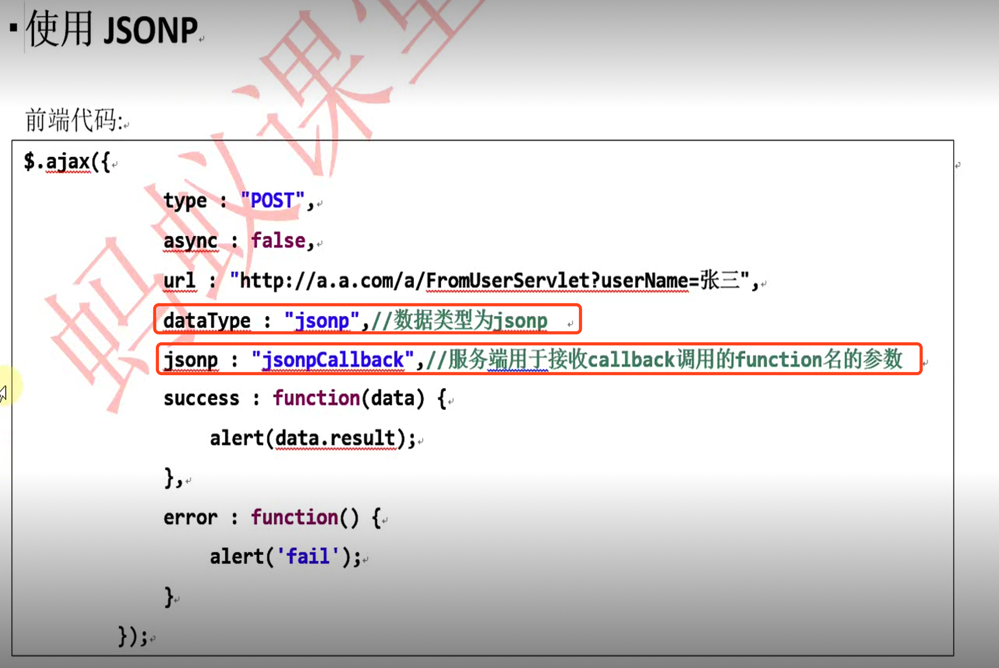
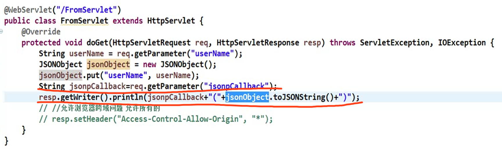
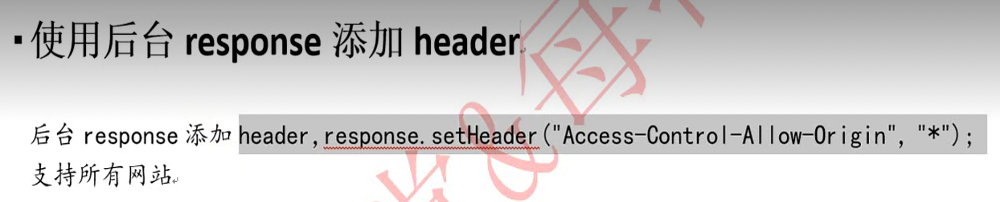

# 跨域解决方案
跨域是浏览器安全机制，请求访问的域名与ajax请求地址不一致，浏览器会无法返回请求结果。
浏览器默认 ajax网站资源必须在同一个域名下请求。

跨域问题解决方案：

1.jsonp支持get请求,不支持post请求。

2.使用接口网关---nginx、springcloud zull  网关转发  一般互联网公司实际案例。

3.httpclient内部转发。

4.添加header请求允许访问。`response.setHeader("Access-Control-Allow-Origin","*");`
