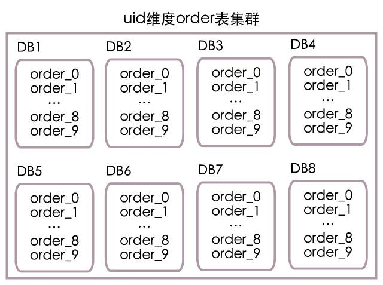
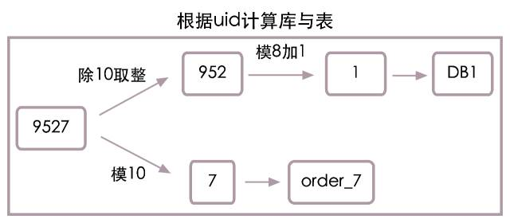
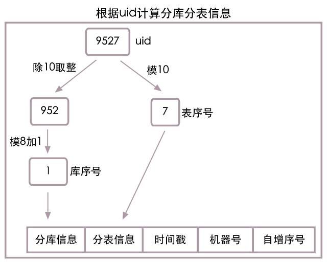
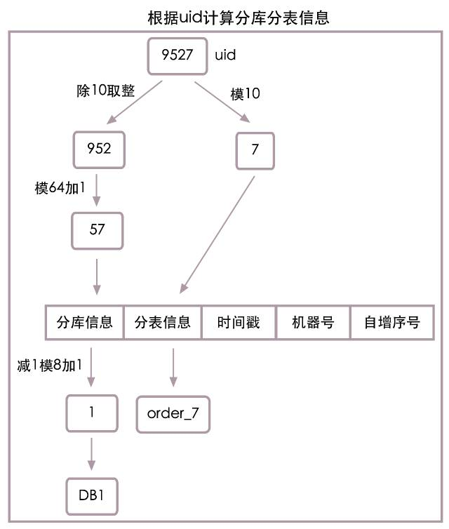
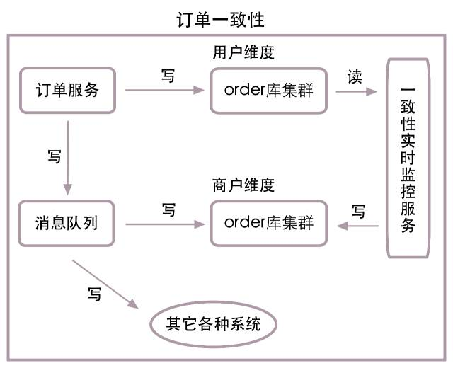
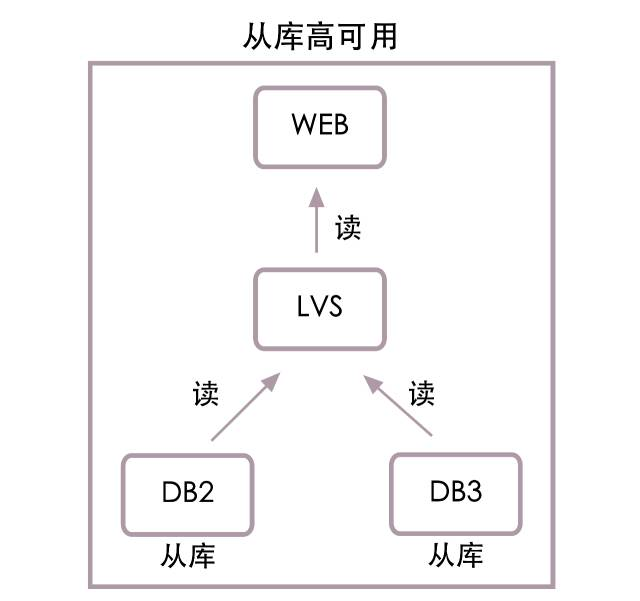
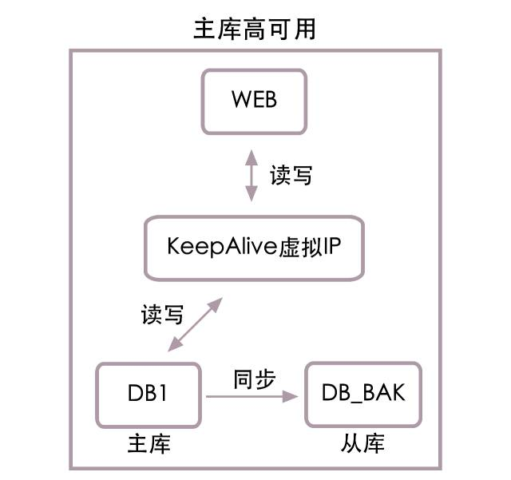
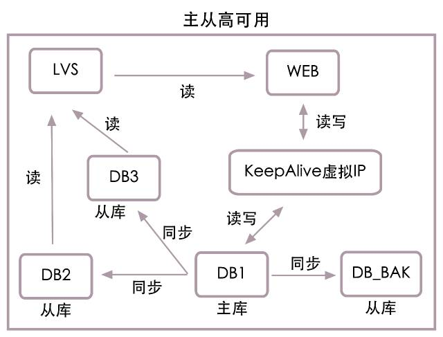
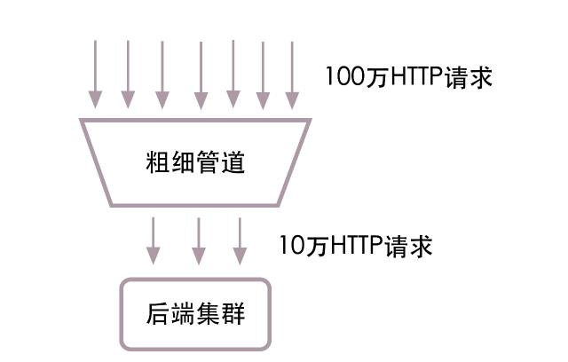

[每秒处理10万订单乐视集团支付架构](https://blog.csdn.net/qiansg123/article/details/80123124)
>声明：本文为CSDN原创投稿文章，未经许可，禁止任何形式的转载。 
作者：梁阳鹤，乐视网boss平台技术部架构师，主要负责乐视集团支付，乐视会员系统，商业运营平台等系统架构工作。开源数据访问层框架[mango](http://mango.jfaster.org)作者。 

随着乐视硬件抢购的不断升级，乐视集团支付面临的请求压力百倍乃至千倍的暴增。作为商品购买的最后一环，保证用户快速稳定的完成支付尤为重要。所以在15年11月，我们对整个支付系统进行了全面的架构升级，使之具备了每秒稳定处理10万订单的能力。为乐视生态各种形式的抢购秒杀活动提供了强有力的支撑。

# 一、库分表

在redis，memcached等缓存系统盛行的互联网时代，构建一个支撑每秒十万只读的系统并不复杂，无非是通过一致性哈希扩展缓存节点，水平扩展web服务器等。支付系统要处理每秒十万笔订单，需要的是每秒数十万的数据库更新操作（insert加update），这在任何一个独立数据库上都是不可能完成的任务，所以我们首先要做的是对订单表（简称order）进行分库与分表。

在进行数据库操作时，一般都会有用户ID（简称uid）字段，所以我们选择以uid进行分库分表。

分库策略我们选择了“二叉树分库”，所谓“二叉树分库”指的是：我们在进行数据库扩容时，都是以2的倍数进行扩容。比如：1台扩容到2台，2台扩容到4台，4台扩容到8台，以此类推。这种分库方式的好处是，我们在进行扩容时，只需DBA进行表级的数据同步，而不需要自己写脚本进行行级数据同步。

光是有分库是不够的，经过持续压力测试我们发现，在同一数据库中，对多个表进行并发更新的效率要远远大于对一个表进行并发更新，所以我们在每个分库中都将order表拆分成10份：order_0，order_1，….，order_9。

最后我们把order表放在了8个分库中（编号1到8，分别对应DB1到DB8），每个分库中10个分表（编号0到9，分别对应order_0到order_9），部署结构如下图所示：

根据uid计算数据库编号：

数据库编号 = (uid / 10) % 8 + 1

根据uid计算表编号：

表编号 = uid % 10

当uid=9527时，根据上面的算法，其实是把uid分成了两部分952和7，其中952模8加1等于1为数据库编号，而7则为表编号。所以uid=9527的订单信息需要去DB1库中的order_7表查找。具体算法流程也可参见下图：

有了分库分表的结构与算法最后就是寻找分库分表的实现工具，目前市面上约有两种类型的分库分表工具：
1.客户端分库分表，在客户端完成分库分表操作，直连数据库
2.使用分库分表中间件，客户端连分库分表中间件，由中间件完成分库分表操作

这两种类型的工具市面上都有，这里不一一列举，总的来看这两类工具各有利弊。客户端分库分表由于直连数据库，所以性能比使用分库分表中间件高15%到20%。而使用分库分表中间件由于进行了统一的中间件管理，将分库分表操作和客户端隔离，模块划分更加清晰，便于DBA进行统一管理。

我们选择的是在客户端分库分表，因为我们自己开发并开源了一套数据层访问框架，它的代号叫“芒果”，芒果框架原生支持分库分表功能，并且配置起来非常简单。

- 芒果主页：mango.jfaster.org

- 芒果源码：github.com/jfaster/mango

# 二、订单ID

订单系统的ID必须具有全局唯一的特征，最简单的方式是利用数据库的序列，每操作一次就能获得一个全局唯一的自增ID，如果要支持每秒处理10万订单，那每秒将至少需要生成10万个订单ID，通过数据库生成自增ID显然无法完成上述要求。所以我们只能通过内存计算获得全局唯一的订单ID。

JAVA领域最著名的唯一ID应该算是UUID了，不过UUID太长而且包含字母，不适合作为订单ID。通过反复比较与筛选，我们借鉴了Twitter的Snowflake算法，实现了全局唯一ID。下面是订单ID的简化结构图：

上图分为3个部分：

1.时间戳
这里时间戳的粒度是毫秒级，生成订单ID时，使用System.currentTimeMillis()作为时间戳。

2.机器号
每个订单服务器都将被分配一个唯一的编号，生成订单ID时，直接使用该唯一编号作为机器号即可。

3.自增序号
当在同一服务器的同一毫秒中有多个生成订单ID的请求时，会在当前毫秒下自增此序号，下一个毫秒此序号继续从0开始。比如在同一服务器同一毫秒有3个生成订单ID的请求，这3个订单ID的自增序号部分将分别是0，1，2。

上面3个部分组合，我们就能快速生成全局唯一的订单ID。不过光全局唯一还不够，很多时候我们会只根据订单ID直接查询订单信息，这时由于没有uid，我们不知道去哪个分库的分表中查询，遍历所有的库的所有表？这显然不行。所以我们需要将分库分表的信息添加到订单ID上，下面是带分库分表信息的订单ID简化结构图：

我们在生成的全局订单ID头部添加了分库与分表的信息，这样只根据订单ID，我们也能快速的查询到对应的订单信息。

分库分表信息具体包含哪些内容？第一部分有讨论到，我们将订单表按uid维度拆分成了8个数据库，每个数据库10张表，最简单的分库分表信息只需一个长度为2的字符串即可存储，第1位存数据库编号，取值范围1到8，第2位存表编号，取值范围0到9。

还是按照第一部分根据uid计算数据库编号和表编号的算法，当uid＝9527时，分库信息＝1，分表信息＝7，将他们进行组合，两位的分库分表信息即为”17”。具体算法流程参见下图：

上述使用表编号作为分表信息没有任何问题，但使用数据库编号作为分库信息却存在隐患，考虑未来的扩容需求，我们需要将8库扩容到16库，这时取值范围1到8的分库信息将无法支撑1到16的分库场景，分库路由将无法正确完成，我们将上诉问题简称为分库信息精度丢失。

为解决分库信息精度丢失问题，我们需要对分库信息精度进行冗余，即我们现在保存的分库信息要支持以后的扩容。这里我们假设最终我们会扩容到64台数据库，所以新的分库信息算法为：

分库信息 = (uid / 10) % 64 + 1

当uid＝9527时，根据新的算法，分库信息=57，这里的57并不是真正数据库的编号，它冗余了最后扩展到64台数据库的分库信息精度。我们当前只有8台数据库，实际数据库编号还需根据下面的公式进行计算：

实际数据库编号 = (分库信息 - 1) % 8 + 1

当uid＝9527时，分库信息＝57，实际数据库编号＝1，分库分表信息=”577”。

由于我们选择模64来保存精度冗余后的分库信息，保存分库信息的长度由1变为了2，最后的分库分表信息的长度为3。具体算法流程也可参见下图：

如上图所示，在计算分库信息的时候采用了模64的方式冗余了分库信息精度，这样当我们的系统以后需要扩容到16库，32库，64库都不会再有问题。

上面的订单ID结构已经能很好的满足我们当前与之后的扩容需求，但考虑到业务的不确定性，我们在订单ID的最前方加了1位用于标识订单ID的版本，这个版本号属于冗余数据，目前并没有用到。下面是最终订单ID简化结构图：

Snowflake算法：[github.com/twitter/snowflake](github.com/twitter/snowflake)

# 三、最终一致性

到目前为止，我们通过对order表uid维度的分库分表，实现了order表的超高并发写入与更新，并能通过uid和订单ID查询订单信息。但作为一个开放的集团支付系统，我们还需要通过业务线ID（又称商户ID，简称bid）来查询订单信息，所以我们引入了bid维度的order表集群，将uid维度的order表集群冗余一份到bid维度的order表集群中，要根据bid查询订单信息时，只需查bid维度的order表集群即可。

上面的方案虽然简单，但保持两个order表集群的数据一致性是一件很麻烦的事情。两个表集群显然是在不同的数据库集群中，如果在写入与更新中引入强一致性的分布式事务，这无疑会大大降低系统效率，增长服务响应时间，这是我们所不能接受的，所以我们引入了消息队列进行异步数据同步，来实现数据的最终一致性。当然消息队列的各种异常也会造成数据不一致，所以我们又引入了实时监控服务，实时计算两个集群的数据差异，并进行一致性同步。

下面是简化的一致性同步图：

# 四、数据库高可用

没有任何机器或服务能保证在线上稳定运行不出故障。比如某一时间，某一数据库主库宕机，这时我们将不能对该库进行读写操作，线上服务将受到影响。

所谓数据库高可用指的是：当数据库由于各种原因出现问题时，能实时或快速的恢复数据库服务并修补数据，从整个集群的角度看，就像没有出任何问题一样。需要注意的是，这里的恢复数据库服务并不一定是指修复原有数据库，也包括将服务切换到另外备用的数据库。

数据库高可用的主要工作是数据库恢复与数据修补，一般我们以完成这两项工作的时间长短，作为衡量高可用好坏的标准。这里有一个恶性循环的问题，数据库恢复的时间越长，不一致数据越多，数据修补的时间就会越长，整体修复的时间就会变得更长。所以数据库的快速恢复成了数据库高可用的重中之重，试想一下如果我们能在数据库出故障的1秒之内完成数据库恢复，修复不一致的数据和成本也会大大降低。

下图是一个最经典的主从结构：

上图中有1台web服务器和3台数据库，其中DB1是主库，DB2和DB3是从库。我们在这里假设web服务器由项目组维护，而数据库服务器由DBA维护。

当从库DB2出现问题时，DBA会通知项目组，项目组将DB2从web服务的配置列表中删除，重启web服务器，这样出错的节点DB2将不再被访问，整个数据库服务得到恢复，等DBA修复DB2时，再由项目组将DB2添加到web服务。

当主库DB1出现问题时，DBA会将DB2切换为主库，并通知项目组，项目组使用DB2替换原有的主库DB1，重启web服务器，这样web服务将使用新的主库DB2，而DB1将不再被访问，整个数据库服务得到恢复，等DBA修复DB1时，再将DB1作为DB2的从库即可。

上面的经典结构有很大的弊病：不管主库或从库出现问题，都需要DBA和项目组协同完成数据库服务恢复，这很难做到自动化，而且恢复工程也过于缓慢。

我们认为，数据库运维应该和项目组分开，当数据库出现问题时，应由DBA实现统一恢复，不需要项目组操作服务，这样便于做到自动化，缩短服务恢复时间。

先来看从库高可用结构图：

如上图所示，web服务器将不再直接连接从库DB2和DB3，而是连接LVS负载均衡，由LVS连接从库。这样做的好处是LVS能自动感知从库是否可用，从库DB2宕机后，LVS将不会把读数据请求再发向DB2。同时DBA需要增减从库节点时，只需独立操作LVS即可，不再需要项目组更新配置文件，重启服务器来配合。

再来看主库高可用结构图：

如上图所示，web服务器将不再直接连接主库DB1，而是连接KeepAlive虚拟出的一个虚拟ip，再将此虚拟ip映射到主库DB1上，同时添加DB_bak从库，实时同步DB1中的数据。正常情况下web还是在DB1中读写数据，当DB1宕机后，脚本会自动将DB_bak设置成主库，并将虚拟ip映射到DB_bak上，web服务将使用健康的DB_bak作为主库进行读写访问。这样只需几秒的时间，就能完成主数据库服务恢复。

组合上面的结构，得到主从高可用结构图：

数据库高可用还包含数据修补，由于我们在操作核心数据时，都是先记录日志再执行更新，加上实现了近乎实时的快速恢复数据库服务，所以修补的数据量都不大，一个简单的恢复脚本就能快速完成数据修复。

# 五、数据分级

支付系统除了最核心的支付订单表与支付流水表外，还有一些配置信息表和一些用户相关信息表。如果所有的读操作都在数据库上完成，系统性能将大打折扣，所以我们引入了数据分级机制。

我们简单的将支付系统的数据划分成了3级：

第1级：订单数据和支付流水数据；这两块数据对实时性和精确性要求很高，所以不添加任何缓存，读写操作将直接操作数据库。

第2级：用户相关数据；这些数据和用户相关，具有读多写少的特征，所以我们使用redis进行缓存。

第3级：支付配置信息；这些数据和用户无关，具有数据量小，频繁读，几乎不修改的特征，所以我们使用本地内存进行缓存。

使用本地内存缓存有一个数据同步问题，因为配置信息缓存在内存中，而本地内存无法感知到配置信息在数据库的修改，这样会造成数据库中数据和本地内存中数据不一致的问题。

为了解决此问题，我们开发了一个高可用的消息推送平台，当配置信息被修改时，我们可以使用推送平台，给支付系统所有的服务器推送配置文件更新消息，服务器收到消息会自动更新配置信息，并给出成功反馈。

# 六、粗细管道

黑客攻击，前端重试等一些原因会造成请求量的暴涨，如果我们的服务被激增的请求给一波打死，想要重新恢复，就是一件非常痛苦和繁琐的过程。

举个简单的例子，我们目前订单的处理能力是平均10万下单每秒，峰值14万下单每秒，如果同一秒钟有100万个下单请求进入支付系统，毫无疑问我们的整个支付系统就会崩溃，后续源源不断的请求会让我们的服务集群根本启动不起来，唯一的办法只能是切断所有流量，重启整个集群，再慢慢导入流量。

我们在对外的web服务器上加一层“粗细管道”，就能很好的解决上面的问题。

下面是粗细管道简单的结构图：

请看上面的结构图，http请求在进入web集群前，会先经过一层粗细管道。入口端是粗口，我们设置最大能支持100万请求每秒，多余的请求会被直接抛弃掉。出口端是细口，我们设置给web集群10万请求每秒。剩余的90万请求会在粗细管道中排队，等待web集群处理完老的请求后，才会有新的请求从管道中出来，给web集群处理。这样web集群处理的请求数每秒永远不会超过10万，在这个负载下，集群中的各个服务都会高校运转，整个集群也不会因为暴增的请求而停止服务。

如何实现粗细管道？nginx商业版中已经有了支持，相关资料请搜索

nginx max_conns，需要注意的是max_conns是活跃连接数，具体设置除了需要确定最大TPS外，还需确定平均响应时间。

nginx相关：[http://nginx.org/en/docs/http/ngx_http_upstream_module.html](http://nginx.org/en/docs/http/ngx_http_upstream_module.html)

编辑推荐：架构技术实践系列文章（部分）：

- [梁阳鹤：每秒处理10万订单乐视集团支付架构]()

- [沈辉煌：亿级日PV的魅族云同步的核心协议与架构实践]()

- [携程Docker最佳实践]()

- [游戏研发与运营环境Docker化]()

- [当当网高可用架构之道]()

- [黄哲铿：应对电商大促峰值的九个方法]()

- [1号店交易系统架构如何向「高并发高可用」演进]()

- [从C10K到C10M高性能网络的探索与实践]()

- [服务化架构的演进与实践]()

- [1号店架构师王富平：一号店用户画像系统实践]()

- [唯品会官华：实现电商平台从业务到架构的治理体系]()

- [沈剑：58同城数据库架构最佳实践]()

- [荔枝FM架构师刘耀华：异地多活IDC机房架构]()

- [UPYUN的云CDN技术架构演进之路]()

- [初页CTO丁乐：分布式以后还能敏捷吗？]()

- [陈科：河狸家运维系统监控系统的实现方案]()

- [途牛谭俊青：多数据中心状态同步&两地三中心的理论]()

- [云运维的启示与架构设计]()

- [魅族多机房部署方案]()

- [艺龙十万级服务器监控系统开发的架构和心得]()

- [京东商品详情页应对“双11”大流量的技术实践]()

- [架构师于小波：魅族实时消息推送架构]()