# Mybatis介绍

Mybatis是在2010年由阿帕奇下的开源项目ibatis迁移到谷歌codde后，更改为mybatis。

这是一个十分好用的持久层的框架，我们能过通过这种框架实现对jdbc操作的数据库进行封装，我们只需要关心我们数据库SQL本身就可以了，不用麻烦的去注册驱动，连接数据库等复杂的过程。

在这里，其主要是用来xml来执行我们一寝的配置，通过java对象和statement中的sql映射生成我们最终想要的SQL语句，最后，我们 由mybatis框架执行sql语句和将结果映射成java对象返回即可。

# Mybatis架构（牢记）

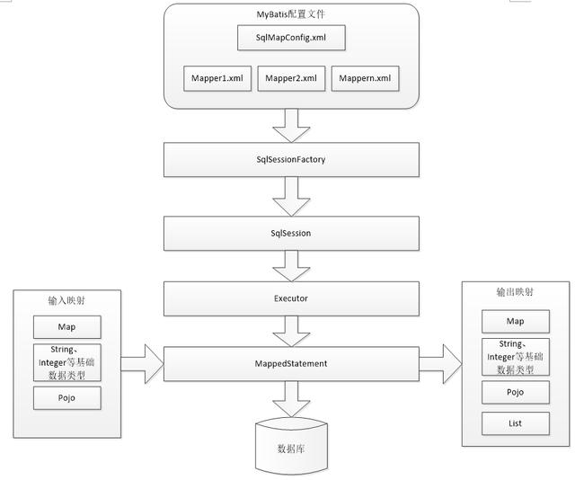

1、 mybatis配置 文件

在上图中我们可以看到最上面的SqlMapConfig.xml，这个配置文件是我们的全局配置文件，我们其中可以配置mybatis的运行环境等等，而mapper.xml文件就是我们说的sql映射文件，我们在此文件中配置了sql语句，执行的时候此文件还需要在全局配置文件中加载。

2、 通过配置等一些的信息，我们可以构造出SqlSessionFactory（会话工厂）

3、 通过会话工厂创建sqlSession（会话），我们操作的sql就是通过sqlSession执行的。

4、 mybatis的底层自定义了Executor执行器接口操作数据库

5、 Mapped Statement，它封装了mybatis的一些配置信息和sql映射信息等等。mapper.xml文件中我们每一个sql都对应着一个Mapped Statement对象。

# Mybatis入门程序

先给大家看一下，所有代码文件的布局。下面的步骤，我们按照这些去补全。

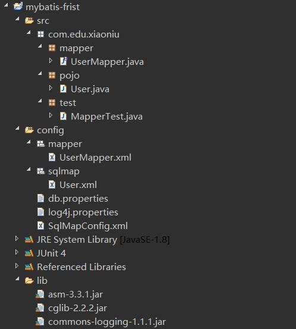

##### 1.下载jar包

>下载地址 https://github.com/mybatis/mybatis-3/releases

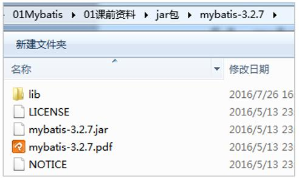

在这个包里面我们可以看到，第一个是其依赖包，第三个是其核心包。

##### 2.环境搭建

首先，我们先新建一个项目工程，新建lib，将我们上面的核心包和依赖包全部加入到项目中，除此之外，不要忘了还有我们的数据库的驱动包也要添加进来（参考开篇文章）。具体的效果如下图。

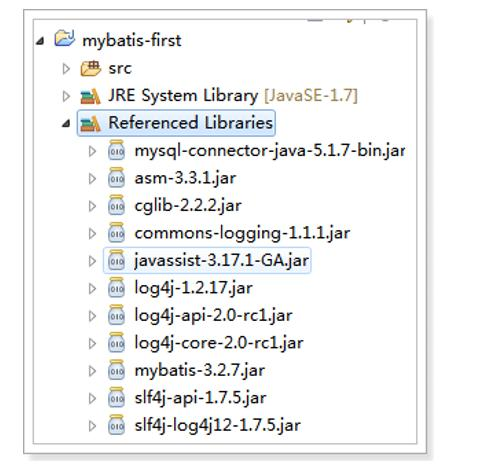

##### 3.加入配置文件

我们新建一个资源文件包，并在其中加入3个配置文件。

3.1配置文件log4j.properties（日志信息）

对于日文件我们直接拷贝即可。

># Global logging configurationlog4j.rootLogger=DEBUG, stdout# Console output...log4j.appender.stdout=org.apache.log4j.ConsoleAppenderlog4j.appender.stdout.layout=org.apache.log4j.PatternLayoutlog4j.appender.stdout.layout.ConversionPattern=%5p [%t] - %m%n

3.2配置文件 db.properties

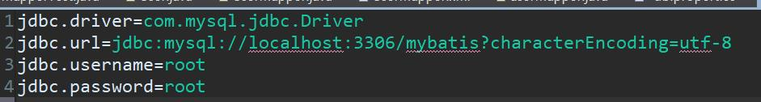

我们通过key，value的形式来配置加载数据库的连接。

3.3配置文件SqlMapConfig.xml

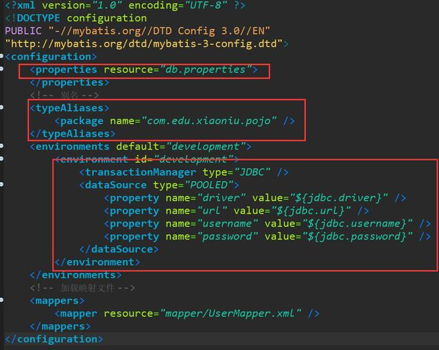

上面图片就是一个.xml的配置文件，我们通过<properties>将数据库连接的文件加载进来，通过typeAlias修一下我们过长的类型，再往下就是加载我们的数据库信息了。

其中主要的配置信息大概是这个样子的，

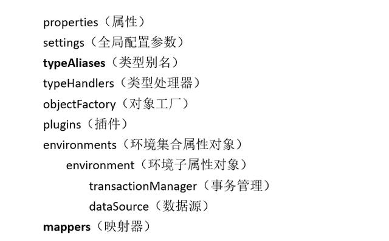

##### 3.封装pojo

我们的数据库是这么定义的。

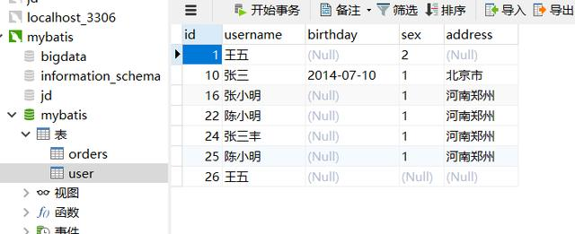

像以前一样我们将我们使用的字段进行封装，获取get，set方法，tostring方法。

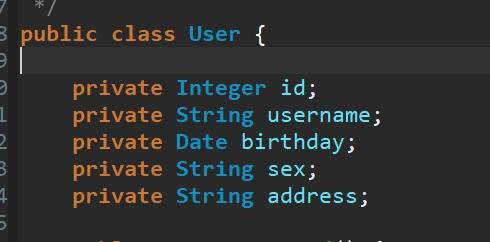

##### 4.Mapper.xml(映射文件)

接下来，我们需要定义一个mapper映射文件UserMapper.xml，具体的效果图如下所示。这个文件其实就是存我们各种sql语句的。

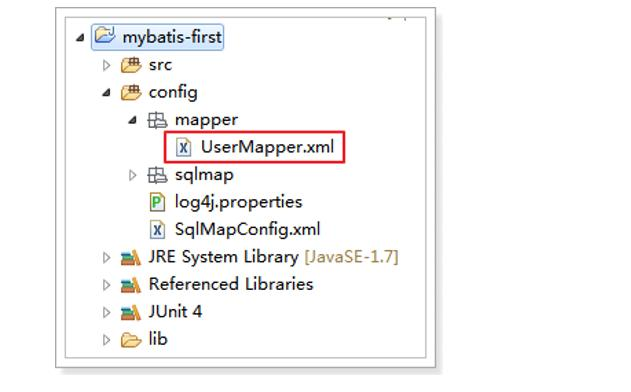

具体内容是，这里我们定义了3个SQL语句，分别是查询用户和保存用户信息的sql语句。

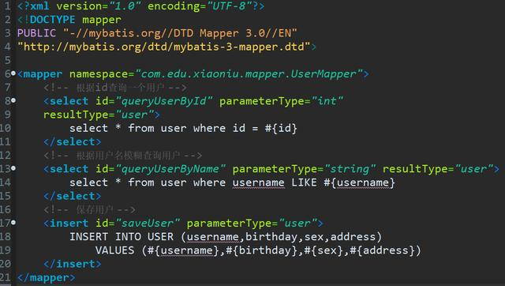

##### 5.UserMapper(接口文件)

内容如下，我们定义了3个接口，分别表示我们之后实现的方法。

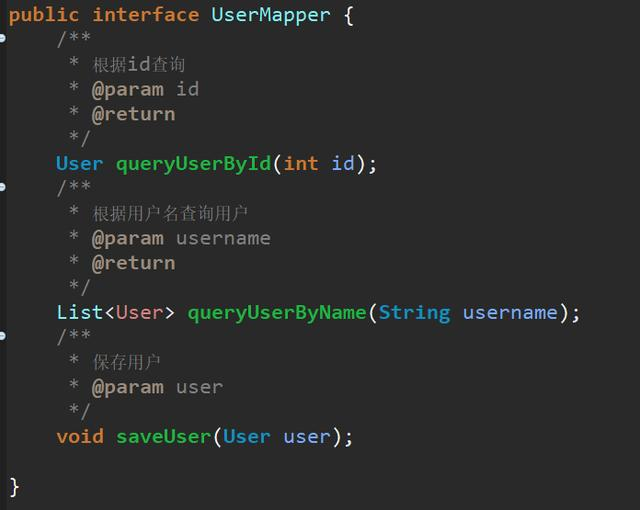

6.加载UserMapper.xml文件

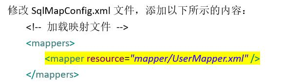

##### 7.测试

测试的时候，就是我们要按照最上面的流程图一次进行，这里需要大家写的地方只有红框中的内容，我们只演示通过id查询。代码图如下。

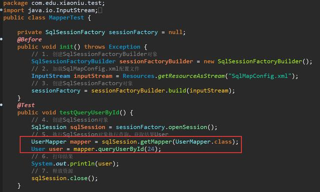

完成之后，我们的代码也就写完了。我们将类名选中后，点击右键run as通过测试来运行代码。

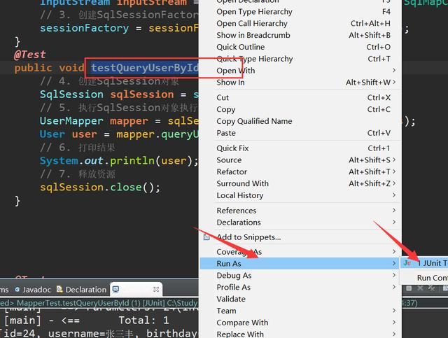

打印完成之后，大家会看到好多行运行结果，这不是错误，是我们之前设置的日志文件，我们仔细查看，便能找到我们的结果。

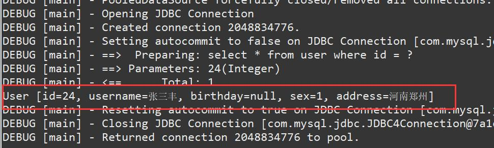

面就是我们介绍的开源的优秀的持久层框架Mybatis，我们在加入jar包后，我们添加3个配置文件用来加载数据库，封装完数据。

我们只需要在UserMapper.xml文件中添加sql语句，便可以通过mybatis框架执行sql语句和将结果映射成java对象返回即可。需要我们修改的地方，其实就是这两处，是不是更加的快人一步。