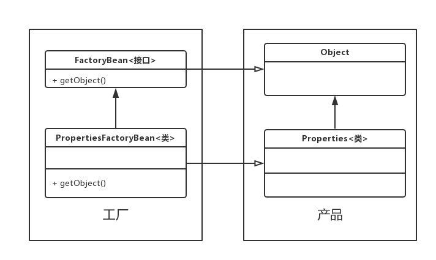

在上一篇我们分析了Spring IOC的核心部分——bean的创建和组装，最后留下了FactoryBean的处理并未讲解，是因为我觉得应当单独用一篇来详细介绍，也因此足见它的重要性。在Spring的文档中是这样定义FactoryBean的：

>The FactoryBean interface is a point of pluggability into the Spring IoC container’s instantiation logic. If you have complex initialization code that is better expressed in Java as opposed to a (potentially) verbose amount of XML, you can create your own FactoryBean, write the complex initialization inside that class, and then plug your custom FactoryBean into the container.

翻译过来就是

>FactoryBean接口是Spring IOC容器的实例化逻辑的可插拔点。如果有复杂的bean初始化，相对于冗长的xml方式，期望通过java编程的方式来表达，就可以通过创建自定义的FactoryBean来实现并将FactoryBean插入到IOC容器中。

上面的解释可能有些抽象，简单地说，FactoryBean就是可以创建Bean对象的工厂Bean。在Spring中，通过FactoryBean来扩展的遍地都是：AOP,ORM,事务管理，JMX,Remoting，Freemarker,Velocity等等。下面我们就来分析下FactoryBean的原理。

# 1.FactoryBean的定义#

FactoryBean接口只有三个方法

- getObject()

- getObjectType()

- isSingleton()
```
public interface FactoryBean<T> {

  	//返回工厂创建的bean对象实例，可以是单例的也可以是多例
  	T getObject() throws Exception;

  	// 返回创建对象的类型
  	Class<?> getObjectType();

      // 创建的对象是否单例
  	boolean isSingleton();
}
```
# 2.FactoryBean的原理#

如何判断一个bean是FactoryBean，除了根据对象是否实现了FactoryBean接口，在BeanFactory容器基础接口中特别定义了FactoryBean的前缀。
```
public interface BeanFactory {

	String FACTORY_BEAN_PREFIX = "&";
}
```
给定一个id=mybean的FactoryBean，getBean("mybean")得到的就是这个FactoryBean创建的对象实例，而getBean("&mybean")得到的确实FactoryBean自身对象。

在AbstractBeanFactory的doGetBean中，当创建好或获取到Bean的对象实例后，不论是singleton、prototype或者其他scope的，都会调用getObjectForBeanInstance方法，这个方法就是处理FactoryBean的入口。
```
protected Object getObjectForBeanInstance(
		Object beanInstance, String name, String beanName, RootBeanDefinition mbd) {

	// 判断如果请求一个&前缀的beanName，而实例化的对象不是FactoryBean的子类，则抛出BeanIsNotAFactoryException异常
	if (BeanFactoryUtils.isFactoryDereference(name) && !(beanInstance instanceof FactoryBean)) {
		throw new BeanIsNotAFactoryException(transformedBeanName(name), beanInstance.getClass());
	}

	// 如果bean实例对象不是FactoryBean的子类，或者请求的beanName以&前缀，则直接返回bean实例对象
	if (!(beanInstance instanceof FactoryBean) || BeanFactoryUtils.isFactoryDereference(name)) {
		return beanInstance;
	}

	Object object = null;
	// mbd==null说明FactoryBean实例对象是单例，且从单例缓存中取出，则从缓存中查询FactoryBean创建的bean实例对象
	if (mbd == null) {
		object = getCachedObjectForFactoryBean(beanName);
	}
	if (object == null) {
		// 强制转换beanInstance为FactoryBean
		FactoryBean<?> factory = (FactoryBean<?>) beanInstance;
		// 缓存不存在且mbd==null，则根据beanName获得RootBeanDefinition
		if (mbd == null && containsBeanDefinition(beanName)) {
			mbd = getMergedLocalBeanDefinition(beanName);
		}
		// bean是否为合成的，合成bean在获得FactoryBean创建好的bean对象实例后，不需要后置处理
		boolean synthetic = (mbd != null && mbd.isSynthetic());
		// FactoryBean创建bean实例对象
		object = getObjectFromFactoryBean(factory, beanName, !synthetic);
	}
	return object;
}
```
BeanFactoryUtils.isFactoryDereference(name)方法判断name是否以&前缀
```
public static boolean isFactoryDereference(String name) {
	return (name != null && name.startsWith(BeanFactory.FACTORY_BEAN_PREFIX));
}
```
getObjectFromFactoryBean是实际操作的入口。
```
protected Object getObjectFromFactoryBean(FactoryBean<?> factory, String beanName, boolean shouldPostProcess) {
	// FactoryBean是单例，且已存在单例对象
	if (factory.isSingleton() && containsSingleton(beanName)) {
		// 以singletonObjects为锁，保证创建的对象为单例
		synchronized (getSingletonMutex()) {
			// 查询缓存是否存在
			Object object = this.factoryBeanObjectCache.get(beanName);
			if (object == null) {
				// 调用FactoryBean的getObject方法获取bean实例对象
				object = doGetObjectFromFactoryBean(factory, beanName);
				// 再次查询缓存是否存在
				Object alreadyThere = this.factoryBeanObjectCache.get(beanName);
				if (alreadyThere != null) {
					object = alreadyThere;
				}
				else {
					// 调用FactoryBean后置处理
					// 默认直接返回bean
					if (object != null && shouldPostProcess) {
						try {
							object = postProcessObjectFromFactoryBean(object, beanName);
						}
						catch (Throwable ex) {
							throw new BeanCreationException(beanName,
									"Post-processing of FactoryBean's singleton object failed", ex);
						}
					}
					// 加入缓存
					this.factoryBeanObjectCache.put(beanName, (object != null ? object : NULL_OBJECT));
				}
			}
			return (object != NULL_OBJECT ? object : null);
		}
	}
	else {
		// FactoryBean为多例，直接调用getObject方法获取bean实例对象
		Object object = doGetObjectFromFactoryBean(factory, beanName);
		// FactoryBean后置处理
		if (object != null && shouldPostProcess) {
			try {
				object = postProcessObjectFromFactoryBean(object, beanName);
			}
			catch (Throwable ex) {
				throw new BeanCreationException(beanName, "Post-processing of FactoryBean's object failed", ex);
			}
		}
		return object;
	}
}
```
doGetObjectFromFactoryBean方法为实际获取FactoryBean创建的bean实例对象的触发点，核心方法就是调用FactoryBean的getObject方法
```
private Object doGetObjectFromFactoryBean(final FactoryBean<?> factory, final String beanName)
		throws BeanCreationException {

	Object object;
	try {
		if (System.getSecurityManager() != null) {
			AccessControlContext acc = getAccessControlContext();
			try {
				object = AccessController.doPrivileged(new PrivilegedExceptionAction<Object>() {
					[@Override](https://my.oschina.net/u/1162528)
					public Object run() throws Exception {
							return factory.getObject();
						}
					}, acc);
			}
			catch (PrivilegedActionException pae) {
				throw pae.getException();
			}
		}
		else {
			object = factory.getObject();
		}
	}
	catch (FactoryBeanNotInitializedException ex) {
		throw new BeanCurrentlyInCreationException(beanName, ex.toString());
	}
	catch (Throwable ex) {
		throw new BeanCreationException(beanName, "FactoryBean threw exception on object creation", ex);
	}

	// Do not accept a null value for a FactoryBean that's not fully
	// initialized yet: Many FactoryBeans just return null then.
	if (object == null && isSingletonCurrentlyInCreation(beanName)) {
		throw new BeanCurrentlyInCreationException(
				beanName, "FactoryBean which is currently in creation returned null from getObject");
	}
	return object;
}
```
对于单例的FactoryBean，生产出的bean对象实例也是单例的并有缓存，而多例的也是遵循每请求一次就创建一个新对象。

# 3. PropertiesFactoryBean#

看完FactoryBean的原理，我们来介绍一个简单的实例。PropertiesFactoryBean是经常使用的spring资源配置文件加载工具，通常使用#{prop.key}来获取资源文件的属性值，prop为PropertiesFactoryBean在spring容器中的name，而key为资源文件中的key，但是key常常以点号分隔，比如key.name=value这样的，则可以通过#{prop['key.name']}这样的表达式来获取。来看个具体的例子。

example.properties文件中定义了key为example.factorybean的一个配置
```
example.factorybean=PropertiesFactoryBean
```
PropertiesBean.java需要注入配置文件中的配置到propertiesValue属性中，并将propertiesValue的值打印出来。
```
package com.lntea.spring.demo.bean;


public class PropertiesBean {

	private String propertiesValue;
	
	public void print(){
		System.out.println("propertiesValue:"+propertiesValue);
	}

	public String getPropertiesValue() {
		return propertiesValue;
	}

	public void setPropertiesValue(String propertiesValue) {
		this.propertiesValue = propertiesValue;
	}
}
```
properties.xml定义了PropertiesFactoryBean，设置name为prop，并对locations属性赋值classpath下的example.properties资源。另外定义了上面的PropertiesBean，指定propertiesValue属性的值为#{prop['example.factorybean']}
```
<?xml version="1.0" encoding="UTF-8"?>
<beans xmlns="http://www.springframework.org/schema/beans"
	xmlns:xsi="http://www.w3.org/2001/XMLSchema-instance" 
	xsi:schemaLocation="
	http://www.springframework.org/schema/beans
	http://www.springframework.org/schema/beans/spring-beans-3.0.xsd">
	
	<bean id="prop" class="org.springframework.beans.factory.config.PropertiesFactoryBean">
		<property name="locations">
			<value>classpath:example.properties</value>
		</property>
	</bean>
	
	<bean id="propertiesBean" class="com.lntea.spring.demo.bean.PropertiesBean">
		<property name="propertiesValue" value="#{prop['example.factorybean']}"></property>
	</bean>
</beans>
```
来下个测试
```
ApplicationContext context = new ClassPathXmlApplicationContext("properties.xml");
PropertiesBean propertiesBean = context.getBean("propertiesBean",PropertiesBean.class);
propertiesBean.print();
```
执行结果拿到了example.factorybean对应的值“PropertiesFactoryBean”。看过之前spring的xml文件解析的可能会问，property标签里的value属性解析出来就是String对象啊，怎么会转换成资源文件里的值呢。

这里简要介绍一下，ApplicationContext创建时会默认注入一个spring表达式的解析类，叫StandardBeanExpressionResolver，负责解析#{}这样的表达式。当拿到value属性中的#{prop['example.factorybean']}，解析类识别出#{}的表达式，然后再从spring容器中查找name=prop的bean对象，因为我们在properties.xml中配置过PropertiesFactoryBean的id=prop,因此就会通过getBean加载，而PropertiesFactoryBean是FactoryBean的子类，最后就通过 getObejct方法获取真正的bean实例对象。返回的bean实力对象是一个Properties对象，再从中查询example.factorybean的key对应的值，得到最终的结果。关于spring表达式的解析这里就略过，我们主要来看下PropertiesFactoryBean的源码。
```
public class PropertiesFactoryBean extends PropertiesLoaderSupport
	implements FactoryBean<Properties>, InitializingBean {

	private boolean singleton = true;

	private Properties singletonInstance;


	// 设置是否单例
	public final void setSingleton(boolean singleton) {
		this.singleton = singleton;
	}

	[@Override](https://my.oschina.net/u/1162528)
	publ	ic final boolean isSingleton() {
		return this.singleton;
	}


	// 实现InitializingBean接口，初始化时调用
	// 读取配置文件加载到Properties对象中
	[@Override](https://my.oschina.net/u/1162528)
	public final void afterPropertiesSet() throws IOException {
		if (this.singleton) {
			this.singletonInstance = createProperties();
		}
	}

	// 返回加载完的Properties对象
	[@Override](https://my.oschina.net/u/1162528)
	public final Properties getObject() throws IOException {
		if (this.singleton) {
			return this.singletonInstance;
		}
		else {
			return createProperties();
		}
	}

	[@Override](https://my.oschina.net/u/1162528)
	public Class<Properties> getObjectType() {
		return Properties.class;
	}


	// 资源文件加载方法
	protected Properties createProperties() throws IOException {
		return mergeProperties();
	}

}
```
PropertiesFactoryBean实现了InitializingBean接口的afterPropertiesSet方法，在bean初始化时调用createProperties方法加载资源文件。而实际调用的mergeProperties在父类PropertiesLoaderSupport中实现。
```
protected Properties mergeProperties() throws IOException {
	Properties result = new Properties();

	if (this.localOverride) {
		// Load properties from file upfront, to let local properties override.
		loadProperties(result);
	}

	if (this.localProperties != null) {
		for (Properties localProp : this.localProperties) {
			CollectionUtils.mergePropertiesIntoMap(localProp, result);
		}
	}

	if (!this.localOverride) {
		// Load properties from file afterwards, to let those properties override.
		loadProperties(result);
	}

	return result;
}

protected void loadProperties(Properties props) throws IOException {
	if (this.locations != null) {
		for (Resource location : this.locations) {
			if (logger.isInfoEnabled()) {
				logger.info("Loading properties file from " + location);
			}
			try {
				PropertiesLoaderUtils.fillProperties(
						props, new EncodedResource(location, this.fileEncoding), this.propertiesPersister);
			}
			catch (IOException ex) {
				if (this.ignoreResourceNotFound) {
					if (logger.isWarnEnabled()) {
						logger.warn("Could not load properties from " + location + ": " + ex.getMessage());
					}
				}
				else {
					throw ex;
				}
			}
		}
	}
}
```
最后通过PropertiesLoaderUtils.fillProperties方法读取配置文件的输入流加载到Properties对象中。

通过源码看起来PropertiesFactoryBean的实现比较简单，首先实现InitializingBean接口，再bean初始化时加载资源，当调用FactoryBean的getObject方法时将加载完的Properties对象返回。**其实大部分的FactoryBean的子类都是通过此种方式来完成和spring的对接，先是在初始化时处理准备工作，然后在getObject调用时返回真正的bean实例对象。**而FactoryBean作为Spring的重要扩展之一，其实现方式如此简单，真的值得好好学习。

# 4.工厂方法模式#

上面我们聊了FactoryBean的原理和实现，最后来看下它的设计模式。工厂方法模式其实非常常见，应用者众多，因为其很好理解且非常使用。先来看下FactoryBean的UML图 。 



FactoryBean是工厂的接口，接口中的getObject方法返回的产品默认是一个Object。PropertiesFactoryBean是工厂的一个实现，生产出来的是Object的子类Properties。对于不同的工厂实现，生产出来的产品也是不同的。比如JndiObjectFactoryBean返回的是JNDI对象，RmiProxyFactoryBean返回的是RMI对象。

工厂方法模式，在编写代码时并不清楚要创建的对象是什么，因而只定义接口及通用方法，把具体的实现交给子类来处理，因为不同的子类所创建的对象并不一致。

这一章中我们重点讨论了FactoryBean，因为它是spring容器的重要扩展之一，而另一重要的扩展方式则是BeanPostProcessor，接下来我们就来分析下BeanPostProcessor和bean的初始化。