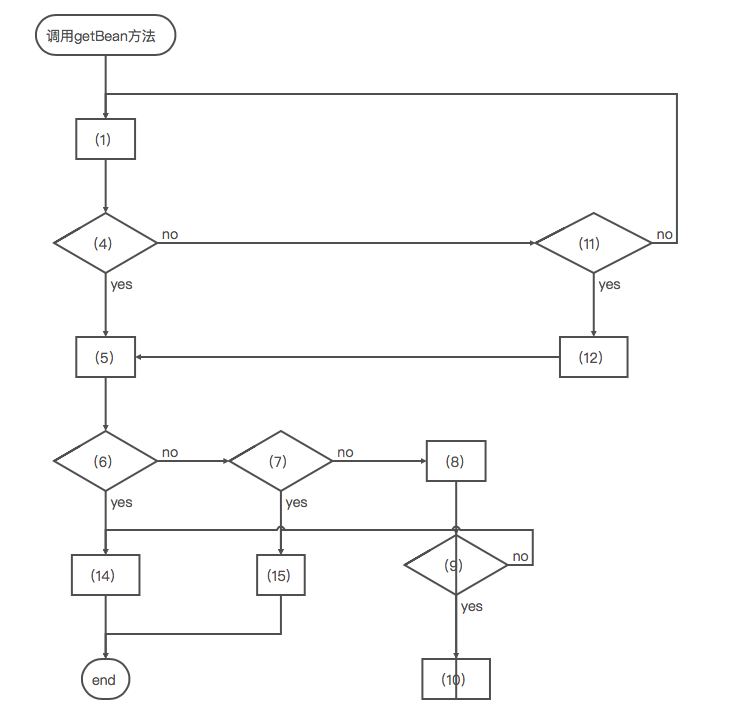

# spring-getBean方法流程

### 流程图



 (1）调用AbstractBeanFactory的doGetBean方法 

（2）转化beanName，如果包含&，删除之 

（3）根据beanName从缓存中获取Bean 

（4）Bean 是否 不为null并且args为null 

（5）调用getObjectForBeanInstance方法 

（6） 判断BeanInstance是否为FactoryBean类型并且不以name为&开头 

（7）判断BeanInstance不是FactoryBean类型的或者是FactoryBean类型的并且以&开头 

（8）从FactoryBean生成的实例缓存中获取obean 

（9）判断bean是否为null 

（10）根据FactoryBean的getObject方法返回Bean 

（11）检查BeanFactory是否包含此Bean定义,如果不包含，继续自己的父BeanFactory查找 

（12）获取bean的依赖项 

（13）调用getObjectForBeanInstance方法 

（14）抛出异常 

（15）返回Bean

# 代码注释
```
protected <T> T doGetBean(
            final String name, final Class<T> requiredType, final Object[] args, boolean typeCheckOnly)
            throws BeansException {

        final String beanName = transformedBeanName(name);
        Object bean;

        // 从缓存中获取BeanInstance，此BeanInstance在我看来，这才是真正创建Bean实例的工厂，根据不同的情况这个Bean实例做处理，或直接返回，如果是FactoryBean并且并且那么没有以&开头则调用其方法getObject（）返回实例
        Object sharedInstance = getSingleton(beanName);
        if (sharedInstance != null && args == null) {
            if (logger.isDebugEnabled()) {
                if (isSingletonCurrentlyInCreation(beanName)) {
                    logger.debug("Returning eagerly cached instance of singleton bean '" + beanName +
                            "' that is not fully initialized yet - a consequence of a circular reference");
                }
                else {
                    logger.debug("Returning cached instance of singleton bean '" + beanName + "'");
                }
            }
            //真正的bean 返回处理
            bean = getObjectForBeanInstance(sharedInstance, name, beanName, null);
        }

        else {
            // 假设循环依赖的时候，如果我们已经开始在当前线程中创建此bean实例，但是还没有创建完成，则失败；例如此时是A依赖于B，但是B不依赖于A，B也没有任何属性依赖于A，则不存在循环依赖，那么无论B初始化，未初始化都不会有以下情况。但是如果B依赖于A，A在获取依赖的Bean是激活创建B的方法，那么B创建过程中就会出现以下情况。就会出现循环依赖错误。如果A，B 是单例的并且A的构造函数不包含B，B的构造函数不包含A，spring还是可以通过提前暴露实例地址处理这种依赖，但是其它情况spring也无能为力了。循环依赖也是一个大问题。。。
            if (isPrototypeCurrentlyInCreation(beanName)) {
                throw new BeanCurrentlyInCreationException(beanName);
            }

            // 判断工厂中是否含有此Bean的定义
            BeanFactory parentBeanFactory = getParentBeanFactory();
            if (parentBeanFactory != null && !containsBeanDefinition(beanName)) {
                // 如果没有，查询父工厂
                String nameToLookup = originalBeanName(name);
                if (args != null) {
                    // 执行带有args参数的getbean方法
                    return (T) parentBeanFactory.getBean(nameToLookup, args);
                }
                else {
                    //如果没有参数，执行标准的getbean方法 
                    return parentBeanFactory.getBean(nameToLookup, requiredType);
                }
            }

            //如果不仅仅是做类型检查，那么需要标记此Bean正在创建之中
            if (!typeCheckOnly) {
                markBeanAsCreated(beanName);
            }

            try {
                final RootBeanDefinition mbd = getMergedLocalBeanDefinition(beanName);
                checkMergedBeanDefinition(mbd, beanName, args);

                // 获取依赖的Bean
                String[] dependsOn = mbd.getDependsOn();
                if (dependsOn != null) {
                    for (String dependsOnBean : dependsOn) {
                        if (isDependent(beanName, dependsOnBean)) {
                            throw new BeanCreationException(mbd.getResourceDescription(), beanName,
                                    "Circular depends-on relationship between '" + beanName + "' and '" + dependsOnBean + "'");
                        }
                        registerDependentBean(dependsOnBean, beanName);
                        getBean(dependsOnBean);
                    }
                }

                // 这里终于开始创建Bean实例了，如果是单例的，那么会创建一个单例的匿名工厂，如果是原型模式的，则不需要创建单例的工厂的，其他的如request、session作用域的，则根据自身的需要
                if (mbd.isSingleton()) {
                    sharedInstance = getSingleton(beanName, new ObjectFactory<Object>() {
                        @Override
                        public Object getObject() throws BeansException {
                            try {
                                return createBean(beanName, mbd, args);
                            }
                            catch (BeansException ex) {
                                // Explicitly remove instance from singleton cache: It might have been put there
                                // eagerly by the creation process, to allow for circular reference resolution.
                                // Also remove any beans that received a temporary reference to the bean.
                                destroySingleton(beanName);
                                throw ex;
                            }
                        }
                    });
                    bean = getObjectForBeanInstance(sharedInstance, name, beanName, mbd);
                }

                else if (mbd.isPrototype()) {
                    // It's a prototype -> create a new instance.
                    Object prototypeInstance = null;
                    try {
                    //把当前的beanName加入正在创建beanName的集合中，会在第一步判断
                        beforePrototypeCreation(beanName);
                        prototypeInstance = createBean(beanName, mbd, args);
                    }
                    finally {
                    //把当前的beanName从正在创建beanName的集合中移除
                        afterPrototypeCreation(beanName);
                    }
                    bean = getObjectForBeanInstance(prototypeInstance, name, beanName, mbd);
                }

                else {
                    String scopeName = mbd.getScope();
                    final Scope scope = this.scopes.get(scopeName);
                    if (scope == null) {
                        throw new IllegalStateException("No Scope registered for scope name '" + scopeName + "'");
                    }
                    try {
                        Object scopedInstance = scope.get(beanName, new ObjectFactory<Object>() {
                            @Override
                            public Object getObject() throws BeansException {
                                beforePrototypeCreation(beanName);
                                try {
                                    return createBean(beanName, mbd, args);
                                }
                                finally {
                                    afterPrototypeCreation(beanName);
                                }
                            }
                        });
                        bean = getObjectForBeanInstance(scopedInstance, name, beanName, mbd);
                    }
                    catch (IllegalStateException ex) {
                        throw new BeanCreationException(beanName,
                                "Scope '" + scopeName + "' is not active for the current thread; consider " +
                                "defining a scoped proxy for this bean if you intend to refer to it from a singleton",
                                ex);
                    }
                }
            }
            catch (BeansException ex) {
                cleanupAfterBeanCreationFailure(beanName);
                throw ex;
            }
        }

        // 检查类型，如果不满足可以进行类型转换，如果转换器进行不了这两种类型的转换，则抛出异常
        if (requiredType != null && bean != null && !requiredType.isAssignableFrom(bean.getClass())) {
            try {
                return getTypeConverter().convertIfNecessary(bean, requiredType);
            }
            catch (TypeMismatchException ex) {
                if (logger.isDebugEnabled()) {
                    logger.debug("Failed to convert bean '" + name + "' to required type [" +
                            ClassUtils.getQualifiedName(requiredType) + "]", ex);
                }
                throw new BeanNotOfRequiredTypeException(name, requiredType, bean.getClass());
            }
        }
        return (T) bean;
    }
```