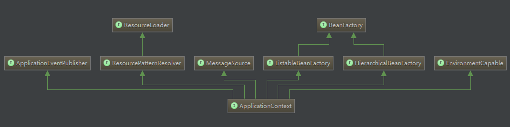

# ApplicationContext接口
在实际应用中使用Spring框架，大多数都不会使用`BeanFactory`的方式来构建Spring容器，因为Spring容器提供了一个更加简易而强大的方式——`ApplicationContext`。`ApplicationContext`也是一个接口，不仅继承了`BeanFactory`的功能特性，而且支持了其他高级容器的特性。先来看它的继承结构：



从继承的接口可以看出它支持了下面的几个特性：

1.MessageSource，支持多消息源，主要用于国际化

2.ApplicationEventPublisher,支持事件发布，与Spring的生命周期相结合，更好地管理和扩展Spring

3.ResourcePatternResolver，基类为ResourceLoader，支持资源模式，更好地对各种方式(文件或I/O)定义的资源文件的处理

4.EnvironmentCapable,对环境的感知

ApplicationContext本身提供的方法非常简单，只定义了id和名称的一些信息以及内部BeanFactory的get方法。

```
public interface ApplicationContext extends EnvironmentCapable, ListableBeanFactory, HierarchicalBeanFactory,
	MessageSource, ApplicationEventPublisher, ResourcePatternResolver {

    // 唯一id
    String getId();

    // 所属应用的名称
    String getApplicationName();

    // 显示名称
    String getDisplayName();

    // 启动时间
    long getStartupDate();

    // 父类ApplicationContext
    ApplicationContext getParent();

    // 内部BeanFactory
    AutowireCapableBeanFactory getAutowireCapableBeanFactory() throws IllegalStateException;
}
```

ApplicationContext的实现类有很多，常用的有：

- ClassPathXmlApplicationContext
- FileSystemXmlApplicationContext
- XmlWebApplicationContext

`ClassPathXmlApplicationContext`和`FileSystemXmlApplicationContext`只是加载资源文件的方式不同，而`XmlWebApplicationContext`是支持web项目，但是其底层的实现方式大部分都是一致的。下面就以常用的`ClassPathXmlApplicationContext`来举例分析Spring容器的启动原理。

# ClassPathXmlApplicationContext实现原理
实际的项目中启动一个Spring容器其实很简单
```
new ClassPathXmlApplicationContext("applicationcontext.xml");
CountDownLatch latch = new CountDownLatch(1);
latch.await();
```
首先创建`ClassPathXmlApplicationContext`对象，并传入配置文件路径，后面的两句只是用来阻塞主进程结束的。来看`ClassPathXmlApplicationContext`的构造方法。
```
public ClassPathXmlApplicationContext(String configLocation) throws BeansException {
	this(new String[] {configLocation}, true, null);
}

public ClassPathXmlApplicationContext(String[] configLocations, boolean refresh, ApplicationContext parent)
		throws BeansException {

	super(parent);
	setConfigLocations(configLocations);
	if (refresh) {
		refresh();
	}
}
```
super方法一直调用父类构造函数，直到AbstractApplicationContext抽象基类
```
public AbstractApplicationContext() {
	this.resourcePatternResolver = getResourcePatternResolver();
}

public AbstractApplicationContext(ApplicationContext parent) {
	this();
	setParent(parent);
}
```

this方法获得默认的资源解析器(ResourcePatternResolver)，setParent方法设置父ApplicationContext，默认parent传参为null。

setConfigLocations方法将构造方法传入的资源文件设置到AbstractRefreshableConfigApplicationContext方法的configLocations集合中。主要的操作refresh方法的实现是在AbstractApplicationContext类中。在refresh方法中，Spring抽象出每个细分操作为单独的方法，然后按顺序进行调用。具体来看源码。

```
public void refresh() throws BeansException, IllegalStateException {
	synchronized (this.startupShutdownMonitor) {
		// Prepare this context for refreshing.
		// 刷新前准备，主要是设置开始时间以及标识active标志位为true
		prepareRefresh();

		// Tell the subclass to refresh the internal bean factory.
		// 创建BeanFactory实例，并加载配置文件
		ConfigurableListableBeanFactory beanFactory = obtainFreshBeanFactory();

		// Prepare the bean factory for use in this context.
		// BeanFactory准备工作，主要是设置类加载器，Spring表达式解析器以及框架相关的Aware接口默认配置
		prepareBeanFactory(beanFactory);

		try {
			// Allows post-processing of the bean factory in context subclasses.
			// BeanFactory后置处理(BeanFactory初始化完成后的扩展)，如web项目中配置ServletContext
			postProcessBeanFactory(beanFactory);

			// Invoke factory processors registered as beans in the context.
			// 实例化并执行所有注册的BeanFactoryPostProcessor
			invokeBeanFactoryPostProcessors(beanFactory);

			// Register bean processors that intercept bean creation.
			// 实例化并注册所有BeanPostProcessor
			registerBeanPostProcessors(beanFactory);

			// Initialize message source for this context.
			// 初始化消息源
			initMessageSource();

			// Initialize event multicaster for this context.
			// 初始化上下文事件机制
			initApplicationEventMulticaster();

			// Initialize other special beans in specific context subclasses.
			// 为特殊的上下文预留的方法，初始化特殊的bean
			onRefresh();

			// Check for listener beans and register them.
			// 注册监听器
			registerListeners();

			// Instantiate all remaining (non-lazy-init) singletons.
			// 冻结所有配置并实例化所有非懒加载的单例bean
			finishBeanFactoryInitialization(beanFactory);

			// Last step: publish corresponding event.
			// 初始化生命周期，发布容器事件
			finishRefresh();
		}

		catch (BeansException ex) {
			logger.warn("Exception encountered during context initialization - cancelling refresh attempt", ex);

			// Destroy already created singletons to avoid dangling resources.
			// 销毁已经创建的单例bean
			destroyBeans();

			// Reset 'active' flag.
			// 重置active标识
			cancelRefresh(ex);

			// Propagate exception to caller.
			throw ex;
		}
	}
}
```

其实通过每个子方法的名称和注释基本就能清楚其内部处理的主要内容，下面分析一些比较重要的节点方法。

# 创建组装BeanFactory并加载资源文件
在`ClassPathXmlApplicationContext`构造方法中，定义的方法名为refresh，就是指刷新，也就是Spring容器不仅仅只是创建，也是可以刷新的，而refresh方法中的obtainFreshBeanFactory方法顾名思义是获得一个新鲜的BeanFactory，它的实现在`AbstractApplicationContext`中。

```
protected ConfigurableListableBeanFactory obtainFreshBeanFactory() {
	refreshBeanFactory();
	ConfigurableListableBeanFactory beanFactory = getBeanFactory();
	if (logger.isDebugEnabled()) {
		logger.debug("Bean factory for " + getDisplayName() + ": " + beanFactory);
	}
	return beanFactory;
}
```

可以看到，真正作用的是`refreshBeanFactory`，也就是真正对`BeanFactory`进行重置刷新的地方，然后refresh方法之后的操作基于一个新的`BeanFactory`进行组装重建，从而达到刷新整个Spring容器的目的。`refreshBeanFactory`方法的实现是在`AbstractApplicationContext`的子类`AbstractRefreshableApplicationContext`中。

```
protected final void refreshBeanFactory() throws BeansException {
	// 如果已存在BeanFactory，则销毁所有bean并关闭BeanFactory
	if (hasBeanFactory()) {
		destroyBeans();
		closeBeanFactory();
	}
	try {
		// 实例化一个新的BeanFactory
		DefaultListableBeanFactory beanFactory = createBeanFactory();
		// 设置序列化id为唯一id
		beanFactory.setSerializationId(getId());
		// BeanFactory的自定义配置
		customizeBeanFactory(beanFactory);
		// 加载资源配置文件
		loadBeanDefinitions(beanFactory);
		synchronized (this.beanFactoryMonitor) {
			this.beanFactory = beanFactory;
		}
	}
	catch (IOException ex) {
		throw new ApplicationContextException("I/O error parsing bean definition source for " + getDisplayName(), ex);
	}
}

protected DefaultListableBeanFactory createBeanFactory() {
	return new DefaultListableBeanFactory(getInternalParentBeanFactory());
}
```

可以看到默认创建的BeanFactory就是DefaultListableBeanFactory对象，之前的章节讨论BeanFactory时也重点强调了这个类，至此发现它就是当前Spring容器内部BeanFactory的默认实现类。另外在此处对资源配置文件进行了加载，具体的加载方法同之前的章节大致相同，请见spring源码-IOC容器(二)-Bean的定位解析注册。

BeanFactory创建完成后，需要对BeanFactory进行一些配置，提供对框架级操作的基础。
```
protected void prepareBeanFactory(ConfigurableListableBeanFactory beanFactory) {
	// Tell the internal bean factory to use the context's class loader etc.
	// 类加载器
	beanFactory.setBeanClassLoader(getClassLoader());
	// Spring表达式解析器
	beanFactory.setBeanExpressionResolver(new StandardBeanExpressionResolver(beanFactory.getBeanClassLoader()));
	// 属性编辑注册器策略类
	beanFactory.addPropertyEditorRegistrar(new ResourceEditorRegistrar(this, getEnvironment()));

	// Configure the bean factory with context callbacks.
	// 设置框架级Aware接口实现由容器自动注入对应属性
	beanFactory.addBeanPostProcessor(new ApplicationContextAwareProcessor(this));
	beanFactory.ignoreDependencyInterface(ResourceLoaderAware.class);
	beanFactory.ignoreDependencyInterface(ApplicationEventPublisherAware.class);
	beanFactory.ignoreDependencyInterface(MessageSourceAware.class);
	beanFactory.ignoreDependencyInterface(ApplicationContextAware.class);
	beanFactory.ignoreDependencyInterface(EnvironmentAware.class);

	// BeanFactory interface not registered as resolvable type in a plain factory.
	// MessageSource registered (and found for autowiring) as a bean.
	beanFactory.registerResolvableDependency(BeanFactory.class, beanFactory);
	beanFactory.registerResolvableDependency(ResourceLoader.class, this);
	beanFactory.registerResolvableDependency(ApplicationEventPublisher.class, this);
	beanFactory.registerResolvableDependency(ApplicationContext.class, this);

	// Detect a LoadTimeWeaver and prepare for weaving, if found.
	if (beanFactory.containsBean(LOAD_TIME_WEAVER_BEAN_NAME)) {
		beanFactory.addBeanPostProcessor(new LoadTimeWeaverAwareProcessor(beanFactory));
		// Set a temporary ClassLoader for type matching.
		beanFactory.setTempClassLoader(new ContextTypeMatchClassLoader(beanFactory.getBeanClassLoader()));
	}

	// 注册环境相关bean
	// Register default environment beans.
	if (!beanFactory.containsLocalBean(ENVIRONMENT_BEAN_NAME)) {
		beanFactory.registerSingleton(ENVIRONMENT_BEAN_NAME, getEnvironment());
	}
	if (!beanFactory.containsLocalBean(SYSTEM_PROPERTIES_BEAN_NAME)) {
		beanFactory.registerSingleton(SYSTEM_PROPERTIES_BEAN_NAME, getEnvironment().getSystemProperties());
	}
	if (!beanFactory.containsLocalBean(SYSTEM_ENVIRONMENT_BEAN_NAME)) {
		beanFactory.registerSingleton(SYSTEM_ENVIRONMENT_BEAN_NAME, getEnvironment().getSystemEnvironment());
	}
}
```
# 实例化并执行BeanFactoryPostProcessor
```
BeanFactoryPostProcessor的定义是在BeanFactory初始化完成后对BeanFactory进行调整的扩展点

public interface BeanFactoryPostProcessor {

	// 支持BeanFactory初始化完成后对其进行调整
	void postProcessBeanFactory(ConfigurableListableBeanFactory beanFactory) throws BeansException;

}

//而BeanDefinitionRegistryPostProcessor是BeanFactoryPostProcessor的子类，支持对BeanDefinition的调整。

public interface BeanDefinitionRegistryPostProcessor extends BeanFactoryPostProcessor {

	void postProcessBeanDefinitionRegistry(BeanDefinitionRegistry registry) throws BeansException;

}
```
来看refresh方法中执行BeanFactoryPostProcessor的具体子方法
```
protected void invokeBeanFactoryPostProcessors(ConfigurableListableBeanFactory beanFactory) {
			PostProcessorRegistrationDelegate.invokeBeanFactoryPostProcessors(beanFactory, getBeanFactoryPostProcessors());
}
```
实际的操作是通过一个PostProcessor注册委托类来处理，步骤如下：

1.对于内置的beanFactoryPostProcessors，判断BeanFactory实现是否实现BeanDefinitionRegistry接口

- 是

    1.过滤所有内置的beanFactoryPostProcessors中的                  BeanDefinitionRegistryPostProcessor

    2.根据BeanDefinitionRegistryPostProcessor是否实现PriorityOrdered或Ordered接口进行排序，调用postProcessBeanDefinitionRegistry方法。优先执行PriorityOrdered接口的，其次为Ordered，最后执行其他的。

    3.对没有继承BeanDefinitionRegistryPostProcessor接口的BeanFactoryPostProcessor类调用其接口方法postProcessBeanFactory
- 否，直接调用BeanFactoryPostProcessor类的接口方法postProcessBeanFactory

2.查询所有BeanFactory中注册的BeanDefinition有类型为BeanFactoryPostProcessor的beanName，再根据是否实现PriorityOrdered或Ordered接口进行排序，调用接口方法postProcessBeanFactory，先执行PriorityOrdered接口的，其次为Ordered，最后执行其他的。

```
public static void invokeBeanFactoryPostProcessors(
 	ConfigurableListableBeanFactory beanFactory, List<BeanFactoryPostProcessor> beanFactoryPostProcessors) {

    // Invoke BeanDefinitionRegistryPostProcessors first, if any.
    Set<String> processedBeans = new HashSet<String>();

    // 判断beanFactory是否为BeanDefinitionRegistry的子类
    if (beanFactory instanceof BeanDefinitionRegistry) {
 	    BeanDefinitionRegistry registry = (BeanDefinitionRegistry) beanFactory;
 	    List<BeanFactoryPostProcessor> regularPostProcessors = new LinkedList<BeanFactoryPostProcessor>();
 	    List<BeanDefinitionRegistryPostProcessor> registryPostProcessors =
 			    new LinkedList<BeanDefinitionRegistryPostProcessor>();

 	    // 遍历内置beanFactoryPostProcessors，查询BeanFactoryPostProcessor的子接口BeanDefinitionRegistryPostProcessor
 	    for (BeanFactoryPostProcessor postProcessor : beanFactoryPostProcessors) {
 		    if (postProcessor instanceof BeanDefinitionRegistryPostProcessor) {
 			    BeanDefinitionRegistryPostProcessor registryPostProcessor =
 					    (BeanDefinitionRegistryPostProcessor) postProcessor;
 			    registryPostProcessor.postProcessBeanDefinitionRegistry(registry);
 			    registryPostProcessors.add(registryPostProcessor);
 		    }
 		    else {
 			    regularPostProcessors.add(postProcessor);
 		    }
 	    }

 	    // Do not initialize FactoryBeans here: We need to leave all regular beans
 	    // uninitialized to let the bean factory post-processors apply to them!
 	    // Separate between BeanDefinitionRegistryPostProcessors that implement
 	    // PriorityOrdered, Ordered, and the rest.
 	    String[] postProcessorNames =
 			    beanFactory.getBeanNamesForType(BeanDefinitionRegistryPostProcessor.class, true, false);

 	    // First, invoke the BeanDefinitionRegistryPostProcessors that implement PriorityOrdered.
 	    List<BeanDefinitionRegistryPostProcessor> priorityOrderedPostProcessors = new ArrayList<BeanDefinitionRegistryPostProcessor>();
 	    for (String ppName : postProcessorNames) {
 		    if (beanFactory.isTypeMatch(ppName, PriorityOrdered.class)) {
 			    priorityOrderedPostProcessors.add(beanFactory.getBean(ppName, BeanDefinitionRegistryPostProcessor.class));
 			    processedBeans.add(ppName);
 		    }
 	    }
 	    OrderComparator.sort(priorityOrderedPostProcessors);
 	    registryPostProcessors.addAll(priorityOrderedPostProcessors);
 	    invokeBeanDefinitionRegistryPostProcessors(priorityOrderedPostProcessors, registry);

 	    // Next, invoke the BeanDefinitionRegistryPostProcessors that implement Ordered.
 	    postProcessorNames = beanFactory.getBeanNamesForType(BeanDefinitionRegistryPostProcessor.class, true, false);
 	    List<BeanDefinitionRegistryPostProcessor> orderedPostProcessors = new ArrayList<BeanDefinitionRegistryPostProcessor>();
 	    for (String ppName : postProcessorNames) {
 		    if (!processedBeans.contains(ppName) && beanFactory.isTypeMatch(ppName, Ordered.class)) {
 			    orderedPostProcessors.add(beanFactory.getBean(ppName, BeanDefinitionRegistryPostProcessor.class));
 			    processedBeans.add(ppName);
 		    }
 	    }
 	    OrderComparator.sort(orderedPostProcessors);
 	    registryPostProcessors.addAll(orderedPostProcessors);
 	    invokeBeanDefinitionRegistryPostProcessors(orderedPostProcessors, registry);

 	    // Finally, invoke all other BeanDefinitionRegistryPostProcessors until no further ones appear.
 	    boolean reiterate = true;
 	    while (reiterate) {
 		    reiterate = false;
 		    postProcessorNames = beanFactory.getBeanNamesForType(BeanDefinitionRegistryPostProcessor.class, true, false);
 		    for (String ppName : postProcessorNames) {
 			    if (!processedBeans.contains(ppName)) {
 				    BeanDefinitionRegistryPostProcessor pp = beanFactory.getBean(ppName, BeanDefinitionRegistryPostProcessor.class);
 				    registryPostProcessors.add(pp);
 				    processedBeans.add(ppName);
 				    pp.postProcessBeanDefinitionRegistry(registry);
 				    reiterate = true;
 			    }
 		    }
 	    }

 	    // Now, invoke the postProcessBeanFactory callback of all processors handled so far.
 	    invokeBeanFactoryPostProcessors(registryPostProcessors, beanFactory);
 	    invokeBeanFactoryPostProcessors(regularPostProcessors, beanFactory);
    }

    else {
 	    // Invoke factory processors registered with the context instance.
 	    invokeBeanFactoryPostProcessors(beanFactoryPostProcessors, beanFactory);
    }

    // Do not initialize FactoryBeans here: We need to leave all regular beans
    // uninitialized to let the bean factory post-processors apply to them!
    String[] postProcessorNames =
 		    beanFactory.getBeanNamesForType(BeanFactoryPostProcessor.class, true, false);

    // Separate between BeanFactoryPostProcessors that implement PriorityOrdered,
    // Ordered, and the rest.
    List<BeanFactoryPostProcessor> priorityOrderedPostProcessors = new ArrayList<BeanFactoryPostProcessor>();
    List<String> orderedPostProcessorNames = new ArrayList<String>();
    List<String> nonOrderedPostProcessorNames = new ArrayList<String>();
    for (String ppName : postProcessorNames) {
 	    if (processedBeans.contains(ppName)) {
 		    // skip - already processed in first phase above
 	    }
 	    else if (beanFactory.isTypeMatch(ppName, PriorityOrdered.class)) {
 		    priorityOrderedPostProcessors.add(beanFactory.getBean(ppName, BeanFactoryPostProcessor.class));
 	    }
 	    else if (beanFactory.isTypeMatch(ppName, Ordered.class)) {
 		    orderedPostProcessorNames.add(ppName);
 	    }
 	    else {
 		    nonOrderedPostProcessorNames.add(ppName);
 	    }
    }

    // First, invoke the BeanFactoryPostProcessors that implement PriorityOrdered.
    OrderComparator.sort(priorityOrderedPostProcessors);
    invokeBeanFactoryPostProcessors(priorityOrderedPostProcessors, beanFactory);

    // Next, invoke the BeanFactoryPostProcessors that implement Ordered.
    List<BeanFactoryPostProcessor> orderedPostProcessors = new ArrayList<BeanFactoryPostProcessor>();
    for (String postProcessorName : orderedPostProcessorNames) {
 	    orderedPostProcessors.add(beanFactory.getBean(postProcessorName, BeanFactoryPostProcessor.class));
    }
    OrderComparator.sort(orderedPostProcessors);
    invokeBeanFactoryPostProcessors(orderedPostProcessors, beanFactory);

    // Finally, invoke all other BeanFactoryPostProcessors.
    List<BeanFactoryPostProcessor> nonOrderedPostProcessors = new ArrayList<BeanFactoryPostProcessor>();
    for (String postProcessorName : nonOrderedPostProcessorNames) {
 	    nonOrderedPostProcessors.add(beanFactory.getBean(postProcessorName, BeanFactoryPostProcessor.class));
    }
    invokeBeanFactoryPostProcessors(nonOrderedPostProcessors, beanFactory);
}
```

# 注册BeanPostProcessor
refresh方法中的registerBeanPostProcessors，用来注册BeanPostProcessor到BeanFactory中，具体实现也是通过PostProcessorRegistrationDelegate委托类来进行。
```
protected void registerBeanPostProcessors(ConfigurableListableBeanFactory beanFactory) {
	PostProcessorRegistrationDelegate.registerBeanPostProcessors(beanFactory, this);
}
```
处理的过程类似于上面的BeanFactoryPostProcessor，都是从BeanFactory中查询类型为BeanPostProcessor的beanName，再根据其是否实现PriorityOrdered，Ordered接口排序，然后统一调用BeanFactory的addBeanPostProcessor方法注册。

最后硬编码方式内置增加了一个监听器发现的BeanPostProcessor的实现ApplicationListenerDetector，用来在bean初始化之后，判断bean是否实现ApplicationListener接口，如果是，就将其注册到applicationListeners中。

# bean的预实例化
如果bean配置的是非懒加载的单例(默认为懒加载)，则在容器启动过程中就通过getBean方法对其实例化，这个操作在refresh方法中对应finishBeanFactoryInitialization子方法。
```
protected void finishBeanFactoryInitialization(ConfigurableListableBeanFactory beanFactory) {
	// Initialize conversion service for this context.
	// 初始化类型转换服务bean
	if (beanFactory.containsBean(CONVERSION_SERVICE_BEAN_NAME) &&
			beanFactory.isTypeMatch(CONVERSION_SERVICE_BEAN_NAME, ConversionService.class)) {
		beanFactory.setConversionService(
				beanFactory.getBean(CONVERSION_SERVICE_BEAN_NAME, ConversionService.class));
	}

	// Initialize LoadTimeWeaverAware beans early to allow for registering their transformers early.
	String[] weaverAwareNames = beanFactory.getBeanNamesForType(LoadTimeWeaverAware.class, false, false);
	for (String weaverAwareName : weaverAwareNames) {
		getBean(weaverAwareName);
	}

	// Stop using the temporary ClassLoader for type matching.
	// 停止使用临时类加载器
	beanFactory.setTempClassLoader(null);

	// Allow for caching all bean definition metadata, not expecting further changes.
	// 冻结bean definition元数据配置
	beanFactory.freezeConfiguration();

	// Instantiate all remaining (non-lazy-init) singletons.
	// 实例化non-lazy-init单例
	beanFactory.preInstantiateSingletons();
}
```
在预实例化时，对FactoryBean也做了特殊的处理，只有SmartFactoryBean的子类并且isEagerInit方法为true时，才会执行FactoryBean的getObject方法创建真正的对象。并且创建的对象是SmartInitializingSingleton的子类时，执行接口方法afterSingletonsInstantiated。
```
public void preInstantiateSingletons() throws BeansException {
	if (this.logger.isDebugEnabled()) {
		this.logger.debug("Pre-instantiating singletons in " + this);
	}

	// Iterate over a copy to allow for init methods which in turn register new bean definitions.
	// While this may not be part of the regular factory bootstrap, it does otherwise work fine.
	List<String> beanNames = new ArrayList<String>(this.beanDefinitionNames);

	// Trigger initialization of all non-lazy singleton beans...
	for (String beanName : beanNames) {
		RootBeanDefinition bd = getMergedLocalBeanDefinition(beanName);
		if (!bd.isAbstract() && bd.isSingleton() && !bd.isLazyInit()) {
			if (isFactoryBean(beanName)) {
				final FactoryBean<?> factory = (FactoryBean<?>) getBean(FACTORY_BEAN_PREFIX + beanName);
				boolean isEagerInit;
				if (System.getSecurityManager() != null && factory instanceof SmartFactoryBean) {
					isEagerInit = AccessController.doPrivileged(new PrivilegedAction<Boolean>() {
						[@Override](https://my.oschina.net/u/1162528)
						public Boolean run() {
							return ((SmartFactoryBean<?>) factory).isEagerInit();
						}
					}, getAccessControlContext());
				}
				else {
					isEagerInit = (factory instanceof SmartFactoryBean &&
							((SmartFactoryBean<?>) factory).isEagerInit());
				}
				if (isEagerInit) {
					getBean(beanName);
				}
			}
			else {
				getBean(beanName);
			}
		}
	}

	// Trigger post-initialization callback for all applicable beans...
	for (String beanName : beanNames) {
		Object singletonInstance = getSingleton(beanName);
		if (singletonInstance instanceof SmartInitializingSingleton) {
			final SmartInitializingSingleton smartSingleton = (SmartInitializingSingleton) singletonInstance;
			if (System.getSecurityManager() != null) {
				AccessController.doPrivileged(new PrivilegedAction<Object>() {
					[@Override](https://my.oschina.net/u/1162528)
					public Object run() {
						smartSingleton.afterSingletonsInstantiated();
						return null;
					}
				}, getAccessControlContext());
			}
			else {
				smartSingleton.afterSingletonsInstantiated();
			}
		}
	}
}
```
# 发布容器刷新完成事件
finishRefresh方法中对生命周期处理类进行初始化并刷新，然后发布了容器刷新完成事件。到此容器刷新的过程就结束了。
```
protected void finishRefresh() {
	// Initialize lifecycle processor for this context.
	initLifecycleProcessor();

	// Propagate refresh to lifecycle processor first.
	getLifecycleProcessor().onRefresh();

	// Publish the final event.
	publishEvent(new ContextRefreshedEvent(this));

	// Participate in LiveBeansView MBean, if active.
	LiveBeansView.registerApplicationContext(this);
}
```
## 异常

当然如果过程中抛出了BeansException异常，则需要对Spring容器进行清理。
```
// Destroy already created singletons to avoid dangling resources.
// 销毁所有实例化的单例bean
destroyBeans();

// Reset 'active' flag.
// 重置active为false
cancelRefresh(ex);
```